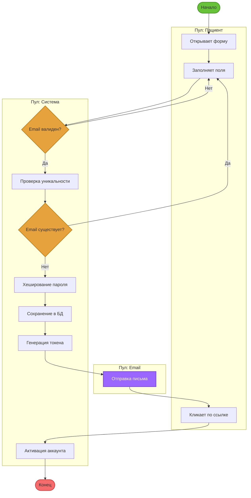

# BPMN Сценарий 1: Регистрация пациента

## Участники (Pools)
- **Пациент**
- **Система диагностики**
- **Email-сервис**

## BPMN Диаграмма

## Процесс

1. **Старт:** Пациент открывает форму регистрации
2. **Задача:** Заполнение формы (email, пароль, ФИО)
3. **Шлюз (XOR):** Проверка email
   - **Валидный:** Продолжить регистрацию
   - **Невалидный:** Показать ошибку → возврат к заполнению
4. **Задача:** Проверка уникальности email
5. **Шлюз (XOR):** Email уже существует?
   - **Да:** Показать ошибку → возврат к заполнению
   - **Нет:** Продолжить
6. **Задача:** Хеширование пароля BCrypt
7. **Задача:** Создание записи в PostgreSQL
8. **Задача:** Генерация токена активации
9. **Задача:** Отправка письма подтверждения (Email-сервис)
10. **Событие:** Ожидание клика по ссылке
11. **Задача:** Активация аккаунта
12. **Конец:** Успешная регистрация

## Особенности
- **Шлюз исключающий (XOR):** Только один путь выполняется
- **Пулы:** Разделение ответственности между участниками
- **События:** Временное ожидание действия пользователя
