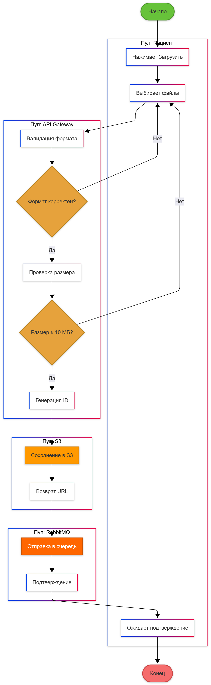

# 3.1.5. BPMN Сценарий 2: Загрузка данных

## Участники
- **Пациент**
- **API Gateway**
- **Storage Service (S3)**
- **Message Broker (RabbitMQ)**

## BPMN Диаграмма

## Процесс

1. **Старт:** Пациент нажимает "Загрузить данные"
2. **Задача:** Выбор файлов (изображения/текст)
3. **Шлюз (XOR):** Проверка формата файла
   - **JPEG/PNG/TXT:** Продолжить
   - **Другой формат:** Показать ошибку
4. **Шлюз (XOR):** Проверка размера
   - **≤ 10 МБ:** Продолжить
   - **> 10 МБ:** Показать ошибку
5. **Задача:** Генерация уникального ID
6. **Задача:** Сохранение в S3
7. **Задача:** Отправка сообщения в RabbitMQ
8. **Событие:** Подтверждение получения
9. **Конец:** Данные загружены

## Особенности
- **Последовательные шлюзы:** Многоуровневая валидация
- **Асинхронность:** RabbitMQ обрабатывает данные независимо
