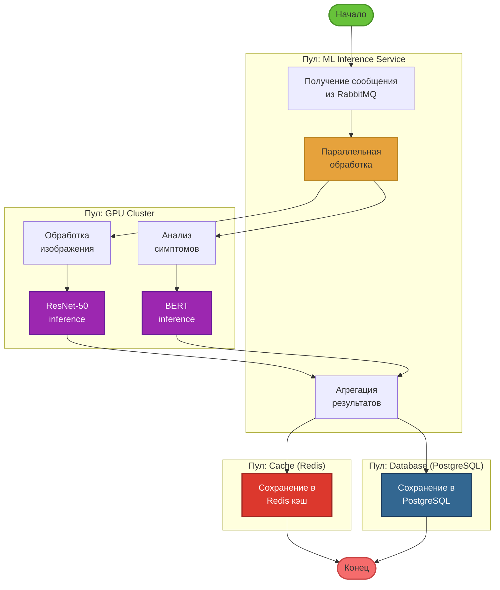

# BPMN Сценарий 3: ИИ-анализ (параллельная обработка)

## Участники
- **ML Inference Service**
- **GPU Cluster**
- **Cache (Redis)**
- **Database (PostgreSQL)**

## BPMN Диаграмма

## Процесс

1. **Старт:** Получение сообщения из RabbitMQ
2. **Шлюз (AND/Parallel):** Параллельная обработка
   - **Ветка 1: Обработка изображения**
     - Препроцессинг (OpenCV)
     - ResNet-50 inference
   - **Ветка 2: Обработка текста**
     - Токенизация (BERT Tokenizer)
     - BERT inference
3. **Шлюз (AND/Join):** Ожидание завершения обеих веток
4. **Задача:** Агрегация результатов
5. **Шлюз (AND/Parallel):** Параллельное сохранение
   - **Ветка 1:** Сохранение в Redis (кэш)
   - **Ветка 2:** Сохранение в PostgreSQL (постоянное хранилище)
6. **Конец:** Результаты готовы

## Особенности
- **Параллельный шлюз (AND):** Обе ветки выполняются одновременно
- **Синхронизация:** Агрегация только после завершения обеих задач
- **GPU-оптимизация:** Batch processing для ResNet и BERT
