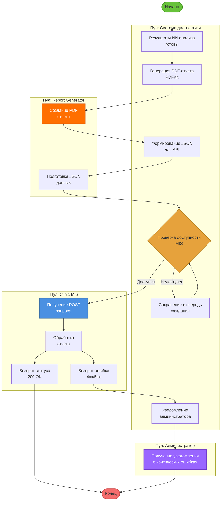

# BPMN Сценарий 4: Интеграция с MIS (Clinic Management Information System)

## Участники
- **Система диагностики**
- **Report Generator**
- **Clinic MIS**
- **Администратор**

## BPMN Диаграмма

## Процесс

1. **Старт:** Результаты ИИ-анализа готовы
2. **Задача:** Генерация PDF-отчёта (PDFKit)
3. **Задача:** Формирование JSON для API
4. **Шлюз (XOR):** Проверка доступности MIS
   - **Доступен:** Отправить отчёт
   - **Недоступен:** Сохранить в очередь ожидания
5. **Задача:** POST запрос к MIS API
6. **Шлюз (XOR):** Проверка ответа
   - **200 OK:** Успешная отправка
   - **4xx/5xx:** Повтор через 5 минут
7. **Событие (таймер):** Ожидание перед повтором
8. **Задача:** Уведомление администратора (если 3 неудачи)
9. **Конец:** Отчёт доставлен

## Особенности
- **Обработка ошибок:** Retry mechanism с экспоненциальной задержкой
- **Таймер-события:** Автоматический повтор
- **Эскалация:** Уведомление администратора при критических ошибках
