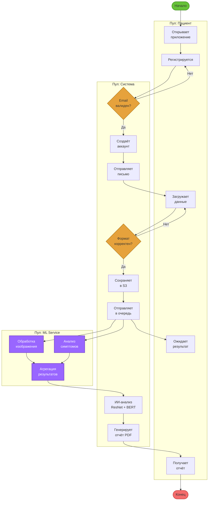

# BPMN Диаграммы

## Описание методологии

BPMN (Business Process Model and Notation) — стандарт нотации для моделирования бизнес-процессов, разработанный OMG (Object Management Group).

## BPMN Process Overview (Общий обзор)

### BPMN Process Overview (Интерактивная версия)

## Сценарий 1: Регистрация пациента

### Участники (Pools)
- **Пациент**
- **Система диагностики**
- **Email-сервис**

### Процесс

1. **Старт:** Пациент открывает форму регистрации
2. **Задача:** Заполнение формы (email, пароль)
3. **Шлюз (XOR):** Проверка email
   - **Валидный:** Продолжить регистрацию
   - **Невалидный:** Показать ошибку → возврат к заполнению
4. **Задача:** Создание записи в PostgreSQL
5. **Задача:** Отправка письма подтверждения (Email-сервис)
6. **Событие:** Ожидание клика по ссылке
7. **Задача:** Активация аккаунта
8. **Конец:** Успешная регистрация

### Особенности
- **Шлюз исключающий (XOR):** Только один путь выполняется
- **Пулы:** Разделение ответственности между участниками
- **События:** Временное ожидание действия пользователя

---

## Сценарий 2: Загрузка данных

### Участники
- **Пациент**
- **API Gateway**
- **Storage Service (S3)**
- **Message Broker (RabbitMQ)**

### Процесс

1. **Старт:** Пациент нажимает "Загрузить данные"
2. **Задача:** Выбор файлов (изображения/текст)
3. **Шлюз (XOR):** Проверка формата файла
   - **JPEG/PNG:** Продолжить
   - **Другой формат:** Показать ошибку
4. **Шлюз (XOR):** Проверка размера
   - **≤ 10 МБ:** Продолжить
   - **> 10 МБ:** Показать ошибку
5. **Задача:** Сохранение в S3
6. **Задача:** Отправка сообщения в RabbitMQ
7. **Событие:** Подтверждение получения
8. **Конец:** Данные загружены

### Особенности
- **Последовательные шлюзы:** Многоуровневая валидация
- **Асинхронность:** RabbitMQ обрабатывает данные независимо

---

## Сценарий 3: ИИ-анализ (параллельная обработка)

### Участники
- **ML Inference Service**
- **GPU Cluster**
- **Cache (Redis)**
- **Database (PostgreSQL)**

### Процесс

1. **Старт:** Получение сообщения из RabbitMQ
2. **Шлюз (AND/Parallel):** Параллельная обработка
   - **Ветка 1: Обработка изображения**
     - Препроцессинг (OpenCV)
     - ResNet-50 inference
   - **Ветка 2: Обработка текста**
     - Токенизация (BERT Tokenizer)
     - BERT inference
3. **Шлюз (AND/Join):** Ожидание завершения обеих веток
4. **Задача:** Агрегация результатов
5. **Шлюз (AND/Parallel):** Параллельное сохранение
   - **Ветка 1:** Сохранение в Redis (кэш)
   - **Ветка 2:** Сохранение в PostgreSQL (постоянное хранилище)
6. **Конец:** Результаты готовы

### Особенности
- **Параллельный шлюз (AND):** Обе ветки выполняются одновременно
- **Синхронизация:** Агрегация только после завершения обеих задач
- **GPU-оптимизация:** Batch processing для ResNet и BERT

---

## Сценарий 4: Интеграция с MIS (Clinic Management Information System)

### Участники
- **Система диагностики**
- **Report Generator**
- **Clinic MIS**
- **Администратор**

### Процесс

1. **Старт:** Результаты ИИ-анализа готовы
2. **Задача:** Генерация PDF-отчёта (PDFKit)
3. **Задача:** Формирование JSON для API
4. **Шлюз (XOR):** Проверка доступности MIS
   - **Доступен:** Отправить отчёт
   - **Недоступен:** Сохранить в очередь ожидания
5. **Задача:** POST запрос к MIS API
6. **Шлюз (XOR):** Проверка ответа
   - **200 OK:** Успешная отправка
   - **4xx/5xx:** Повтор через 5 минут
7. **Событие (таймер):** Ожидание перед повтором
8. **Задача:** Уведомление администратора (если 3 неудачи)
9. **Конец:** Отчёт доставлен

### Особенности
- **Обработка ошибок:** Retry mechanism с экспоненциальной задержкой
- **Таймер-события:** Автоматический повтор
- **Эскалация:** Уведомление администратора при критических ошибках

---

## Элементы BPMN, использованные в диаграммах

### События
- **Старт (Start Event):** Начало процесса
- **Конец (End Event):** Завершение процесса
- **Таймер (Timer Event):** Временная задержка
- **Сообщение (Message Event):** Получение внешнего сообщения

### Задачи
- **Задача пользователя (User Task):** Требует действия человека
- **Системная задача (Service Task):** Автоматическое выполнение
- **Отправка сообщения (Send Task):** Асинхронная отправка

### Шлюзы
- **Исключающий (XOR Gateway):** Один путь из нескольких
- **Параллельный (AND Gateway):** Все пути одновременно
- **Объединяющий (Join Gateway):** Синхронизация параллельных веток

### Пулы и дорожки
- **Пулы (Pools):** Разные организации/системы
- **Дорожки (Lanes):** Роли внутри одной организации

---

## Детальные BPMN диаграммы

### Сценарий 1: Регистрация пациента
- [BPMN Сценарий 1: Регистрация пациента](bpmn-scenario1.md)

### Сценарий 2: Загрузка данных
- [BPMN Сценарий 2: Загрузка данных](bpmn-scenario2.md)

### Сценарий 3: ИИ-анализ (параллельная обработка)
- [BPMN Сценарий 3: ИИ-анализ](bpmn-scenario3.md)

### Сценарий 4: Интеграция с MIS
- [BPMN Сценарий 4: Интеграция с MIS](bpmn-scenario4.md)

## Источники

- [BPMN 2.0 Specification](https://www.omg.org/spec/BPMN/2.0/)
- «BPMN Method and Style» Bruce Silver
- [Camunda BPMN Tutorial](https://camunda.com/bpmn/)

