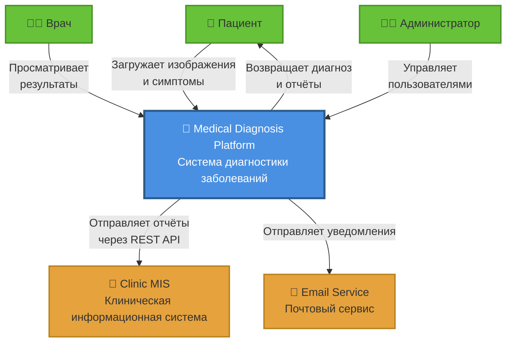
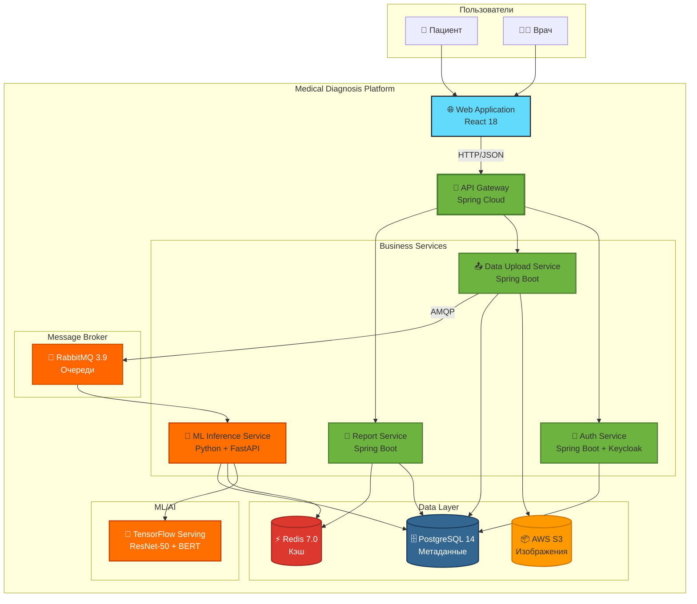

# C4 Модель архитектуры

## Введение в C4

C4 (Context, Containers, Components, Code) — методология визуализации архитектуры ПО, разработанная Simon Brown.

### Зачем использовать C4?

- **Уровни абстракции:** Позволяет описать систему от общего контекста до кода
- **Стандартизация:** Упрощает коммуникацию между разработчиками, DevOps и заказчиками

### C4 Context Diagram (Интерактивная версия)

## 4.1.1. C4-Context (Уровень 1: Контекст)

**Система:** Medical Diagnosis Platform

**Внешние сущности:**
- **Пациент:** Взаимодействует через веб-интерфейс (React)
- **Clinic MIS:** Интеграция через REST API (Spring Web)
- **Администратор:** Управляет правами доступа (Keycloak)

**Связи:**
- Пациент → Система: `POST /upload` (изображения/текст)
- Система → MIS: `POST /report` (JSON/PDF)

### Обоснование

Контекстная диаграмма помогает заказчикам понять границы системы (источник: [C4 Model](https://c4model.com/)).

---

## 4.1.2. C4-Container (Уровень 2: Контейнеры)

### Контейнеры:

#### Web-интерфейс (React)
- Фронтенд для загрузки данных и отображения результатов
- Связь с API Gateway через HTTP

#### API Gateway (Spring Cloud)
- Маршрутизация запросов
- Аутентификация (JWT), валидация данных (Spring Validator)

#### ML Inference Service (TensorFlow Serving)
- GPU-обработка изображений (ResNet-50) и текста (BERT)
- Асинхронное взаимодействие через RabbitMQ

#### Database Cluster
- **PostgreSQL 14:** Хранение метаданных (пациенты, отчёты)
- **Redis 7.0:** Кэширование результатов ИИ (скорость доступа)

#### Message Broker (RabbitMQ 3.9)
- Очередь `medical_data` для обработки запросов

### Зачем контейнеры?

**Масштабируемость:** Каждый контейнер можно обновлять и масштабировать независимо (источник: «Kubernetes in Action»).

### C4 Container Diagram (Интерактивная версия)

---

## 4.1.3. C4-Component (Уровень 3: Компоненты)

### API Gateway компоненты:

- **AuthController:** Регистрация (JWT), управление ролями
- **DataUploadController:** Приём файлов (multipart/form-data) → отправка в RabbitMQ

### ML Inference Service компоненты:

- **ImagePreprocessor:** Resize (OpenCV), нормализация (TensorFlow)
- **BERTTokenizer:** Токенизация текста (HuggingFace)
- **ResNetModel:** Классификация изображений (CheXNet weights)

### Хранилище компоненты:

- **S3Client:** Сохранение сырых данных (AWS S3)
- **RedisCache:** Кэширование результатов (TTL=1h)

---

## Диаграммы

Полные диаграммы C4 с декомпозицией до уровня компонентов представлены на изображениях выше.

