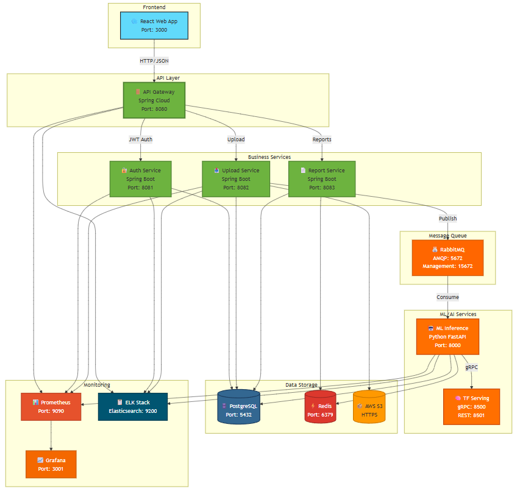

# Компонентная схема сервисов

## Описание

Компонентная схема показывает, как микросервисы взаимодействуют друг с другом, какие протоколы используются для коммуникации, и какие данные передаются между компонентами.

### System Architecture (Интерактивная версия)

## Ключевые компоненты

### 1. Frontend Layer

#### Web Application (React 18)
- **Назначение:** Пользовательский интерфейс
- **Технологии:** 
  - React 18 (UI framework)
  - Redux Toolkit (state management)
  - Axios (HTTP client)
  - Material-UI (component library)
- **Связи:**
  - → API Gateway (HTTP/HTTPS)
  - ← WebSocket для real-time уведомлений

---

### 2. API Layer

#### API Gateway (Spring Cloud Gateway)
- **Назначение:** Единая точка входа, маршрутизация, аутентификация
- **Функции:**
  - Routing (маршрутизация запросов)
  - Authentication (JWT validation)
  - Rate Limiting (ограничение запросов)
  - Load Balancing (балансировка нагрузки)
- **Связи:**
  - ← Web Application (HTTP)
  - → Auth Service (gRPC)
  - → Data Upload Service (HTTP)
  - → Report Service (HTTP)
  - → Prometheus (метрики)

---

### 3. Business Logic Layer

#### Auth Service (Spring Boot + Keycloak)
- **Назначение:** Управление пользователями и авторизация
- **Функции:**
  - Регистрация пользователей
  - Генерация JWT токенов
  - Управление ролями (RBAC)
- **Связи:**
  - ← API Gateway (gRPC)
  - → PostgreSQL (read/write users)
  - → Email Service (SMTP)

#### Data Upload Service (Spring Boot)
- **Назначение:** Приём и валидация медицинских данных
- **Функции:**
  - Валидация файлов (формат, размер)
  - Сохранение в S3
  - Отправка в очередь обработки
- **Связи:**
  - ← API Gateway (HTTP)
  - → AWS S3 (REST API)
  - → RabbitMQ (AMQP)
  - → PostgreSQL (metadata)

#### ML Inference Service (Python + FastAPI)
- **Назначение:** Обработка данных моделями ИИ
- **Функции:**
  - Препроцессинг изображений (OpenCV)
  - ResNet-50 inference
  - BERT tokenization & inference
  - Постпроцессинг результатов
- **Связи:**
  - ← RabbitMQ (consumer)
  - → TensorFlow Serving (gRPC)
  - → Redis (write results)
  - → PostgreSQL (write results)

#### Report Service (Spring Boot)
- **Назначение:** Генерация отчётов
- **Функции:**
  - Генерация PDF (PDFKit)
  - Генерация HTML
  - Интеграция с Clinic MIS
- **Связи:**
  - ← API Gateway (HTTP)
  - → PostgreSQL (read results)
  - → Redis (read cached results)
  - → Clinic MIS (REST API)

---

### 4. ML/AI Layer

#### TensorFlow Serving (gRPC)
- **Назначение:** Высокопроизводительный inference
- **Модели:**
  - ResNet-50 (image classification)
  - BERT (text analysis)
- **Связи:**
  - ← ML Inference Service (gRPC)
  - → GPU Cluster (CUDA)
  - → Model Registry (model loading)

#### Model Registry (MLflow)
- **Назначение:** Версионирование и хранение моделей
- **Функции:**
  - Хранение весов моделей
  - A/B тестирование версий
  - Rollback к предыдущим версиям
- **Связи:**
  - ← TensorFlow Serving (model pull)
  - → AWS S3 (model storage)

---

### 5. Data Layer

#### PostgreSQL 14 (Primary Database)
- **Назначение:** Хранение метаданных и результатов
- **Схемы:**
  - `users`: Пользователи и роли
  - `medical_data`: Метаданные загруженных файлов
  - `results`: Результаты диагностики
  - `reports`: История отчётов
- **Связи:**
  - ← Auth Service (read/write)
  - ← Data Upload Service (write)
  - ← ML Inference Service (write)
  - ← Report Service (read)
- **Репликация:** 
  - Master-Slave (1 master, 2 replicas)
  - Streaming replication

#### Redis 7.0 (Cache)
- **Назначение:** Кэширование результатов ИИ
- **Данные:**
  - Результаты inference (TTL = 1 hour)
  - Сессии пользователей
  - Rate limiting counters
- **Связи:**
  - ← ML Inference Service (write)
  - ← Report Service (read)
  - ← API Gateway (rate limiting)
- **Репликация:** 
  - Redis Sentinel (HA)

#### AWS S3 (Object Storage)
- **Назначение:** Хранение медицинских изображений
- **Buckets:**
  - `medical-images-raw`: Оригинальные изображения
  - `medical-images-processed`: Обработанные изображения
  - `ml-models`: Веса моделей
  - `reports-archive`: Архив PDF-отчётов
- **Связи:**
  - ← Data Upload Service (write)
  - ← Model Registry (read/write)

---

### 6. Message Broker Layer

#### RabbitMQ 3.9 (Message Broker)
- **Назначение:** Асинхронная обработка задач
- **Очереди:**
  - `medical_data`: Загруженные данные для обработки
  - `ml_inference`: Задачи для ML Service
  - `report_generation`: Задачи для Report Service
  - `dlq` (Dead Letter Queue): Неудачные задачи
- **Связи:**
  - ← Data Upload Service (producer)
  - → ML Inference Service (consumer)
  - → Report Service (consumer)
- **Конфигурация:**
  - Durable queues
  - Message TTL = 24 hours
  - Max retries = 3

---

### 7. Monitoring & Logging Layer

#### ELK Stack

##### Filebeat
- **Назначение:** Сбор логов
- **Связи:**
  - ← Все сервисы (log files)
  - → Logstash (forwarding)

##### Logstash
- **Назначение:** Обработка и фильтрация логов
- **Связи:**
  - ← Filebeat (logs)
  - → Elasticsearch (indexing)

##### Elasticsearch
- **Назначение:** Индексация и поиск по логам
- **Связи:**
  - ← Logstash (logs)
  - → Kibana (queries)

##### Kibana
- **Назначение:** Визуализация логов и дашборды
- **Связи:**
  - ← Elasticsearch (queries)
  - → DevOps (Web UI)

#### Prometheus + Grafana

##### Prometheus
- **Назначение:** Сбор метрик
- **Метрики:**
  - API Gateway: Request rate, latency
  - ML Service: Inference time, GPU utilization
  - PostgreSQL: Connection pool, query time
  - RabbitMQ: Queue size, message rate
- **Связи:**
  - ← Все сервисы (scraping)
  - → Grafana (queries)
  - → AlertManager (alerts)

##### Grafana
- **Назначение:** Визуализация метрик
- **Дашборды:**
  - System overview
  - ML performance
  - API performance
  - Infrastructure health
- **Связи:**
  - ← Prometheus (queries)
  - → DevOps (Web UI)

---

### 8. External Integrations

#### Email Service (SMTP)
- **Назначение:** Отправка уведомлений
- **Провайдер:** SendGrid / AWS SES
- **Связи:**
  - ← Auth Service (registration emails)
  - ← Report Service (report ready notifications)

#### Clinic MIS (Medical Information System)
- **Назначение:** Интеграция с клиникой
- **Протокол:** REST API (JSON)
- **Связи:**
  - ← Report Service (POST /reports)

---

## Протоколы коммуникации

| Источник | Назначение | Протокол | Формат данных |
|----------|------------|----------|---------------|
| Web App | API Gateway | HTTP/HTTPS | JSON |
| API Gateway | Auth Service | gRPC | Protobuf |
| API Gateway | Other Services | HTTP | JSON |
| Data Upload Service | RabbitMQ | AMQP | JSON |
| ML Inference Service | TensorFlow Serving | gRPC | Protobuf |
| Services | PostgreSQL | TCP | SQL |
| Services | Redis | TCP | Redis Protocol |
| Services | S3 | HTTPS | REST API |
| Services | Prometheus | HTTP | Metrics Format |
| Services | ELK | TCP | JSON |

---

## Паттерны взаимодействия

### 1. Синхронное взаимодействие
- **Используется:** Web App ↔ API Gateway ↔ Report Service
- **Преимущества:** Простота, немедленный ответ
- **Недостатки:** Блокирующий вызов

### 2. Асинхронное взаимодействие
- **Используется:** Data Upload → RabbitMQ → ML Inference
- **Преимущества:** Отказоустойчивость, масштабируемость
- **Недостатки:** Сложность отслеживания

### 3. Event-Driven
- **Используется:** ML результаты → Event → Report Generation
- **Преимущества:** Слабая связанность
- **Недостатки:** Сложность debugging

### 4. Request-Response
- **Используется:** API Gateway ↔ Business Services
- **Преимущества:** Прямолинейность
- **Недостатки:** Tight coupling

---

## Масштабирование

### Горизонтальное
- **API Gateway:** 3+ replicas (Kubernetes HPA)
- **ML Inference Service:** Auto-scaling based on GPU utilization
- **Data Upload Service:** 2+ replicas

### Вертикальное
- **TensorFlow Serving:** GPU instances (NVIDIA T4/A100)
- **PostgreSQL:** High-memory instances
- **Redis:** High-memory instances

### Кэширование
- **Redis:** Результаты ИИ (TTL = 1h)
- **CDN:** Статические ресурсы (CloudFlare)

---

## Источники

- «Building Microservices» Sam Newman
- «Designing Data-Intensive Applications» Martin Kleppmann
- [Spring Cloud Gateway Documentation](https://spring.io/projects/spring-cloud-gateway)
- [TensorFlow Serving Guide](https://www.tensorflow.org/tfx/guide/serving)

