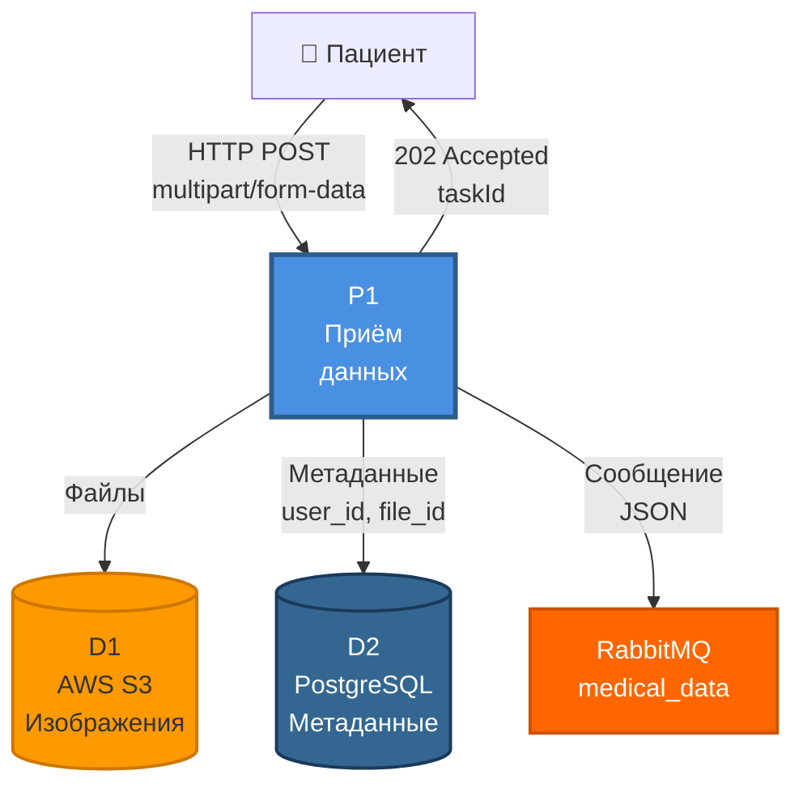

# DFD: Процесс P1 — Приём данных

## Диаграмма потоков данных P1



## Потоки данных

| Поток | Источник | Назначение | Данные | Формат |
|-------|----------|------------|--------|--------|
| 1 | Пациент | P1 | Файлы + метаданные | multipart/form-data |
| 2 | P1 | AWS S3 | Binary file | JPEG/PNG |
| 3 | P1 | PostgreSQL | user_id, file_name, s3_url | SQL INSERT |
| 4 | P1 | RabbitMQ | {fileId, s3Url, type} | JSON/AMQP |
| 5 | P1 | Пациент | {taskId, status} | JSON/HTTP |

## Хранилища данных

**D1: AWS S3**
- Bucket: medical-images-raw
- Key format: {userId}/{fileId}.jpg
- Access: Private (signed URLs)

**D2: PostgreSQL - таблица medical_data**
```sql
CREATE TABLE medical_data (
    id UUID PRIMARY KEY,
    user_id BIGINT,
    file_name VARCHAR(255),
    s3_url TEXT,
    uploaded_at TIMESTAMP
);
```

