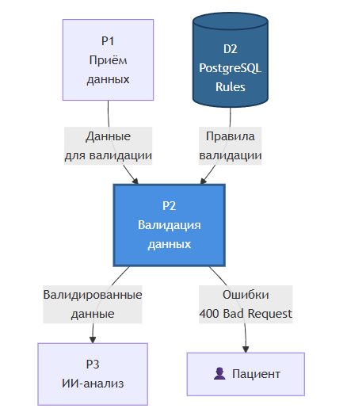

# 3.1.4. DFD: Процесс P2 — Валидация данных

## Диаграмма потоков данных P2

## Правила валидации

| Правило | Проверка | Действие при ошибке |
|---------|----------|---------------------|
| Формат файла | MIME-type in [image/jpeg, image/png] | Reject: INVALID_FORMAT |
| Размер | ≤ 10 MB | Reject: FILE_TOO_LARGE |
| Текст | Valid JSON or Plain text | Reject: INVALID_TEXT |
| Rate limit | ≤ 100 req/min per user | Reject: RATE_LIMIT_EXCEEDED |

