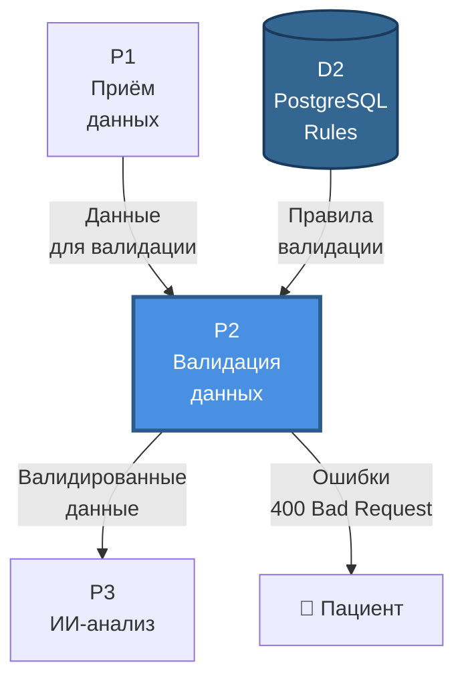

# DFD: Процесс P2 — Валидация данных

## Диаграмма потоков данных P2

```mermaid
graph TB
    P1[P1<br/>Приём<br/>данных]
    
    P2[P2<br/>Валидация<br/>данных]
    
    D2[(D2<br/>PostgreSQL<br/>Rules)]
    
    P3[P3<br/>ИИ-анализ]
    
    Patient[👤 Пациент]
    
    P1 -->|Данные<br/>для валидации| P2
    D2 -->|Правила<br/>валидации| P2
    P2 -->|Валидированные<br/>данные| P3
    P2 -->|Ошибки<br/>400 Bad Request| Patient
    
    style P2 fill:#4a90e2,stroke:#2e5c8a,stroke-width:3px,color:#fff
    style D2 fill:#336791,stroke:#1a3a5c,stroke-width:2px,color:#fff
```

## Правила валидации

| Правило | Проверка | Действие при ошибке |
|---------|----------|---------------------|
| Формат файла | MIME-type in [image/jpeg, image/png] | Reject: INVALID_FORMAT |
| Размер | ≤ 10 MB | Reject: FILE_TOO_LARGE |
| Текст | Valid JSON or Plain text | Reject: INVALID_TEXT |
| Rate limit | ≤ 100 req/min per user | Reject: RATE_LIMIT_EXCEEDED |

