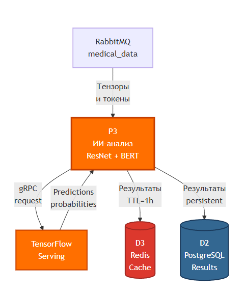

# DFD: Процесс P3 — ИИ-анализ

## Диаграмма потоков данных P3



## Структура результатов

```json
{
  "taskId": "uuid",
  "imagePredictions": [
    {"disease": "Pneumonia", "probability": 0.952}
  ],
  "textPredictions": [
    {"disease": "Flu", "probability": 0.782}
  ],
  "processingTime": 2.3
}
```

