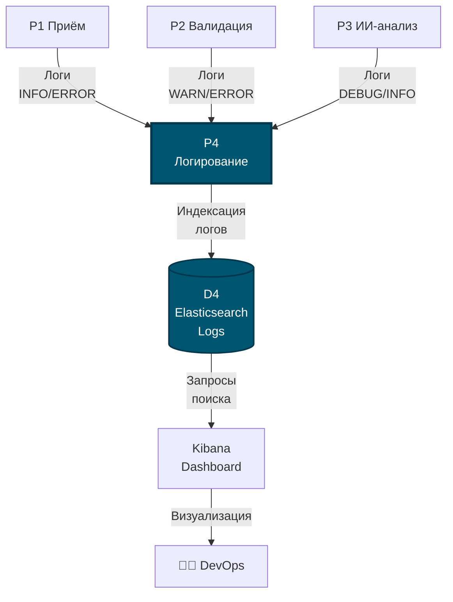

# DFD: Процесс P4 — Логирование

## Диаграмма потоков данных P4



## Структура лог записи

```json
{
  "timestamp": "2024-10-14T10:30:00Z",
  "level": "INFO",
  "service": "ml-inference",
  "message": "Inference completed",
  "taskId": "abc-123",
  "duration": 2300,
  "userId": 42
}
```

