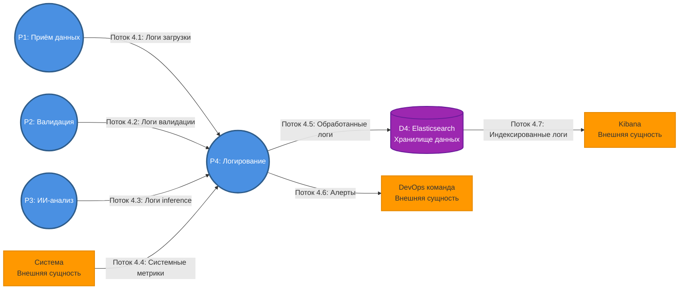

# 3.1.4. DFD: Процесс P4 — Логирование

## Диаграмма потоков данных P4

@drawio{https://github.com/Edisheri/system-engineering-playbook/blob/main/diagrams-codes/DFD_P4.drawio}

### Mermaid версия (для справки)


```mermaid
flowchart LR
    P1(("P1: Приём данных")) -->|"Поток 4.1: Логи загрузки"| P4(("P4: Логирование"))
    P2(("P2: Валидация")) -->|"Поток 4.2: Логи валидации"| P4
    P3(("P3: ИИ-анализ")) -->|"Поток 4.3: Логи inference"| P4
    System[Система<br/>Внешняя сущность] -->|"Поток 4.4: Системные метрики"| P4
    P4 -->|"Поток 4.5: Обработанные логи"| D4[("D4: Elasticsearch<br/>Хранилище данных")]
    P4 -->|"Поток 4.6: Алерты"| DevOps[DevOps команда<br/>Внешняя сущность]
    D4 -->|"Поток 4.7: Индексированные логи"| Kibana[Kibana<br/>Внешняя сущность]
    
    style P1 fill:#4a90e2,stroke:#2e5c8a,stroke-width:3px,color:#fff
    style P2 fill:#4a90e2,stroke:#2e5c8a,stroke-width:3px,color:#fff
    style P3 fill:#4a90e2,stroke:#2e5c8a,stroke-width:3px,color:#fff
    style P4 fill:#4a90e2,stroke:#2e5c8a,stroke-width:3px,color:#fff
    style System fill:#ff9800,stroke:#e68900,stroke-width:2px
    style DevOps fill:#ff9800,stroke:#e68900,stroke-width:2px
    style Kibana fill:#ff9800,stroke:#e68900,stroke-width:2px
    style D4 fill:#9c27b0,stroke:#6a1b9a,stroke-width:2px,color:#fff
```

## Структура лог записи

```json
{
  "timestamp": "2024-10-14T10:30:00Z",
  "level": "INFO",
  "service": "ml-inference",
  "message": "Inference completed",
  "taskId": "abc-123",
  "duration": 2300,
  "userId": 42
}
```

