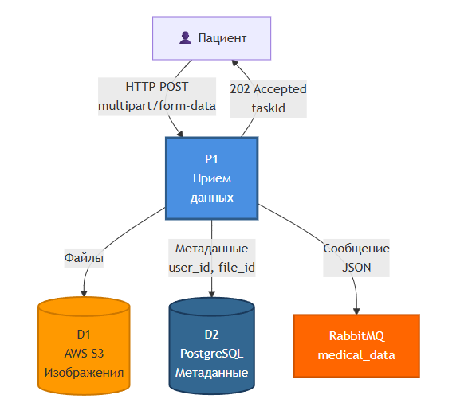

# DFD Диаграммы (Data Flow Diagram)

## Описание методологии

DFD (Data Flow Diagram) — методология моделирования потоков данных в информационной системе, показывающая, как данные перемещаются между процессами, хранилищами и внешними сущностями.

## Процессы системы (4 функции)

### P1: Приём данных

**Описание:** Получение медицинских данных от пациента

**Входные потоки:**
- HTTP POST запрос от пациента
- Multipart/form-data (изображения + текст)

**Выходные потоки:**
- Сообщение в очередь RabbitMQ
- Подтверждение получения (JSON)

**Компоненты:**
- Nginx (точка входа)
- API Gateway (обработка)

**Хранилища:**
- AWS S3 (сырые файлы)

---

### P2: Валидация данных

**Описание:** Проверка корректности входных данных

**Входные потоки:**
- Multipart/form-data из P1
- Правила валидации из PostgreSQL

**Выходные потоки:**
- Валидированные данные → P3
- Ошибки валидации → Пациент

**Компоненты:**
- Spring Validator
- DataUploadController

**Правила валидации:**
- Формат файлов (JPEG/PNG)
- Размер ≤ 10 МБ
- Структура JSON для симптомов

---

### P3: ИИ-анализ

**Описание:** Обработка данных моделями машинного обучения

**Входные потоки:**
- Тензоры изображений (224x224x3)
- Токены BERT
- Параметры моделей из конфигурации

**Выходные потоки:**
- JSON-результаты → Redis (кэш)
- JSON-результаты → PostgreSQL (постоянное хранение)
- Метрики → Prometheus

**Компоненты:**
- TensorFlow Serving
- ResNet-50 модель
- BERT модель
- GPU кластер

**Хранилища:**
- Redis (TTL = 1 час)
- PostgreSQL (таблица `results`)

---

### P4: Логирование

**Описание:** Сбор и хранение логов всех процессов

**Входные потоки:**
- Логи от P1, P2, P3
- Системные метрики (CPU, память, GPU)
- Ошибки и предупреждения

**Выходные потоки:**
- Индексированные логи → Elasticsearch
- Алерты → DevOps команда (Slack/Email)

**Компоненты:**
- Filebeat (агент сбора)
- Logstash (обработка)
- Elasticsearch (индексация)
- Kibana (визуализация)

**Хранилища:**
- Elasticsearch (логи за 30 дней)

---

## Хранилища данных

### D1: AWS S3
- **Тип:** Object Storage
- **Данные:** Сырые медицинские изображения
- **Доступ:** P1 (запись), P3 (чтение при необходимости)

### D2: PostgreSQL
- **Тип:** Реляционная БД
- **Данные:** 
  - Метаданные пациентов
  - Результаты диагностики
  - История запросов
- **Доступ:** Все процессы

### D3: Redis
- **Тип:** In-memory cache
- **Данные:** Кэшированные результаты ИИ
- **Доступ:** P3 (запись), API (чтение)

### D4: Elasticsearch
- **Тип:** Поисковый движок
- **Данные:** Логи и метрики
- **Доступ:** P4 (запись), Kibana (чтение)

---

## Внешние сущности

- **Пациент:** Инициирует запросы, получает результаты
- **Clinic MIS:** Получает отчёты через REST API
- **Администратор:** Управляет системой через административную панель
- **DevOps:** Получает алерты и мониторит систему

---

## Источники

- «Structured Analysis and System Specification» Tom DeMarco
- [DFD Best Practices](https://www.visual-paradigm.com/guide/data-flow-diagram/)

