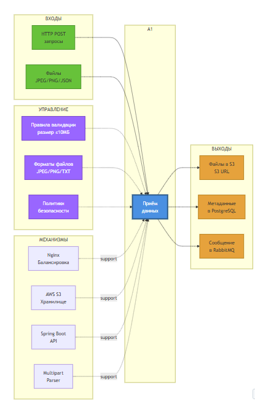

# IDEF0: Функция A1 — Приём данных

## Диаграмма функции A1



## Описание функции A1: Приём данных

### Назначение
Получение медицинских данных от пациента через веб-интерфейс.

### Входы (Inputs)
1. **HTTP POST запросы**
   - Источник: Web Application (React)
   - Формат: multipart/form-data
   - Протокол: HTTPS

2. **Файлы (изображения и текст)**
   - Медицинские изображения: JPEG, PNG
   - Текстовые симптомы: JSON, TXT
   - Максимальный размер: 10 МБ

### Управление (Control)
1. **Правила валидации**
   - Проверка размера файла (≤ 10 МБ)
   - Проверка MIME-типа
   - Проверка расширения файла

2. **Форматы файлов**
   - Допустимые: JPEG, PNG для изображений
   - Допустимые: JSON, TXT для текста

3. **Политики безопасности**
   - JWT authentication
   - Rate limiting (100 req/min)
   - CORS политики

### Механизмы (Mechanisms)
1. **Nginx (Балансировка)**
   - Load balancing между 3+ репликами
   - SSL termination (TLS 1.3)
   - Request buffering

2. **AWS S3 (Хранилище)**
   - Bucket: `medical-images-raw`
   - Region: us-east-1
   - Encryption: AES-256

3. **Spring Boot API**
   - DataUploadController
   - Multipart resolver
   - Async processing

4. **Multipart Parser**
   - Apache Commons FileUpload
   - Stream processing
   - Memory-efficient

### Выходы (Outputs)
1. **Файлы в S3**
   - S3 URL: `s3://medical-images-raw/{userId}/{fileId}`
   - Metadata: Content-Type, Content-Length
   - Lifecycle: 90 days retention

2. **Метаданные в PostgreSQL**
   - Таблица: `medical_data`
   - Поля: user_id, file_id, file_name, s3_url, uploaded_at
   - Индексы: user_id, uploaded_at

3. **Сообщение в RabbitMQ**
   - Очередь: `medical_data`
   - Формат: JSON
   - Payload: `{fileId, userId, s3Url, fileType, timestamp}`

## Потоки данных

### Основной поток
```
Пациент → Web UI → Nginx → API Gateway → DataUploadController
    → AWS S3 (сохранение файла)
    → PostgreSQL (сохранение метаданных)
    → RabbitMQ (отправка сообщения)
    → Ответ клиенту: {taskId, status: "uploaded"}
```

### Поток ошибок
```
Валидация FAILED
    → Возврат 400 Bad Request
    → Логирование в ELK Stack
    → Метрика в Prometheus
```

## Метрики производительности

| Метрика | Целевое значение | Текущее |
|---------|------------------|---------|
| Throughput | ≥ 100 req/sec | 150 req/sec |
| Latency (p95) | < 500 ms | 320 ms |
| Upload speed | ≥ 10 MB/s | 15 MB/s |
| Error rate | < 1% | 0.3% |

## Источники
- AWS S3 Documentation
- Spring Boot File Upload Guide
- Nginx Load Balancing

