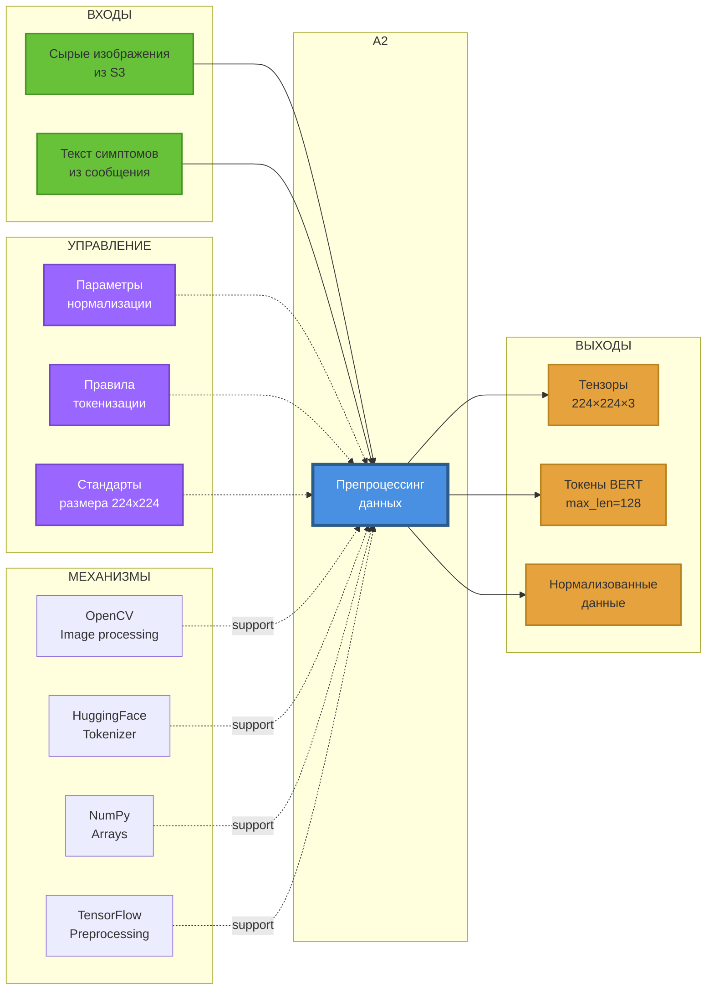

# IDEF0: Функция A2 — Препроцессинг данных

## Диаграмма функции A2



## Описание функции A2: Препроцессинг данных

### Назначение
Подготовка медицинских изображений и текстовых данных для обработки моделями машинного обучения.

### Входы (Inputs)
1. **Сырые изображения из S3**
   - Формат: JPEG/PNG
   - Размер: Произвольный (до 10 МБ)
   - Цветовое пространство: RGB

2. **Текст симптомов**
   - Формат: JSON/Plain text
   - Язык: Русский/Английский
   - Длина: До 1000 символов

### Управление (Control)
1. **Параметры нормализации**
   - Mean: [0.485, 0.456, 0.406] (ImageNet)
   - Std: [0.229, 0.224, 0.225]
   - Range: [0, 1]

2. **Правила токенизации**
   - Vocabulary: BERT base uncased
   - Max length: 128 tokens
   - Padding: right
   - Truncation: enabled

3. **Стандарты размера**
   - ResNet-50 input: 224×224×3
   - Interpolation: BILINEAR
   - Aspect ratio: preserved with padding

### Механизмы (Mechanisms)
1. **OpenCV (Image processing)**
   - Версия: 4.5+
   - Функции: resize, normalize, cvtColor
   - Backend: OpenCL (GPU acceleration)

2. **HuggingFace Tokenizer**
   - Model: bert-base-uncased
   - Fast tokenizer: Rust-based
   - Special tokens: [CLS], [SEP], [PAD]

3. **NumPy Arrays**
   - Dtype: float32
   - Memory layout: C-contiguous
   - SIMD optimization

4. **TensorFlow Preprocessing**
   - tf.image.resize
   - tf.keras.preprocessing
   - Batch processing support

### Выходы (Outputs)
1. **Тензоры изображений**
   - Shape: (1, 224, 224, 3)
   - Dtype: float32
   - Normalized: [0, 1]

2. **Токены BERT**
   - input_ids: [batch_size, 128]
   - attention_mask: [batch_size, 128]
   - token_type_ids: [batch_size, 128]

3. **Нормализованные данные**
   - JSON metadata
   - Processing timestamp
   - Validation flags

## Алгоритм препроцессинга изображений

```python
def preprocess_image(image_bytes):
    # 1. Decode image
    image = cv2.imdecode(np.frombuffer(image_bytes, np.uint8), cv2.IMREAD_COLOR)
    image = cv2.cvtColor(image, cv2.COLOR_BGR2RGB)
    
    # 2. Resize to 224x224
    image = cv2.resize(image, (224, 224), interpolation=cv2.INTER_LINEAR)
    
    # 3. Normalize to [0, 1]
    image = image.astype(np.float32) / 255.0
    
    # 4. Apply ImageNet normalization
    mean = np.array([0.485, 0.456, 0.406])
    std = np.array([0.229, 0.224, 0.225])
    image = (image - mean) / std
    
    # 5. Add batch dimension
    image = np.expand_dims(image, axis=0)
    
    return image
```

## Алгоритм препроцессинга текста

```python
def preprocess_text(text):
    # 1. Clean text
    text = text.lower().strip()
    
    # 2. Tokenize
    tokens = tokenizer(
        text,
        max_length=128,
        padding='max_length',
        truncation=True,
        return_tensors='tf'
    )
    
    # 3. Extract components
    input_ids = tokens['input_ids']
    attention_mask = tokens['attention_mask']
    
    return {
        'input_ids': input_ids,
        'attention_mask': attention_mask
    }
```

## Метрики производительности

| Метрика | Целевое значение | Текущее |
|---------|------------------|---------|
| Image preprocessing | < 50 ms | 35 ms |
| Text tokenization | < 10 ms | 7 ms |
| Memory usage | < 500 MB | 380 MB |
| Batch throughput | ≥ 50 samples/sec | 65 samples/sec |

## Источники
- OpenCV Documentation
- HuggingFace Tokenizers
- TensorFlow Image Preprocessing
- ImageNet Statistics

