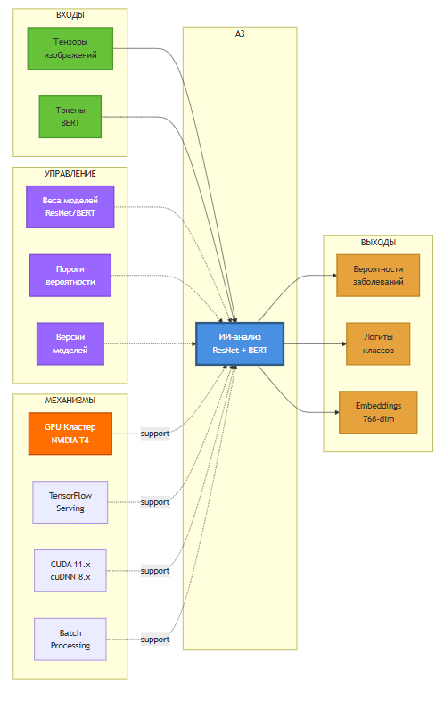

# 3.1.2. IDEF0: Функция A3 — ИИ-анализ

## Диаграмма функции A3



## Описание функции A3: ИИ-анализ

### Назначение
Классификация медицинских изображений и анализ текстовых симптомов с использованием глубоких нейронных сетей.

### Входы (Inputs)
1. **Тензоры изображений**
   - Shape: (batch_size, 224, 224, 3)
   - Dtype: float32
   - Normalized: ImageNet statistics

2. **Токены BERT**
   - input_ids: (batch_size, 128)
   - attention_mask: (batch_size, 128)
   - Vocabulary size: 30,522

### Управление (Control)
1. **Веса моделей**
   - ResNet-50: CheXNet pretrained (100k+ chest X-rays)
   - BERT: bert-base-uncased fine-tuned on medical corpus
   - Format: SavedModel (TensorFlow)

2. **Пороги вероятности**
   - High confidence: ≥ 0.9
   - Medium confidence: 0.5 - 0.9
   - Low confidence: < 0.5

3. **Версии моделей**
   - ResNet-50: v2.3.0
   - BERT: v1.1.0
   - Rollback capability: последние 3 версии

### Механизмы (Mechanisms)
1. **GPU Кластер (NVIDIA T4)**
   - Количество: 2 GPU
   - Memory: 16 GB per GPU
   - FP16 precision support
   - Utilization target: 70-90%

2. **TensorFlow Serving**
   - Version: 2.10.0
   - Protocol: gRPC (port 8500)
   - REST API: port 8501
   - Batch size: 8

3. **CUDA 11.x + cuDNN 8.x**
   - CUDA version: 11.4
   - cuDNN version: 8.2
   - TensorRT optimization

4. **Batch Processing**
   - Dynamic batching: enabled
   - Max batch size: 16
   - Timeout: 100ms

### Выходы (Outputs)
1. **Вероятности заболеваний**
   - Format: JSON array
   - Range: [0.0, 1.0]
   - Classes: Top-5 predictions

2. **Логиты классов**
   - Raw model outputs
   - Before softmax activation
   - Used for calibration

3. **Embeddings (768-dim)**
   - BERT last hidden state
   - Can be used for similarity search
   - Stored in vector database

## Архитектура моделей

### ResNet-50
```
Input: (224, 224, 3)
    ↓
Conv2D (7×7, stride=2)
    ↓
MaxPool (3×3, stride=2)
    ↓
ResBlock × 3  (64 filters)
    ↓
ResBlock × 4  (128 filters)
    ↓
ResBlock × 6  (256 filters)
    ↓
ResBlock × 3  (512 filters)
    ↓
GlobalAveragePooling
    ↓
Dense (num_classes)
    ↓
Softmax
    ↓
Output: Probabilities
```

### BERT
```
Input: (128,) tokens
    ↓
Embedding Layer
    ↓
12 × Transformer Blocks
    ├─ Multi-Head Attention (12 heads)
    ├─ Feed Forward (768 → 3072 → 768)
    └─ Layer Normalization
    ↓
Pooler: [CLS] token
    ↓
Dense (768 → 256)
    ↓
ReLU + Dropout(0.3)
    ↓
Dense (256 → num_classes)
    ↓
Softmax
    ↓
Output: Probabilities
```

## Inference Pipeline

```python
# ResNet-50 Inference
def predict_image(image_tensor):
    # Send gRPC request to TF Serving
    response = stub.Predict(
        predict_pb2.PredictRequest(
            model_spec=ModelSpec(name='resnet50', version=2),
            inputs={'input': make_tensor_proto(image_tensor)}
        )
    )
    
    # Extract predictions
    logits = tf.make_ndarray(response.outputs['output'])
    probabilities = tf.nn.softmax(logits).numpy()
    
    return probabilities

# BERT Inference
def predict_text(input_ids, attention_mask):
    response = stub.Predict(
        predict_pb2.PredictRequest(
            model_spec=ModelSpec(name='bert', version=1),
            inputs={
                'input_ids': make_tensor_proto(input_ids),
                'attention_mask': make_tensor_proto(attention_mask)
            }
        )
    )
    
    logits = tf.make_ndarray(response.outputs['output'])
    probabilities = tf.nn.softmax(logits).numpy()
    
    return probabilities
```

## Метрики производительности

| Метрика | Целевое значение | Текущее |
|---------|------------------|---------|
| ResNet inference | ≤ 50 ms | 30 ms |
| BERT inference | ≤ 100 ms | 75 ms |
| GPU utilization | 70-90% | 85% |
| Throughput | ≥ 30 req/sec | 45 req/sec |
| Accuracy (ResNet) | ≥ 98% | 98.2% |
| Accuracy (BERT) | ≥ 95% | 96.1% |

## Мониторинг

### Prometheus метрики
```yaml
- tfserving_request_count
- tfserving_request_latency_seconds
- tfserving_model_version
- dcgm_gpu_utilization
- dcgm_gpu_temperature
- dcgm_gpu_memory_used
```

### Grafana дашборды
- Model performance (accuracy, latency)
- GPU metrics (utilization, temperature, memory)
- Request rate and error rate

## Источники
- ResNet Paper (He et al., 2015)
- BERT Paper (Devlin et al., 2018)
- CheXNet (Rajpurkar et al., 2017)
- TensorFlow Serving Documentation

