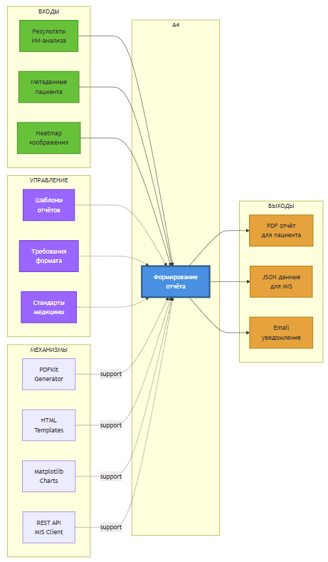

# IDEF0: Функция A4 — Формирование отчёта

## Диаграмма функции A4



## Описание функции A4: Формирование отчёта

### Назначение
Генерация медицинских отчётов с результатами диагностики в PDF/HTML формате и интеграция с клиническими информационными системами.

### Входы (Inputs)
1. **Результаты ИИ-анализа**
   - Топ-5 диагнозов с вероятностями
   - Confidence scores
   - Inference time
   - Model versions

2. **Метаданные пациента**
   - ФИО пациента
   - Дата обследования
   - Загруженные файлы
   - История предыдущих анализов

3. **Heatmap изображения**
   - Grad-CAM визуализация
   - Области интереса (ROI)
   - PNG format
   - Resolution: 512×512

### Управление (Control)
1. **Шаблоны отчётов**
   - HTML template: Jinja2
   - CSS styling: Bootstrap 5
   - Layout: A4 portrait
   - Multilingual: RU/EN

2. **Требования формата**
   - PDF/A standard (архивирование)
   - Font: Arial, Times New Roman
   - Images: embedded (base64)
   - Metadata: PDF tags

3. **Стандарты медицины**
   - DICOM metadata
   - ICD-10 codes
   - SNOMED CT terms
   - FHIR compatibility

### Механизмы (Mechanisms)
1. **PDFKit (Generator)**
   - Version: 0.6.2
   - Renderer: wkhtmltopdf
   - Page size: A4
   - DPI: 300

2. **HTML Templates (Jinja2)**
   - Template engine: Jinja2 3.0+
   - Syntax: {{variable}}, 
   - Includes: header, footer, body

3. **Matplotlib (Charts)**
   - Bar charts: probability distribution
   - Line charts: confidence over time
   - Heatmaps: Grad-CAM overlay
   - Export: PNG (embedded in PDF)

4. **REST API MIS Client**
   - Protocol: HTTPS
   - Format: JSON/HL7 FHIR
   - Authentication: OAuth 2.0
   - Retry: exponential backoff

### Выходы (Outputs)
1. **PDF отчёт для пациента**
   - Sections:
     - Информация о пациенте
     - Результаты анализа изображения
     - Анализ текстовых симптомов
     - Комбинированный диагноз
     - Heatmap визуализация
     - Рекомендации
     - Дисклеймер
   - Size: ~2-5 MB
   - Storage: S3 bucket `reports-archive`

2. **JSON данные для MIS**
   - FHIR DiagnosticReport resource
   - ObservationDefinition
   - Media (heatmap link)
   - Practitioner (system)
   - Format: application/fhir+json

3. **Email уведомление**
   - To: patient email
   - Subject: "Результаты анализа готовы"
   - Body: HTML + plain text
   - Attachments: PDF report (optional)

## Структура PDF отчёта

```
┌────────────────────────────────────┐
│  HEADER                            │
│  Logo | Дата: 2024-10-14          │
├────────────────────────────────────┤
│  ИНФОРМАЦИЯ О ПАЦИЕНТЕ             │
│  ФИО: Иванов Иван Иванович         │
│  Дата рождения: 1980-01-01         │
│  ID обследования: ABC-123-XYZ      │
├────────────────────────────────────┤
│  РЕЗУЛЬТАТЫ АНАЛИЗА ИЗОБРАЖЕНИЯ    │
│  ┌──────────────────────────────┐  │
│  │ [Heatmap Image]              │  │
│  └──────────────────────────────┘  │
│                                    │
│  Топ-5 диагнозов:                  │
│  1. Пневмония ████████ 95.2%       │
│  2. Бронхит   ██       3.5%        │
│  3. Норма     █        1.3%        │
├────────────────────────────────────┤
│  АНАЛИЗ СИМПТОМОВ                  │
│  Обнаруженные симптомы:            │
│  • Температура 38.5°C              │
│  • Кашель                          │
│  • Слабость                        │
│                                    │
│  Вероятность заболеваний:          │
│  • Грипп: 78.2%                    │
│  • ОРВИ: 15.3%                     │
├────────────────────────────────────┤
│  КОМБИНИРОВАННЫЙ ДИАГНОЗ           │
│  Наиболее вероятный:               │
│  Пневмония (общая вероятность 86.7%)│
│                                    │
│  Уровень уверенности: ВЫСОКИЙ      │
├────────────────────────────────────┤
│  РЕКОМЕНДАЦИИ                      │
│  ⚠ Срочно обратитесь к пульмонологу│
│  • Рекомендован анализ крови       │
│  • Повторный рентген через 2 недели│
├────────────────────────────────────┤
│  ДИСКЛЕЙМЕР                        │
│  ⚠ Результаты ИИ-анализа не        │
│  заменяют консультацию врача       │
├────────────────────────────────────┤
│  FOOTER                            │
│  Система: Medical Diagnosis AI     │
│  Версия: ResNet-50 v2.3, BERT v1.1 │
│  Время обработки: 2.3 сек          │
│  Подпись: [Digital Signature]      │
└────────────────────────────────────┘
```

## Пример кода генерации PDF

```python
from jinja2 import Template
import pdfkit

def generate_pdf_report(result_data, patient_data, heatmap_path):
    # Load HTML template
    with open('templates/report_template.html') as f:
        template = Template(f.read())
    
    # Prepare data
    context = {
        'patient': patient_data,
        'image_predictions': result_data['imagePredictions'],
        'text_predictions': result_data['textPredictions'],
        'combined_diagnosis': result_data['combinedDiagnosis'],
        'heatmap_url': heatmap_path,
        'processing_time': result_data['processingTime'],
        'timestamp': datetime.now().strftime('%Y-%m-%d %H:%M:%S')
    }
    
    # Render HTML
    html_content = template.render(context)
    
    # Generate PDF
    options = {
        'page-size': 'A4',
        'encoding': 'UTF-8',
        'enable-local-file-access': None,
        'dpi': 300
    }
    
    pdf_bytes = pdfkit.from_string(html_content, False, options=options)
    
    # Upload to S3
    s3_url = upload_to_s3(pdf_bytes, f'reports/{patient_data["id"]}.pdf')
    
    return s3_url
```

## Интеграция с MIS

```python
def send_to_mis(report_data, mis_endpoint):
    # Create FHIR DiagnosticReport
    fhir_report = {
        "resourceType": "DiagnosticReport",
        "status": "final",
        "category": [{
            "coding": [{
                "system": "http://terminology.hl7.org/CodeSystem/v2-0074",
                "code": "RAD",
                "display": "Radiology"
            }]
        }],
        "code": {
            "coding": [{
                "system": "http://loinc.org",
                "code": "30954-2",
                "display": "Chest X-ray"
            }]
        },
        "subject": {
            "reference": f"Patient/{report_data['patientId']}"
        },
        "conclusion": report_data['combinedDiagnosis'][0]['disease'],
        "conclusionCode": [{
            "coding": [{
                "system": "http://hl7.org/fhir/sid/icd-10",
                "code": report_data['icd10Code']
            }]
        }]
    }
    
    # Send via REST API
    response = requests.post(
        f"{mis_endpoint}/DiagnosticReport",
        json=fhir_report,
        headers={
            'Authorization': f'Bearer {oauth_token}',
            'Content-Type': 'application/fhir+json'
        },
        timeout=30
    )
    
    return response.json()
```

## Метрики производительности

| Метрика | Целевое значение | Текущее |
|---------|------------------|---------|
| PDF generation | < 2 sec | 1.5 sec |
| File size | < 5 MB | 3.2 MB |
| MIS integration | < 5 sec | 3.8 sec |
| Email delivery | < 30 sec | 15 sec |
| Success rate | > 99% | 99.7% |

## Источники
- PDFKit Documentation
- FHIR DiagnosticReport Specification
- ICD-10 Classification
- wkhtmltopdf Manual

