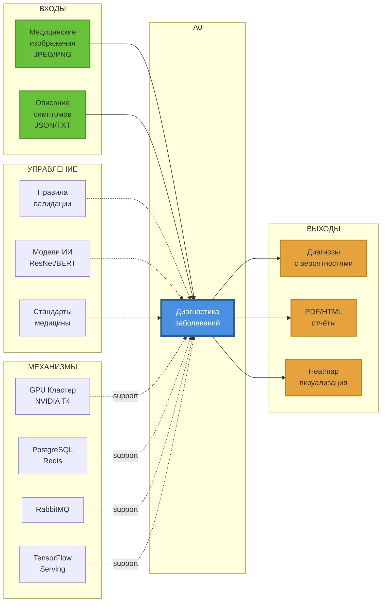

# IDEF0 Диаграммы

## Описание методологии

IDEF0 (Integration Definition for Function Modeling) — методология функционального моделирования, описывающая процессы в виде иерархии функций с входами, выходами, управлением и механизмами.

### IDEF0 Context Diagram (Интерактивная версия)

## Основная функция

**A0: Диагностика заболеваний**

## Декомпозиция на 4 функции

### A1: Приём данных

**Описание:** Получение медицинских данных от пациента

**Входы:**
- Изображения (JPEG/PNG)
- Текст (JSON)

**Выходы:**
- Сообщения в RabbitMQ

**Управление:**
- Правила валидации
- Ограничения размера файлов (10 МБ)

**Механизмы:**
- AWS S3 (хранилище)
- Nginx (балансировка нагрузки)

---

### A2: Препроцессинг

**Описание:** Подготовка данных для ИИ-анализа

**Входы:**
- Данные из очереди RabbitMQ

**Выходы:**
- Тензоры (224x224x3)
- Токены BERT

**Управление:**
- Параметры нормализации
- Правила токенизации

**Механизмы:**
- OpenCV (обработка изображений)
- HuggingFace Tokenizer (обработка текста)

---

### A3: ИИ-анализ

**Описание:** Классификация заболеваний

**Входы:**
- Тензоры изображений
- Токены текста

**Выходы:**
- JSON-результаты (вероятность заболевания)

**Управление:**
- Пороговые значения вероятности
- Версии моделей

**Механизмы:**
- ResNet-50 (анализ изображений)
- BERT (анализ симптомов)
- GPU кластер

---

### A4: Формирование отчёта

**Описание:** Генерация результатов диагностики

**Входы:**
- JSON-данные с результатами

**Выходы:**
- PDF/HTML-отчёты
- Данные для MIS

**Управление:**
- Шаблоны отчётов
- Требования к формату

**Механизмы:**
- PDFKit (генерация PDF)
- REST API (интеграция с MIS)

---

## Источники

- [IDEF0 для ПО](https://www.idef.com/idef0/)
- «Business Process Modeling» Laguna & Marklund

