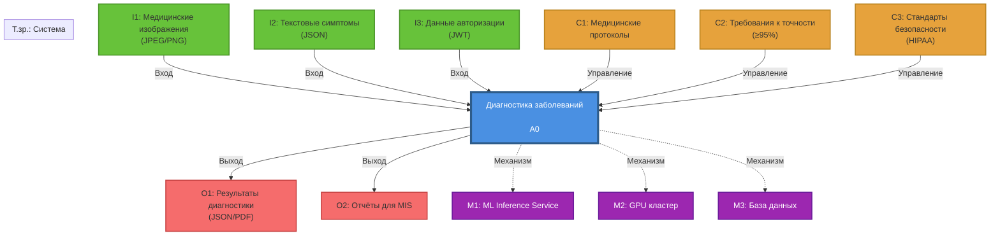
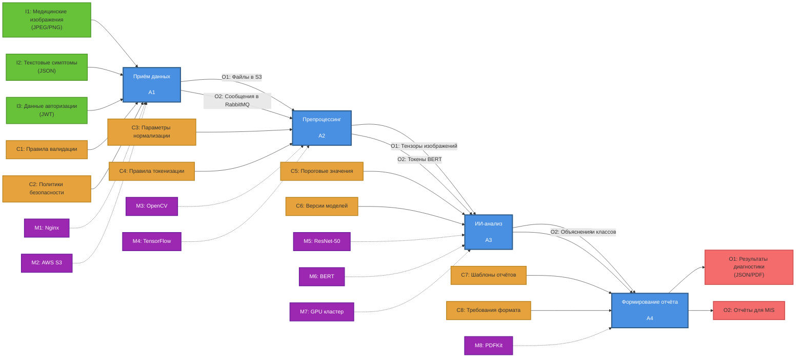

# 3.1.2. IDEF0 Диаграммы (Functional Modeling)

> **Примечание:** Для отображения Mermaid диаграмм установите `mdbook-mermaid`:
> ```bash
> cargo install mdbook-mermaid
> ```
> Затем раскомментируйте в `book.toml`:
> ```toml
> [preprocessor.mermaid]
> command = "mdbook-mermaid"
> ```

## Описание методологии

IDEF0 (Integration Definition for Function Modeling) — методология функционального моделирования, описывающая процессы в виде иерархии функций с входами, выходами, управлением и механизмами (ICOM).

### Структура IDEF0:
- **Блок функции** (Function Box) — прямоугольник с номером (A0, A1, A2...) в правом нижнем углу и названием функции
- **Входы (Inputs)** — стрелки слева, что преобразуется функцией (материалы, данные, информация)
- **Выходы (Outputs)** — стрелки справа, что производит функция (результаты работы)
- **Управление (Control)** — стрелки сверху, правила, стандарты, ограничения, которые управляют выполнением функции
- **Механизмы (Mechanisms)** — стрелки снизу, ресурсы, инструменты, системы, используемые для выполнения функции

**Правила оформления:**
- Каждая стрелка должна иметь подпись (название потока данных)
- Входы и выходы нумеруются (I1, I2... O1, O2...)
- Управление и механизмы также могут нумероваться (C1, C2... M1, M2...)
- При декомпозиции функции A0 получаются функции A1, A2, A3, A4 (или A01, A02, A03...)


```mermaid
flowchart TB
    subgraph Perspective["Т.зр.: Система"]
    end
    
    I1["I1: Медицинские изображения<br/>(JPEG/PNG)"] -->|Вход| A0["Диагностика заболеваний<br/><br/>A0"]
    I2["I2: Текстовые симптомы<br/>(JSON)"] -->|Вход| A0
    I3["I3: Данные авторизации<br/>(JWT)"] -->|Вход| A0
    
    C1["C1: Медицинские протоколы"] -->|Управление| A0
    C2["C2: Требования к точности<br/>(≥95%)"] -->|Управление| A0
    C3["C3: Стандарты безопасности<br/>(HIPAA)"] -->|Управление| A0
    
    A0 -->|Выход| O1["O1: Результаты диагностики<br/>(JSON/PDF)"]
    A0 -->|Выход| O2["O2: Отчёты для MIS"]
    
    A0 -.->|Механизм| M1["M1: ML Inference Service"]
    A0 -.->|Механизм| M2["M2: GPU кластер"]
    A0 -.->|Механизм| M3["M3: База данных"]
    
    style A0 fill:#4a90e2,stroke:#2e5c8a,stroke-width:4px,color:#fff
    style I1 fill:#67c23a,stroke:#4a9428,stroke-width:2px
    style I2 fill:#67c23a,stroke:#4a9428,stroke-width:2px
    style I3 fill:#67c23a,stroke:#4a9428,stroke-width:2px
    style O1 fill:#f56c6c,stroke:#c94545,stroke-width:2px
    style O2 fill:#f56c6c,stroke:#c94545,stroke-width:2px
    style C1 fill:#e6a23c,stroke:#b8821e,stroke-width:2px
    style C2 fill:#e6a23c,stroke:#b8821e,stroke-width:2px
    style C3 fill:#e6a23c,stroke:#b8821e,stroke-width:2px
    style M1 fill:#9c27b0,stroke:#6a1b9a,stroke-width:2px,color:#fff
    style M2 fill:#9c27b0,stroke:#6a1b9a,stroke-width:2px,color:#fff
    style M3 fill:#9c27b0,stroke:#6a1b9a,stroke-width:2px,color:#fff
```

> **Примечание:** Диаграмма показывает структуру IDEF0 с ICOM элементами. Входы (зелёные) слева, выходы (красные) справа, управление (оранжевые) сверху, механизмы (фиолетовые) снизу. См. [спецификации диаграмм](diagram-specifications.md) для деталей.

## A0: Диагностика заболеваний (Контекстная диаграмма)

@drawio{https://github.com/Edisheri/system-engineering-playbook/blob/main/diagrams-codes/IDEF0_A0.drawio}

**Назначение:** Высокоуровневое описание системы медицинской диагностики

**Входы (I):**
- Медицинские изображения (JPEG/PNG)
- Текстовые симптомы (JSON)

**Выходы (O):**
- Результаты диагностики (JSON/PDF)
- Отчёты для MIS

**Управление (C):**
- Медицинские протоколы
- Требования к точности (≥95%)
- Стандарты безопасности (HIPAA)

**Механизмы (M):**
- ML Inference Service
- GPU кластер
- База данных

## Декомпозиция A0 на 4 функции (A1-A4)

@drawio{https://github.com/Edisheri/system-engineering-playbook/blob/main/diagrams-codes/IDEF0_DECOMPOSITION.drawio}


```mermaid
flowchart LR
    I1["I1: Медицинские изображения<br/>(JPEG/PNG)"] --> A1["Приём данных<br/><br/>A1"]
    I2["I2: Текстовые симптомы<br/>(JSON)"] --> A1
    I3["I3: Данные авторизации<br/>(JWT)"] --> A1
    
    C1["C1: Правила валидации"] --> A1
    C2["C2: Политики безопасности"] --> A1
    
    A1 -->|O1: Файлы в S3| A2["Препроцессинг<br/><br/>A2"]
    A1 -->|O2: Сообщения в RabbitMQ| A2
    
    C3["C3: Параметры нормализации"] --> A2
    C4["C4: Правила токенизации"] --> A2
    
    A2 -->|O1: Тензоры изображений| A3["ИИ-анализ<br/><br/>A3"]
    A2 -->|O2: Токены BERT| A3
    
    C5["C5: Пороговые значения"] --> A3
    C6["C6: Версии моделей"] --> A3
    
    A3 -->|O1: Вероятности классов| A4["Формирование отчёта<br/><br/>A4"]
    A3 -->|O2: Объяснения| A4
    
    C7["C7: Шаблоны отчётов"] --> A4
    C8["C8: Требования формата"] --> A4
    
    A4 --> O1["O1: Результаты диагностики<br/>(JSON/PDF)"]
    A4 --> O2["O2: Отчёты для MIS"]
    
    M1["M1: Nginx"] -.-> A1
    M2["M2: AWS S3"] -.-> A1
    M3["M3: OpenCV"] -.-> A2
    M4["M4: TensorFlow"] -.-> A2
    M5["M5: ResNet-50"] -.-> A3
    M6["M6: BERT"] -.-> A3
    M7["M7: GPU кластер"] -.-> A3
    M8["M8: PDFKit"] -.-> A4
    
    style A1 fill:#4a90e2,stroke:#2e5c8a,stroke-width:3px,color:#fff
    style A2 fill:#4a90e2,stroke:#2e5c8a,stroke-width:3px,color:#fff
    style A3 fill:#4a90e2,stroke:#2e5c8a,stroke-width:3px,color:#fff
    style A4 fill:#4a90e2,stroke:#2e5c8a,stroke-width:3px,color:#fff
    style I1 fill:#67c23a,stroke:#4a9428,stroke-width:2px
    style I2 fill:#67c23a,stroke:#4a9428,stroke-width:2px
    style I3 fill:#67c23a,stroke:#4a9428,stroke-width:2px
    style O1 fill:#f56c6c,stroke:#c94545,stroke-width:2px
    style O2 fill:#f56c6c,stroke:#c94545,stroke-width:2px
    style C1 fill:#e6a23c,stroke:#b8821e,stroke-width:2px
    style C2 fill:#e6a23c,stroke:#b8821e,stroke-width:2px
    style C3 fill:#e6a23c,stroke:#b8821e,stroke-width:2px
    style C4 fill:#e6a23c,stroke:#b8821e,stroke-width:2px
    style C5 fill:#e6a23c,stroke:#b8821e,stroke-width:2px
    style C6 fill:#e6a23c,stroke:#b8821e,stroke-width:2px
    style C7 fill:#e6a23c,stroke:#b8821e,stroke-width:2px
    style C8 fill:#e6a23c,stroke:#b8821e,stroke-width:2px
    style M1 fill:#9c27b0,stroke:#6a1b9a,stroke-width:2px,color:#fff
    style M2 fill:#9c27b0,stroke:#6a1b9a,stroke-width:2px,color:#fff
    style M3 fill:#9c27b0,stroke:#6a1b9a,stroke-width:2px,color:#fff
    style M4 fill:#9c27b0,stroke:#6a1b9a,stroke-width:2px,color:#fff
    style M5 fill:#9c27b0,stroke:#6a1b9a,stroke-width:2px,color:#fff
    style M6 fill:#9c27b0,stroke:#6a1b9a,stroke-width:2px,color:#fff
    style M7 fill:#9c27b0,stroke:#6a1b9a,stroke-width:2px,color:#fff
    style M8 fill:#9c27b0,stroke:#6a1b9a,stroke-width:2px,color:#fff
```

## Декомпозиция A0 на 4 функции (A1-A4)

### A1: Приём данных

**Номер функции:** A1 (декомпозиция A0)

**Входы (I):**
- I1: HTTP POST запросы (multipart/form-data)
- I2: Медицинские изображения (JPEG/PNG, ≤10 МБ)
- I3: Текстовые симптомы (JSON)

**Выходы (O):**
- O1: Файлы в S3 (s3://medical-images-raw/{fileId})
- O2: Метаданные в PostgreSQL (таблица medical_data)
- O3: Сообщения в RabbitMQ (очередь medical_data)

**Управление (C):**
- C1: Правила валидации (размер, формат, MIME-тип)
- C2: Политики безопасности (JWT, rate limiting)
- C3: Ограничения размера файлов (10 МБ)

**Механизмы (M):**
- M1: Nginx (балансировка нагрузки, SSL termination)
- M2: AWS S3 (хранилище файлов)
- M3: Spring Boot API (DataUploadController)

---

### A2: Препроцессинг

**Номер функции:** A2 (декомпозиция A0)

**Входы (I):**
- I1: Сообщения из RabbitMQ (fileId, s3Url, fileType)
- I2: Файлы из S3 (бинарные данные)

**Выходы (O):**
- O1: Тензоры изображений (224x224x3, float32)
- O2: Токены BERT (input_ids, attention_mask, max_length=128)
- O3: Метаданные препроцессинга (размер, нормализация)

**Управление (C):**
- C1: Параметры нормализации (mean=[0.485, 0.456, 0.406], std=[0.229, 0.224, 0.225])
- C2: Правила токенизации (BERT vocab, max_length=128)
- C3: Правила изменения размера (resize до 224x224)

**Механизмы (M):**
- M1: OpenCV (декодирование, изменение размера изображений)
- M2: HuggingFace Tokenizer (токенизация текста)
- M3: NumPy/TensorFlow (преобразование в тензоры)

---

### A3: ИИ-анализ

**Номер функции:** A3 (декомпозиция A0)

**Входы (I):**
- I1: Тензоры изображений (224x224x3, batch dimension)
- I2: Токены BERT (input_ids, attention_mask)

**Выходы (O):**
- O1: Вероятности классов (softmax output, shape=[num_classes])
- O2: Топ-3 диагноза с вероятностями (JSON)
- O3: Объяснения (Grad-CAM heatmap для изображений, SHAP для текста)
- O4: Результаты в Redis (TTL=1h) и PostgreSQL

**Управление (C):**
- C1: Пороговые значения вероятности (threshold=0.1)
- C2: Версии моделей (ResNet-50 v1.0, BERT-base-uncased)
- C3: Параметры inference (batch_size=1, timeout=2s)

**Механизмы (M):**
- M1: ResNet-50 модель (TensorFlow Serving, GPU inference)
- M2: BERT модель (TensorFlow Serving, fine-tuned classification head)
- M3: GPU кластер (NVIDIA Tesla V100, CUDA 11.x)
- M4: TensorFlow Serving (gRPC API)

---

### A4: Формирование отчёта

**Номер функции:** A4 (декомпозиция A0)

**Входы (I):**
- I1: JSON-данные с результатами (диагнозы, вероятности, объяснения)
- I2: Метаданные пациента (user_id, timestamp)
- I3: Heatmap изображения (Grad-CAM, URL из S3)

**Выходы (O):**
- O1: PDF-отчёты (шаблон с логотипом, результатами, heatmap)
- O2: HTML-отчёты (веб-версия для пациента)
- O3: Данные для MIS (REST API, формат JSON/XML)
- O4: Уведомления (WebSocket для real-time обновлений)

**Управление (C):**
- C1: Шаблоны отчётов (PDF template, HTML template)
- C2: Требования к формату (PDF/A для архивации, JSON для API)
- C3: Политики конфиденциальности (HIPAA compliance)

**Механизмы (M):**
- M1: PDFKit (генерация PDF из HTML шаблона)
- M2: REST API Client (интеграция с Clinic MIS)
- M3: WebSocket Server (real-time уведомления)
- M4: Template Engine (Thymeleaf/Handlebars)

---

## Источники

- [IDEF0 для ПО](https://www.idef.com/idef0/)
- «Business Process Modeling» Laguna & Marklund

