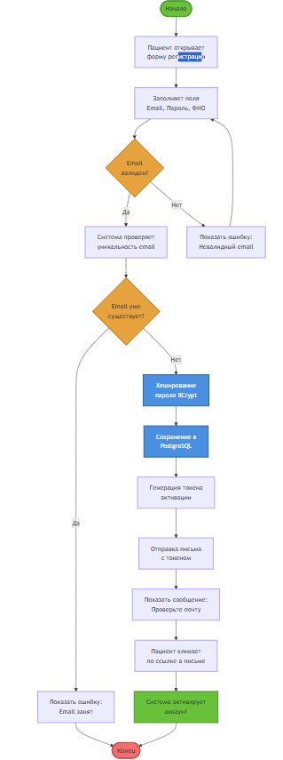

# IDEF3: Процесс P1 — Регистрация пациента

## Диаграмма процесса P1



## Описание процесса P1

### Участники
- **Пациент** — инициирует регистрацию
- **Web UI (React)** — отображает форму
- **Auth Service** — обрабатывает регистрацию
- **PostgreSQL** — хранит данные пользователей
- **Email Service** — отправляет письмо

### Временные связи

| Событие | Последующее событие | Условие | Задержка |
|---------|---------------------|---------|----------|
| E2 → E3 | Валидация успешна | Email корректен | 50 мс |
| E3 → E4 | Email уникален | Нет дубликатов | 100 мс |
| E4 → E5 | Пароль захеширован | BCrypt | 200 мс |
| E7 → E11 | Письмо доставлено | SMTP успех | 5-30 сек |
| E11 → E12 | Токен валиден | Не истёк | 100 мс |

### Точки синхронизации
- **После E3**: Обязательна проверка уникальности
- **После E7**: Асинхронное ожидание действия пользователя
- **После E11**: Проверка валидности токена

### UOB (Unit of Behavior)

**UOB-1: Валидация данных**
- Input: Email, Password
- Process: Regex validation
- Output: Валидированные данные или ошибка

**UOB-2: Проверка уникальности**
- Input: Email
- Process: SELECT FROM users WHERE email=?
- Output: Boolean (exists/not exists)

**UOB-3: Создание пользователя**
- Input: User data
- Process: Hash password, INSERT INTO users
- Output: User ID

**UOB-4: Отправка письма**
- Input: Email, Token
- Process: SMTP send
- Output: Message ID

### Временная диаграмма

```
t=0s    Начало регистрации
t=0.5s  Валидация email
t=0.6s  Проверка уникальности
t=0.8s  Хеширование пароля
t=1.0s  Сохранение в БД
t=1.1s  Генерация токена
t=1.2s  Отправка письма
t=5-30s Доставка письма (асинхронно)
...     Ожидание действия пользователя
t=X     Клик по ссылке
t=X+0.1s Активация аккаунта
t=X+0.2s Конец процесса
```

## Источники
- IDEF3 Process Description Capture Method
- Spring Security Documentation

