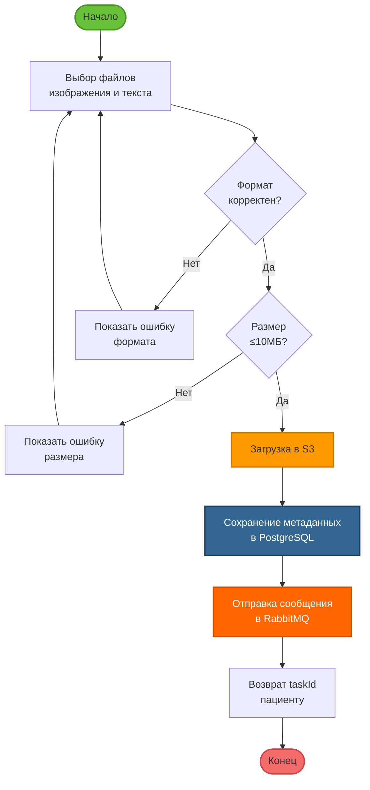

# IDEF3: Процесс P2 — Загрузка медицинских данных

## Диаграмма процесса P2

## Временные характеристики

| Этап | Среднее время | P95 |
|------|---------------|-----|
| Валидация формата | 10 мс | 25 мс |
| Загрузка в S3 (5MB) | 500 мс | 1200 мс |
| Сохранение метаданных | 50 мс | 120 мс |
| Отправка в RabbitMQ | 10 мс | 30 мс |
| **Итого** | **570 мс** | **1375 мс** |

