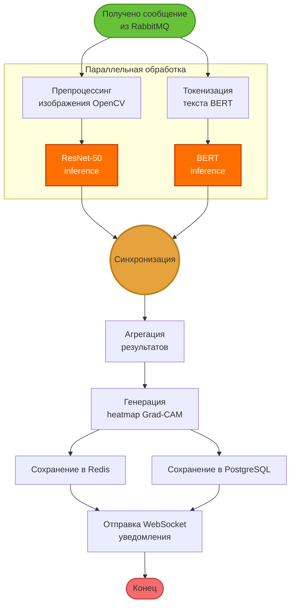

# IDEF3: Процесс P3 — GPU-обработка данных

## Диаграмма процесса P3

## Временные характеристики GPU

| Этап | GPU Time | CPU Time |
|------|----------|----------|
| ResNet-50 inference | 30 мс | 450 мс |
| BERT inference | 75 мс | 890 мс |
| Grad-CAM generation | 50 мс | N/A |
| **Параллельно** | **75 мс** | **890 мс** |

