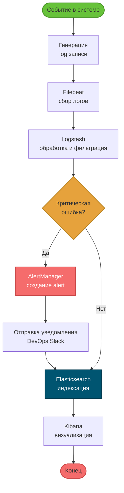

# IDEF3: Процесс P4 — Логирование и мониторинг

## Диаграмма процесса P4

```mermaid
graph TB
    Start([Событие в системе])
    
    E1[Генерация<br/>log записи]
    E2[Filebeat<br/>сбор логов]
    E3[Logstash<br/>обработка и фильтрация]
    E4[Elasticsearch<br/>индексация]
    
    J1{Критическая<br/>ошибка?}
    
    E5[AlertManager<br/>создание alert]
    E6[Отправка уведомления<br/>DevOps Slack]
    
    E7[Kibana<br/>визуализация]
    
    End([Конец])
    
    Start --> E1
    E1 --> E2
    E2 --> E3
    E3 --> J1
    
    J1 -->|Да| E5
    E5 --> E6
    E6 --> E4
    
    J1 -->|Нет| E4
    
    E4 --> E7
    E7 --> End
    
    style Start fill:#67c23a,stroke:#4a9428,stroke-width:2px
    style E4 fill:#005571,stroke:#00394d,stroke-width:2px,color:#fff
    style E5 fill:#f56c6c,stroke:#c94545,stroke-width:2px,color:#fff
    style J1 fill:#e6a23c,stroke:#b8821e,stroke-width:2px
    style End fill:#f56c6c,stroke:#c94545,stroke-width:2px
```

## Логирование происходит параллельно всем процессам!

