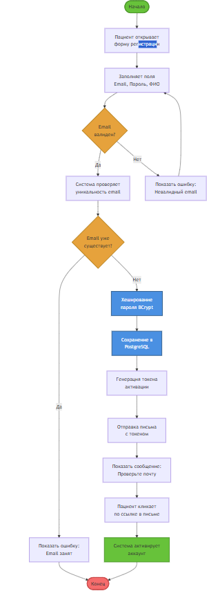

# 3.1.3. IDEF3 Диаграммы (Process Description)

## Описание методологии

IDEF3 (Process Description Capture Method) — методология описания процессов, фокусирующаяся на последовательности действий и временных связях между ними.

### Структура IDEF3:
- **UOB (Unit of Behavior)** — блоки процессов, описывающие действия
- **Связи (Links)** — временные связи между UOB:
  - **Последовательные (Precedence)** — один после другого
  - **Параллельные (Concurrent)** — одновременно
  - **Альтернативные (Exclusive OR)** — выбор одного из вариантов
- **Junction** — точки ветвления/слияния (AND, OR, XOR)
- **Референсы (Referents)** — ссылки на другие диаграммы или объекты

## Процессы системы (4 процесса: P1-P4)

### P1: Регистрация пациента

**Номер процесса:** P1

**UOB (Unit of Behavior):**
- **UOB-1:** Заполнение формы регистрации (Patient → Web UI)
- **UOB-2:** Валидация данных (Web UI → Auth Service)
- **UOB-3:** Проверка уникальности email (Auth Service → PostgreSQL)
- **UOB-4:** Создание пользователя (Auth Service → PostgreSQL)
- **UOB-5:** Генерация токена активации (Auth Service)
- **UOB-6:** Отправка письма (Auth Service → Email Service)
- **UOB-7:** Активация аккаунта (Patient → Auth Service)

**Временные связи:**
- UOB-1 → UOB-2 (последовательная связь)
- UOB-2 → UOB-3 (последовательная связь)
- UOB-3 → UOB-4 (последовательная связь, условие: email уникален)
- UOB-4 → UOB-5 (последовательная связь)
- UOB-5 → UOB-6 (последовательная связь)
- UOB-6 → UOB-7 (асинхронная связь, задержка 5-30 сек)

**Junction:**
- После UOB-3: XOR junction (если email существует → ошибка, иначе → UOB-4)

**Компоненты:**
- React (интерфейс)
- Keycloak (аутентификация)
- PostgreSQL (хранение данных)
- Email Service (SMTP)

---

### P2: Загрузка данных

**Номер процесса:** P2

**UOB (Unit of Behavior):**
- **UOB-1:** Выбор файлов (Patient → Web UI)
- **UOB-2:** Отправка POST запроса (Web UI → API Gateway)
- **UOB-3:** Валидация формата и размера (API Gateway)
- **UOB-4:** Сохранение в S3 (DataUploadController → AWS S3)
- **UOB-5:** Сохранение метаданных (DataUploadController → PostgreSQL)
- **UOB-6:** Отправка сообщения в очередь (DataUploadController → RabbitMQ)

**Временные связи:**
- UOB-1 → UOB-2 (последовательная связь)
- UOB-2 → UOB-3 (последовательная связь)
- UOB-3 → UOB-4 (последовательная связь, условие: валидация успешна)
- UOB-4 → UOB-5 (параллельная связь, AND junction)
- UOB-4 → UOB-6 (параллельная связь, AND junction)
- UOB-5 → UOB-6 (синхронизация перед отправкой в очередь)

**Junction:**
- После UOB-3: XOR junction (если валидация не прошла → ошибка, иначе → UOB-4)
- После UOB-4: AND junction (параллельное выполнение UOB-5 и UOB-6)

**Референсы:**
- Референс на P1: Регистрация обязательна для загрузки (precondition)

**Компоненты:**
- Nginx (балансировка)
- API Gateway (валидация)
- AWS S3 (хранение)
- RabbitMQ (очередь)
- PostgreSQL (метаданные)

---

### P3: GPU-обработка

**Номер процесса:** P3

**UOB (Unit of Behavior):**
- **UOB-1:** Получение сообщения из RabbitMQ (ML Service ← RabbitMQ)
- **UOB-2:** Загрузка файла из S3 (ML Service → AWS S3)
- **UOB-3:** Препроцессинг изображения (ImagePreprocessor)
- **UOB-4:** Препроцессинг текста (BERTTokenizer)
- **UOB-5:** Inference ResNet-50 (TensorFlow Serving → GPU)
- **UOB-6:** Inference BERT (TensorFlow Serving → GPU)
- **UOB-7:** Агрегация результатов (ML Service)
- **UOB-8:** Сохранение в Redis (ML Service → Redis)
- **UOB-9:** Сохранение в PostgreSQL (ML Service → PostgreSQL)

**Временные связи:**
- UOB-1 → UOB-2 (последовательная связь)
- UOB-2 → UOB-3 (последовательная связь, для изображений)
- UOB-2 → UOB-4 (последовательная связь, для текста)
- UOB-3 → UOB-5 (последовательная связь)
- UOB-4 → UOB-6 (последовательная связь)
- UOB-5 → UOB-7 (параллельная связь, AND junction)
- UOB-6 → UOB-7 (параллельная связь, AND junction)
- UOB-7 → UOB-8 (параллельная связь, AND junction)
- UOB-7 → UOB-9 (параллельная связь, AND junction)

**Junction:**
- После UOB-2: OR junction (разветвление на обработку изображений и текста)
- После UOB-5 и UOB-6: AND junction (синхронизация перед агрегацией)
- После UOB-7: AND junction (параллельное сохранение в Redis и PostgreSQL)

**Референсы:**
- Референс на P2: Данные обрабатываются после валидации (precondition)

**Компоненты:**
- TensorFlow Serving (inference)
- GPU кластер (вычисления)
- Redis (кэш)
- PostgreSQL (постоянное хранилище)
- AWS S3 (источник данных)

---

### P4: Логирование и мониторинг

**Номер процесса:** P4

**UOB (Unit of Behavior):**
- **UOB-1:** Генерация логов (все сервисы)
- **UOB-2:** Сбор логов (Filebeat → сервисы)
- **UOB-3:** Обработка и фильтрация (Logstash)
- **UOB-4:** Индексация данных (Logstash → Elasticsearch)
- **UOB-5:** Визуализация метрик (Kibana → Elasticsearch)
- **UOB-6:** Генерация алертов (Kibana → DevOps)

**Временные связи:**
- UOB-1 → UOB-2 (непрерывная связь, real-time)
- UOB-2 → UOB-3 (последовательная связь)
- UOB-3 → UOB-4 (последовательная связь)
- UOB-4 → UOB-5 (параллельная связь, AND junction)
- UOB-4 → UOB-6 (параллельная связь, AND junction, условие: критическая ошибка)

**Junction:**
- После UOB-4: AND junction (параллельная визуализация и генерация алертов)
- После UOB-5: OR junction (алерты генерируются только при критических ошибках)

**Референсы:**
- Референс на P1, P2, P3: Непрерывное выполнение параллельно всем процессам (concurrent process)

**Компоненты:**
- Filebeat (сбор логов)
- Logstash (обработка)
- Elasticsearch (хранение)
- Kibana (визуализация)

---

## Особенности временных связей между процессами

- **Последовательность:** P1 → P2 → P3 (основной flow, precedence links)
- **Параллельность:** P4 выполняется независимо (concurrent process)
- **Синхронизация:** Результаты P3 доступны только после завершения обработки (AND junction)
- **Условия:** XOR junction для обработки ошибок и альтернативных путей

