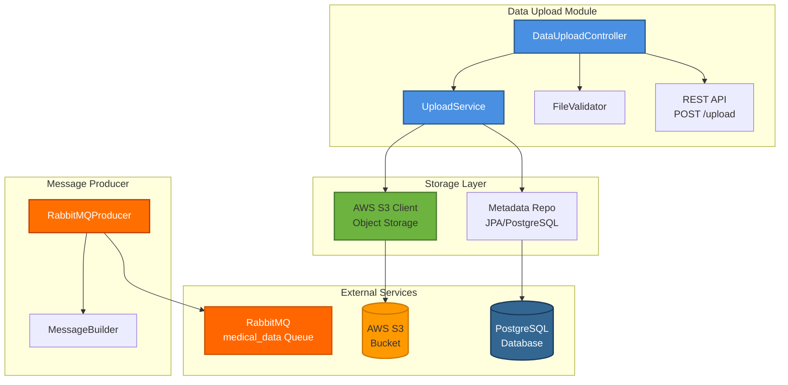

# UML Диаграммы: Загрузка данных

## Функция 2: Загрузка медицинских данных

### 1. Use Case Diagram (Диаграмма вариантов использования)

**Актёры:**
- **Пациент** (Patient)
- **Система хранения** (Storage System)

**Варианты использования:**
1. **Загрузка изображений**
   - Первичный актёр: Пациент
   - Предусловия: Пациент аутентифицирован
   - Постусловия: Изображение сохранено в S3
   
2. **Загрузка описания симптомов**
   - Первичный актёр: Пациент
   - Предусловия: Пациент аутентифицирован
   - Постусловия: Текст сохранён, отправлен в очередь
   
3. **Валидация файлов**
   - Первичный актёр: Система
   - Связь: `<<include>>` для обоих сценариев загрузки

**Связи:**
- `<<include>>`: Загрузка включает валидацию
- `<<extend>>`: Предпросмотр расширяет загрузку изображения

---

### 2. Activity Diagram (Диаграмма активностей)

**Параллельные активности:**
- Fork: Разделение на параллельные потоки
- Join: Синхронизация потоков

---

### 3. Sequence Diagram (Диаграмма последовательности)

**Участники:**
- Patient (Пациент)
- WebUI (React)
- APIGateway (Spring Cloud)
- DataUploadController
- FileValidator
- S3Client
- PostgreSQL
- RabbitMQ

---

### 4. Class Diagram (Диаграмма классов)

---

### 5. State Diagram (Диаграмма состояний)

**Объект:** File Upload

**Состояния:**
1. **Validating:** Проверка формата и размера
2. **Uploading:** Загрузка в S3
3. **Uploaded:** Файл сохранён в S3
4. **InQueue:** Сообщение в RabbitMQ
5. **Processing:** ML Service обрабатывает
6. **Completed:** Обработка завершена
7. **Failed:** Ошибка на любом этапе
8. **Archived:** Перемещён в долгосрочное хранилище

---

### 6. Component Diagram (Диаграмма компонентов)

**Внешние зависимости:**
- AWS SDK (S3 Client)
- Spring AMQP (RabbitMQ)
- Spring Data JPA (PostgreSQL)

---

## Источники

- «Clean Architecture» Robert Martin
- [AWS S3 Best Practices](https://docs.aws.amazon.com/AmazonS3/latest/userguide/best-practices.html)
- [RabbitMQ Patterns](https://www.rabbitmq.com/getstarted.html)

