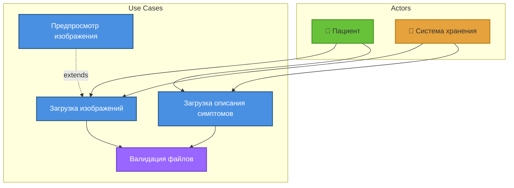

# UML Диаграммы: Загрузка данных

## Функция 2: Загрузка медицинских данных

### 1. Use Case Diagram (Диаграмма вариантов использования)



**Актёры:**
- **Пациент** (Patient)
- **Система хранения** (Storage System)

**Варианты использования:**
1. **Загрузка изображений**
   - Первичный актёр: Пациент
   - Предусловия: Пациент аутентифицирован
   - Постусловия: Изображение сохранено в S3
   
2. **Загрузка описания симптомов**
   - Первичный актёр: Пациент
   - Предусловия: Пациент аутентифицирован
   - Постусловия: Текст сохранён, отправлен в очередь
   
3. **Валидация файлов**
   - Первичный актёр: Система
   - Связь: `<<include>>` для обоих сценариев загрузки

**Связи:**
- `<<include>>`: Загрузка включает валидацию
- `<<extend>>`: Предпросмотр расширяет загрузку изображения

---

### 2. Activity Diagram (Диаграмма активностей)

```
[Начало]
    ↓
[Пациент выбирает файл]
    ↓
<Тип данных?> ◇
    ├─ Изображение → [Validate image format]
    └─ Текст → [Validate JSON structure]
    ↓
<Формат корректен?> ◇
    ├─ Нет → [Показать ошибку формата] → [Конец]
    └─ Да ↓
[Проверка размера файла]
    ↓
<Размер ≤ 10 МБ?> ◇
    ├─ Нет → [Показать ошибку размера] → [Конец]
    └─ Да ↓
[Генерация уникального ID]
    ↓
════════════════════════════════════════
    ║ Параллельное выполнение ║
════════════════════════════════════════
    ║                          ║
    ║ [Сохранение в S3]        ║ [Сохранение метаданных в PostgreSQL]
    ║         ↓                ║          ↓
    ║ [Генерация URL]          ║ [Запись: user_id, file_id, timestamp]
    ║                          ║
════════════════════════════════════════
    ↓ Синхронизация
[Создание сообщения для RabbitMQ]
    ↓
[Отправка в очередь medical_data]
    ↓
[Возврат task_id пациенту]
    ↓
[Конец]
```

**Параллельные активности:**
- Fork: Разделение на параллельные потоки
- Join: Синхронизация потоков

---

### 3. Sequence Diagram (Диаграмма последовательности)

**Участники:**
- Patient (Пациент)
- WebUI (React)
- APIGateway (Spring Cloud)
- DataUploadController
- FileValidator
- S3Client
- PostgreSQL
- RabbitMQ

```
Patient  WebUI  APIGateway  DataUploadController  FileValidator  S3Client  PostgreSQL  RabbitMQ
  |        |         |              |                   |          |           |          |
  |--Select file---->|              |                   |          |           |          |
  |        |         |              |                   |          |           |          |
  |        |--POST /upload--------->|                   |          |           |          |
  |        |  (multipart/form-data) |                   |          |           |          |
  |        |         |              |                   |          |           |          |
  |        |         |              |---validate(file)------------>|           |          |
  |        |         |              |                   |          |           |          |
  |        |         |              |                   |--checkFormat()       |          |
  |        |         |              |                   |<--OK----|           |          |
  |        |         |              |                   |          |           |          |
  |        |         |              |                   |--checkSize()         |          |
  |        |         |              |                   |<--OK----|           |          |
  |        |         |              |<---ValidationResult|          |           |          |
  |        |         |              |                   |          |           |          |
  |        |         |     [Generate unique fileId]     |          |           |          |
  |        |         |              |                   |          |           |          |
  |        |         |              |---upload(file, fileId)------>|           |          |
  |        |         |              |                   |          |--PUT---->|          |
  |        |         |              |                   |          |<--OK-----|          |
  |        |         |              |<---S3 URL---------|          |           |          |
  |        |         |              |                   |          |           |          |
  |        |         |              |---saveMetadata(fileId, url)------------>|          |
  |        |         |              |                   |          |  INSERT  |          |
  |        |         |              |<---OK-------------|          |<---------|          |
  |        |         |              |                   |          |           |          |
  |        |         |              |---sendMessage(fileId, url)----------------------->|
  |        |         |              |                   |          |           |  AMQP   |
  |        |         |              |<---OK-------------|          |           |---------|
  |        |         |              |                   |          |           |          |
  |        |         |<---202 Accepted------------------|          |           |          |
  |        |         |   {taskId: "abc123"}             |          |           |          |
  |<-------|         |              |                   |          |           |          |
  |        |         |              |                   |          |           |          |
[Display: "Processing..."]         |                   |          |           |          |
```

---

### 4. Class Diagram (Диаграмма классов)

```
┌─────────────────────────────────┐
│   DataUploadController          │
├─────────────────────────────────┤
│ - uploadService: UploadService  │
│ - validator: FileValidator      │
├─────────────────────────────────┤
│ + uploadFile(file): Response    │
│ + getUploadStatus(id): Status   │
└─────────────────────────────────┘
           │ uses
           ↓
┌─────────────────────────────────┐         ┌─────────────────────────────┐
│      UploadService              │────────>│     FileValidator           │
├─────────────────────────────────┤         ├─────────────────────────────┤
│ - s3Client: S3Client            │         │ - allowedFormats: List      │
│ - metadataRepo: MetadataRepo    │         │ - maxSize: Long             │
│ - messageProducer: RabbitMQ     │         ├─────────────────────────────┤
├─────────────────────────────────┤         │ + validateFormat(file): bool│
│ + processUpload(file): TaskId   │         │ + validateSize(file): bool  │
│ + saveFile(file): String        │         │ + validate(file): Result    │
│ + saveMetadata(data): void      │         └─────────────────────────────┘
│ + sendToQueue(message): void    │
└─────────────────────────────────┘
           │
           │ uses
           ↓
┌─────────────────────────────────┐
│       S3Client                  │
├─────────────────────────────────┤
│ - bucket: String                │
│ - region: String                │
│ - credentials: AWSCredentials   │
├─────────────────────────────────┤
│ + upload(file, key): URL        │
│ + generatePresignedUrl(key): URL│
│ + deleteFile(key): void         │
└─────────────────────────────────┘

┌─────────────────────────────────┐
│     FileMetadata                │
├─────────────────────────────────┤
│ - id: UUID                      │
│ - userId: Long                  │
│ - fileName: String              │
│ - fileType: FileType            │
│ - s3Url: String                 │
│ - fileSize: Long                │
│ - uploadedAt: Timestamp         │
│ - status: UploadStatus          │
├─────────────────────────────────┤
│ + getId(): UUID                 │
│ + getS3Url(): String            │
│ + updateStatus(status): void    │
└─────────────────────────────────┘
           △
           │ persists
           │
┌─────────────────────────────────┐
│   MetadataRepository            │
├─────────────────────────────────┤
│ <<interface>>                   │
├─────────────────────────────────┤
│ + save(metadata): FileMetadata  │
│ + findById(id): FileMetadata    │
│ + findByUserId(userId): List    │
└─────────────────────────────────┘

┌─────────────────────────────────┐
│   RabbitMQProducer              │
├─────────────────────────────────┤
│ - template: RabbitTemplate      │
│ - exchange: String              │
│ - routingKey: String            │
├─────────────────────────────────┤
│ + send(message): void           │
│ + sendWithRetry(message): void  │
└─────────────────────────────────┘

┌─────────────────────────────────┐
│   <<enumeration>>               │
│      FileType                   │
├─────────────────────────────────┤
│ IMAGE_JPEG                      │
│ IMAGE_PNG                       │
│ TEXT_JSON                       │
└─────────────────────────────────┘

┌─────────────────────────────────┐
│   <<enumeration>>               │
│    UploadStatus                 │
├─────────────────────────────────┤
│ UPLOADING                       │
│ UPLOADED                        │
│ PROCESSING                      │
│ COMPLETED                       │
│ FAILED                          │
└─────────────────────────────────┘
```

---

### 5. State Diagram (Диаграмма состояний)

**Объект:** File Upload

```
             [User uploads file]
                     ↓
               ┌──────────┐
         ●────>│ Validating│
               │(Валидация)│
               └──────────┘
                     │
                     │ validation passed
                     ↓
               ┌──────────┐
               │ Uploading│
               │(Загрузка)│
               └──────────┘
                     │
                ┌────┼────┐
                │    │    │
     error      │    │    │ success
         ┌──────┘    │    └──────┐
         │           │           │
         ↓           ↓           ↓
   ┌──────────┐ ┌──────────┐ ┌──────────┐
   │  Failed  │ │ Uploaded │ │ InQueue  │
   │(Ошибка)  │ │(Загружен)│ │(В очереди)│
   └──────────┘ └──────────┘ └──────────┘
         │           │           │
         │ retry     │           │ message consumed
         └───────────┘           ↓
                           ┌──────────┐
                           │Processing│
                           │(Обработка)│
                           └──────────┘
                                 │
                            ┌────┼────┐
                            │    │    │
                  error     │    │    │ success
                      ┌─────┘    │    └─────┐
                      │          │          │
                      ↓          ↓          ↓
                ┌──────────┐ ┌──────────┐ ┌──────────┐
                │ Failed   │ │Completed │ │ Archived │
                │(Ошибка)  │ │(Готово)  │ │(Архив)   │
                └──────────┘ └──────────┘ └──────────┘
                      │          │ after 30 days│
                      │          └──────────────┘
                      │ admin deletes
                      ↓
                      ●
```

**Состояния:**
1. **Validating:** Проверка формата и размера
2. **Uploading:** Загрузка в S3
3. **Uploaded:** Файл сохранён в S3
4. **InQueue:** Сообщение в RabbitMQ
5. **Processing:** ML Service обрабатывает
6. **Completed:** Обработка завершена
7. **Failed:** Ошибка на любом этапе
8. **Archived:** Перемещён в долгосрочное хранилище

---

### 6. Component Diagram (Диаграмма компонентов)

```
┌─────────────────────────────────────────────────────────────┐
│              Data Upload Module                             │
│                                                             │
│  ┌──────────────────────┐         ┌──────────────────┐     │
│  │                      │         │                  │     │
│  │ DataUploadController │────────>│  UploadService   │     │
│  │                      │ <<uses>>│                  │     │
│  └──────────────────────┘         └──────────────────┘     │
│           │                                │                │
│           │ exposes                        │ uses           │
│           ↓                                ↓                │
│  ┌──────────────────┐           ┌──────────────────┐       │
│  │   REST API       │           │  FileValidator   │       │
│  │  POST /upload    │           └──────────────────┘       │
│  └──────────────────┘                                       │
└─────────────────────────────────────────────────────────────┘
                    │                        │
                    │ uses                   │ uses
                    ↓                        ↓
     ┌────────────────────────┐   ┌─────────────────────┐
     │                        │   │                     │
     │   AWS S3 Client        │   │  Metadata Repo      │
     │   (Object Storage)     │   │  (JPA/PostgreSQL)   │
     │                        │   │                     │
     └────────────────────────┘   └─────────────────────┘
                    │                        │
                    ↓                        ↓
          ┌──────────────────┐    ┌──────────────────┐
          │    AWS S3        │    │   PostgreSQL     │
          │   (Bucket)       │    │   (Database)     │
          └──────────────────┘    └──────────────────┘

┌─────────────────────────────────────────────────────────────┐
│              Message Producer                               │
│                                                             │
│  ┌──────────────────────┐         ┌──────────────────┐     │
│  │                      │         │                  │     │
│  │  RabbitMQProducer    │────────>│  MessageBuilder  │     │
│  │                      │ <<uses>>│                  │     │
│  └──────────────────────┘         └──────────────────┘     │
│           │                                                 │
│           │ publishes                                       │
│           ↓                                                 │
│  ┌──────────────────┐                                       │
│  │   RabbitMQ       │                                       │
│  │ medical_data     │                                       │
│  │   (Queue)        │                                       │
│  └──────────────────┘                                       │
└─────────────────────────────────────────────────────────────┘
```

**Внешние зависимости:**
- AWS SDK (S3 Client)
- Spring AMQP (RabbitMQ)
- Spring Data JPA (PostgreSQL)

---

## Источники

- «Clean Architecture» Robert Martin
- [AWS S3 Best Practices](https://docs.aws.amazon.com/AmazonS3/latest/userguide/best-practices.html)
- [RabbitMQ Patterns](https://www.rabbitmq.com/getstarted.html)

