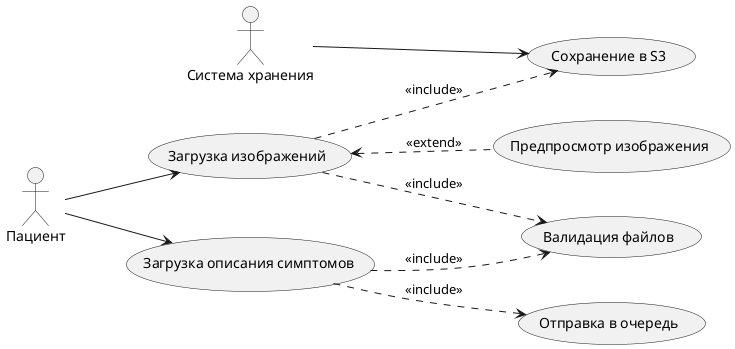
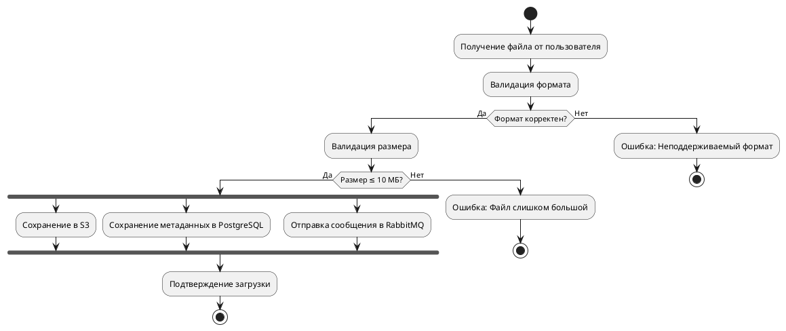
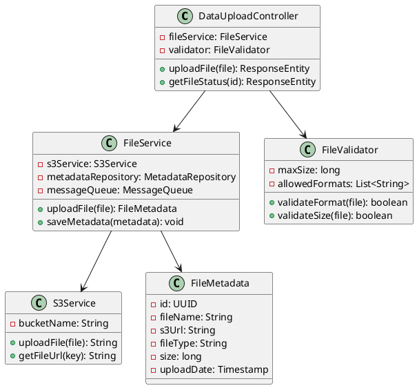
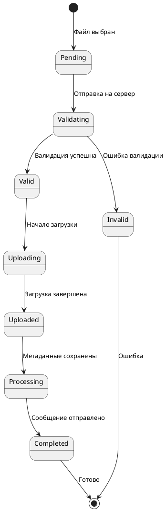
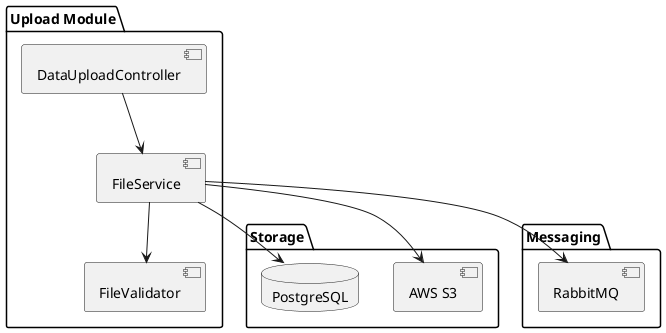

# UML Диаграммы: Загрузка данных

## Функция 2: Загрузка медицинских данных

### 1. Use Case Diagram (Диаграмма вариантов использования)

```plantuml
@startuml
left to right direction

:Пациент: --> (Загрузка изображений)
:Пациент: --> (Загрузка описания симптомов)
:Система хранения: --> (Сохранение в S3)

(Загрузка изображений) ..> (Валидация файлов): <<include>>
(Загрузка описания симптомов) ..> (Валидация файлов): <<include>>
(Загрузка изображений) <.. (Предпросмотр изображения): <<extend>>
(Загрузка изображений) ..> (Сохранение в S3): <<include>>
(Загрузка описания симптомов) ..> (Отправка в очередь): <<include>>
@enduml
```

**Актёры:**
- **Пациент** (Patient)
- **Система хранения** (Storage System)

**Варианты использования:**
1. **Загрузка изображений**
   - Первичный актёр: Пациент
   - Предусловия: Пациент аутентифицирован
   - Постусловия: Изображение сохранено в S3
   
2. **Загрузка описания симптомов**
   - Первичный актёр: Пациент
   - Предусловия: Пациент аутентифицирован
   - Постусловия: Текст сохранён, отправлен в очередь
   
3. **Валидация файлов**
   - Первичный актёр: Система
   - Связь: `<<include>>` для обоих сценариев загрузки

**Связи:**
- `<<include>>`: Загрузка включает валидацию
- `<<extend>>`: Предпросмотр расширяет загрузку изображения

---

### 2. Activity Diagram (Диаграмма активностей)

```plantuml
@startuml
start

:Получение файла от пользователя;

:Валидация формата;

if (Формат корректен?) then (Да)
  :Валидация размера;
  
  if (Размер ≤ 10 МБ?) then (Да)
    fork
      :Сохранение в S3;
    fork again
      :Сохранение метаданных в PostgreSQL;
    fork again
      :Отправка сообщения в RabbitMQ;
    end fork
    
    :Подтверждение загрузки;
    stop
  else (Нет)
    :Ошибка: Файл слишком большой;
    stop
  endif
  
else (Нет)
  :Ошибка: Неподдерживаемый формат;
  stop
endif
@enduml
```

**Параллельные активности:**
- Fork: Разделение на параллельные потоки
- Join: Синхронизация потоков

---

### 3. Sequence Diagram (Диаграмма последовательности)

**Участники:**
- Patient (Пациент)
- WebUI (React)
- APIGateway (Spring Cloud)
- DataUploadController
- FileValidator
- S3Client
- PostgreSQL
- RabbitMQ

```plantuml
@startuml
actor Пациент
participant "WebUI
(React)" as WebUI
participant "APIGateway" as Gateway
participant "DataUploadController" as Controller
participant "FileValidator" as Validator
participant "S3Service" as S3
participant "MessageQueue" as Queue
database "PostgreSQL" as DB

Пациент -> WebUI: Выбор файла
activate WebUI

WebUI -> Gateway: POST /api/upload (multipart)
activate Gateway
Gateway -> Controller: uploadFile()
activate Controller

Controller -> Validator: validateFormat()
activate Validator
Validator -> Validator: Проверка MIME-типа
Validator -> Validator: Проверка расширения
Validator --> Controller: FormatOK
deactivate Validator

Controller -> Validator: validateSize()
activate Validator
Validator -> Validator: Проверка размера (≤10 МБ)
Validator --> Controller: SizeOK
deactivate Validator

alt Валидация успешна
    par Параллельная загрузка
        Controller -> S3: uploadFile(file)
        activate S3
        S3 -> S3: Генерация ключа
        S3 -> S3: Загрузка в bucket
        S3 --> Controller: s3Url
        deactivate S3
    and
        Controller -> Controller: Генерация fileId
    end
    
    Controller -> DB: saveMetadata()
    activate DB
    DB -> DB: INSERT INTO medical_data
    DB --> Controller: Saved
    deactivate DB
    
    Controller -> Queue: sendMessage(fileId)
    activate Queue
    Queue -> Queue: Формирование JSON
    Queue --> Controller: MessageSent
    deactivate Queue
    
    Controller --> Gateway: UploadSuccess
    deactivate Controller
    Gateway --> WebUI: 200 OK
    deactivate Gateway
    WebUI --> Пациент: Файл загружен
else Валидация не прошла
    Controller --> Gateway: 400 Bad Request
    deactivate Controller
    Gateway --> WebUI: 400 Bad Request
    deactivate Gateway
    WebUI --> Пациент: Ошибка валидации
end

deactivate WebUI
@enduml
```

---

### 4. Class Diagram (Диаграмма классов)

```plantuml
@startuml
class DataUploadController {
  -fileService: FileService
  -validator: FileValidator
  +uploadFile(file): ResponseEntity
  +getFileStatus(id): ResponseEntity
}

class FileService {
  -s3Service: S3Service
  -metadataRepository: MetadataRepository
  -messageQueue: MessageQueue
  +uploadFile(file): FileMetadata
  +saveMetadata(metadata): void
}

class FileValidator {
  -maxSize: long
  -allowedFormats: List<String>
  +validateFormat(file): boolean
  +validateSize(file): boolean
}

class S3Service {
  -bucketName: String
  +uploadFile(file): String
  +getFileUrl(key): String
}

class FileMetadata {
  -id: UUID
  -fileName: String
  -s3Url: String
  -fileType: String
  -size: long
  -uploadDate: Timestamp
}

DataUploadController --> FileService
DataUploadController --> FileValidator
FileService --> S3Service
FileService --> FileMetadata
@enduml
```

---

### 5. State Diagram (Диаграмма состояний)

**Объект:** File Upload

```plantuml
@startuml
[*] --> Pending: Файл выбран
Pending --> Validating: Отправка на сервер
Validating --> Valid: Валидация успешна
Validating --> Invalid: Ошибка валидации
Invalid --> [*]: Ошибка
Valid --> Uploading: Начало загрузки
Uploading --> Uploaded: Загрузка завершена
Uploaded --> Processing: Метаданные сохранены
Processing --> Completed: Сообщение отправлено
Completed --> [*]: Готово
@enduml
```

**Состояния:**
1. **Validating:** Проверка формата и размера
2. **Uploading:** Загрузка в S3
3. **Uploaded:** Файл сохранён в S3
4. **InQueue:** Сообщение в RabbitMQ
5. **Processing:** ML Service обрабатывает
6. **Completed:** Обработка завершена
7. **Failed:** Ошибка на любом этапе
8. **Archived:** Перемещён в долгосрочное хранилище

---

### 6. Component Diagram (Диаграмма компонентов)

```plantuml
@startuml
package "Upload Module" {
  [DataUploadController] as Controller
  [FileService] as Service
  [FileValidator] as Validator
}

package "Storage" {
  [AWS S3] as S3
  database "PostgreSQL" as DB
}

package "Messaging" {
  [RabbitMQ] as Queue
}

Controller --> Service
Service --> Validator
Service --> S3
Service --> DB
Service --> Queue
@enduml
```

**Внешние зависимости:**
- AWS SDK (S3 Client)
- Spring AMQP (RabbitMQ)
- Spring Data JPA (PostgreSQL)

---

## Источники

- «Clean Architecture» Robert Martin
- [AWS S3 Best Practices](https://docs.aws.amazon.com/AmazonS3/latest/userguide/best-practices.html)
- [RabbitMQ Patterns](https://www.rabbitmq.com/getstarted.html)

