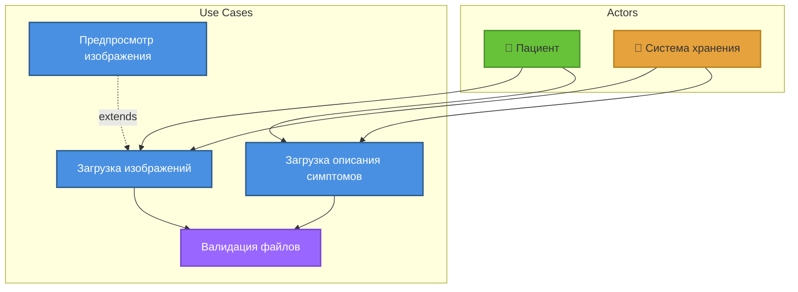
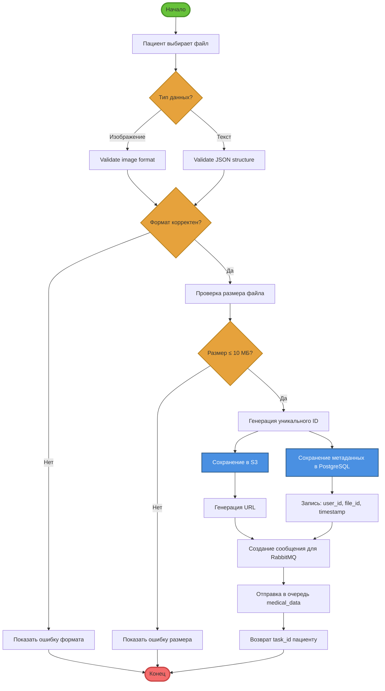
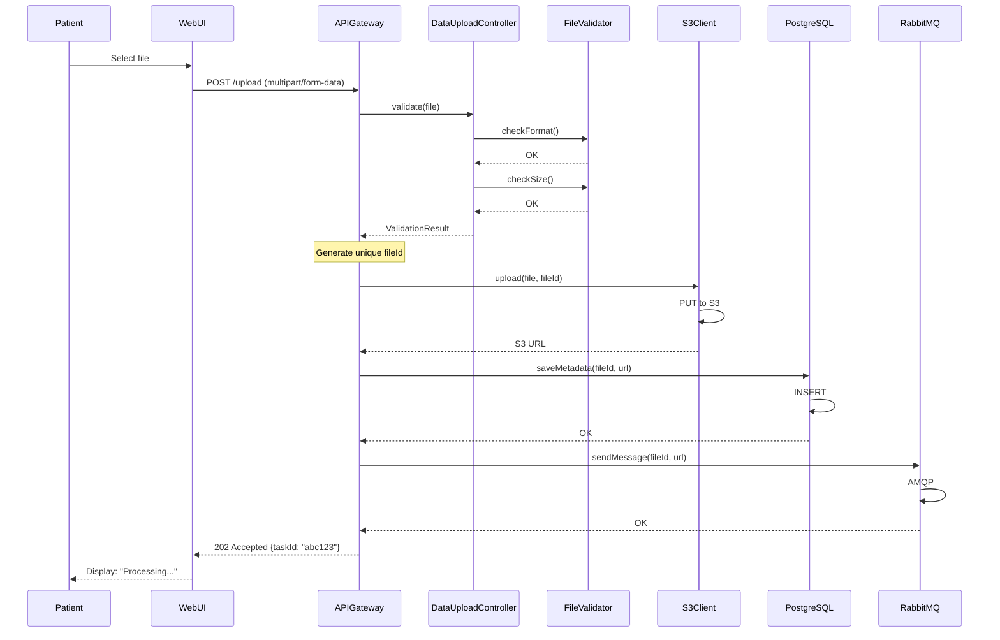
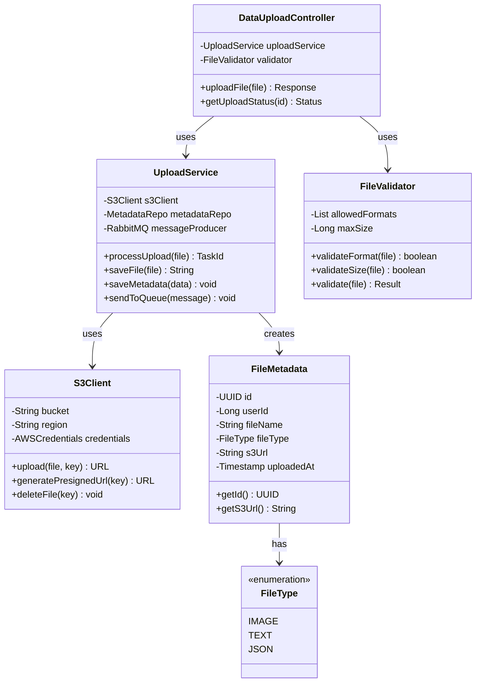
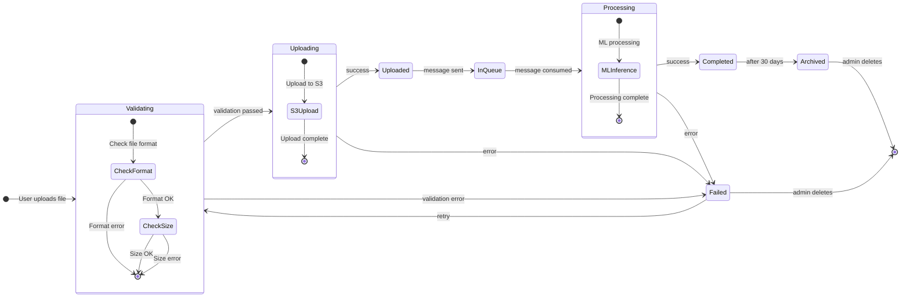
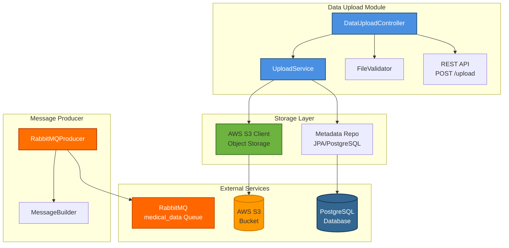

# UML Диаграммы: Загрузка данных

## Функция 2: Загрузка медицинских данных

### 1. Use Case Diagram (Диаграмма вариантов использования)

```mermaid
graph TB
    subgraph "Actors"
        Patient[👤 Пациент]
        StorageSystem[💾 Система хранения]
    end
    
    subgraph "Use Cases"
        UploadImage[Загрузка изображений]
        UploadSymptoms[Загрузка описания симптомов]
        ValidateFiles[Валидация файлов]
        PreviewImage[Предпросмотр изображения]
    end
    
    Patient --> UploadImage
    Patient --> UploadSymptoms
    UploadImage --> ValidateFiles
    UploadSymptoms --> ValidateFiles
    PreviewImage -.->|extends| UploadImage
    StorageSystem --> UploadImage
    StorageSystem --> UploadSymptoms
    
    style Patient fill:#67c23a,stroke:#4a9428,stroke-width:2px
    style StorageSystem fill:#e6a23c,stroke:#b8821e,stroke-width:2px
    style UploadImage fill:#4a90e2,stroke:#2e5c8a,stroke-width:2px,color:#fff
    style UploadSymptoms fill:#4a90e2,stroke:#2e5c8a,stroke-width:2px,color:#fff
    style ValidateFiles fill:#9966ff,stroke:#7744cc,stroke-width:2px,color:#fff
    style PreviewImage fill:#4a90e2,stroke:#2e5c8a,stroke-width:2px,color:#fff
```

**Актёры:**
- **Пациент** (Patient)
- **Система хранения** (Storage System)

**Варианты использования:**
1. **Загрузка изображений**
   - Первичный актёр: Пациент
   - Предусловия: Пациент аутентифицирован
   - Постусловия: Изображение сохранено в S3
   
2. **Загрузка описания симптомов**
   - Первичный актёр: Пациент
   - Предусловия: Пациент аутентифицирован
   - Постусловия: Текст сохранён, отправлен в очередь
   
3. **Валидация файлов**
   - Первичный актёр: Система
   - Связь: `<<include>>` для обоих сценариев загрузки

**Связи:**
- `<<include>>`: Загрузка включает валидацию
- `<<extend>>`: Предпросмотр расширяет загрузку изображения

---

### 2. Activity Diagram (Диаграмма активностей)

```mermaid
flowchart TD
    Start([Начало])
    
    A[Пациент выбирает файл]
    B{Тип данных?}
    C[Validate image format]
    D[Validate JSON structure]
    E{Формат корректен?}
    F[Показать ошибку формата]
    G[Проверка размера файла]
    H{Размер ≤ 10 МБ?}
    I[Показать ошибку размера]
    J[Генерация уникального ID]
    
    K[Сохранение в S3]
    L[Сохранение метаданных в PostgreSQL]
    M[Генерация URL]
    N[Запись: user_id, file_id, timestamp]
    
    O[Создание сообщения для RabbitMQ]
    P[Отправка в очередь medical_data]
    Q[Возврат task_id пациенту]
    End([Конец])
    
    Start --> A
    A --> B
    B -->|Изображение| C
    B -->|Текст| D
    C --> E
    D --> E
    E -->|Нет| F
    F --> End
    E -->|Да| G
    G --> H
    H -->|Нет| I
    I --> End
    H -->|Да| J
    
    J --> K
    J --> L
    K --> M
    L --> N
    
    M --> O
    N --> O
    O --> P
    P --> Q
    Q --> End
    
    style Start fill:#67c23a,stroke:#4a9428,stroke-width:3px
    style End fill:#f56c6c,stroke:#c94545,stroke-width:3px
    style B fill:#e6a23c,stroke:#b8821e,stroke-width:2px
    style E fill:#e6a23c,stroke:#b8821e,stroke-width:2px
    style H fill:#e6a23c,stroke:#b8821e,stroke-width:2px
    style K fill:#4a90e2,stroke:#2e5c8a,stroke-width:2px,color:#fff
    style L fill:#4a90e2,stroke:#2e5c8a,stroke-width:2px,color:#fff
```

**Параллельные активности:**
- Fork: Разделение на параллельные потоки
- Join: Синхронизация потоков

---

### 3. Sequence Diagram (Диаграмма последовательности)

**Участники:**
- Patient (Пациент)
- WebUI (React)
- APIGateway (Spring Cloud)
- DataUploadController
- FileValidator
- S3Client
- PostgreSQL
- RabbitMQ

```mermaid
sequenceDiagram
    participant P as Patient
    participant W as WebUI
    participant A as APIGateway
    participant D as DataUploadController
    participant F as FileValidator
    participant S as S3Client
    participant DB as PostgreSQL
    participant R as RabbitMQ
    
    P->>W: Select file
    W->>A: POST /upload (multipart/form-data)
    A->>D: validate(file)
    D->>F: checkFormat()
    F-->>D: OK
    D->>F: checkSize()
    F-->>D: OK
    D-->>A: ValidationResult
    
    Note over A: Generate unique fileId
    
    A->>S: upload(file, fileId)
    S->>S: PUT to S3
    S-->>A: S3 URL
    
    A->>DB: saveMetadata(fileId, url)
    DB->>DB: INSERT
    DB-->>A: OK
    
    A->>R: sendMessage(fileId, url)
    R->>R: AMQP
    R-->>A: OK
    
    A-->>W: 202 Accepted {taskId: "abc123"}
    W-->>P: Display: "Processing..."
```

---

### 4. Class Diagram (Диаграмма классов)

```mermaid
classDiagram
    class DataUploadController {
        -UploadService uploadService
        -FileValidator validator
        +uploadFile(file) Response
        +getUploadStatus(id) Status
    }
    
    class UploadService {
        -S3Client s3Client
        -MetadataRepo metadataRepo
        -RabbitMQ messageProducer
        +processUpload(file) TaskId
        +saveFile(file) String
        +saveMetadata(data) void
        +sendToQueue(message) void
    }
    
    class FileValidator {
        -List allowedFormats
        -Long maxSize
        +validateFormat(file) boolean
        +validateSize(file) boolean
        +validate(file) Result
    }
    
    class S3Client {
        -String bucket
        -String region
        -AWSCredentials credentials
        +upload(file, key) URL
        +generatePresignedUrl(key) URL
        +deleteFile(key) void
    }
    
    class FileMetadata {
        -UUID id
        -Long userId
        -String fileName
        -FileType fileType
        -String s3Url
        -Timestamp uploadedAt
        +getId() UUID
        +getS3Url() String
    }
    
    class FileType {
        <<enumeration>>
        IMAGE
        TEXT
        JSON
    }
    
    DataUploadController --> UploadService : uses
    DataUploadController --> FileValidator : uses
    UploadService --> S3Client : uses
    UploadService --> FileMetadata : creates
    FileMetadata --> FileType : has
```

---

### 5. State Diagram (Диаграмма состояний)

**Объект:** File Upload

```mermaid
stateDiagram-v2
    direction LR
    
    [*] --> Validating : User uploads file
    
    Validating --> Uploading : validation passed
    Validating --> Failed : validation error
    
    Uploading --> Uploaded : success
    Uploading --> Failed : error
    
    Uploaded --> InQueue : message sent
    InQueue --> Processing : message consumed
    
    Processing --> Completed : success
    Processing --> Failed : error
    
    Completed --> Archived : after 30 days
    Failed --> Validating : retry
    Failed --> [*] : admin deletes
    
    Archived --> [*] : admin deletes
    
    state Validating {
        [*] --> CheckFormat : Check file format
        CheckFormat --> CheckSize : Format OK
        CheckFormat --> [*] : Format error
        CheckSize --> [*] : Size OK
        CheckSize --> [*] : Size error
    }
    
    state Uploading {
        [*] --> S3Upload : Upload to S3
        S3Upload --> [*] : Upload complete
    }
    
    state Processing {
        [*] --> MLInference : ML processing
        MLInference --> [*] : Processing complete
    }
```

**Состояния:**
1. **Validating:** Проверка формата и размера
2. **Uploading:** Загрузка в S3
3. **Uploaded:** Файл сохранён в S3
4. **InQueue:** Сообщение в RabbitMQ
5. **Processing:** ML Service обрабатывает
6. **Completed:** Обработка завершена
7. **Failed:** Ошибка на любом этапе
8. **Archived:** Перемещён в долгосрочное хранилище

---

### 6. Component Diagram (Диаграмма компонентов)

```mermaid
graph TB
    subgraph "Data Upload Module"
        DataUploadController[DataUploadController]
        UploadService[UploadService]
        FileValidator[FileValidator]
        RESTAPI[REST API<br/>POST /upload]
    end
    
    subgraph "Storage Layer"
        S3Client[AWS S3 Client<br/>Object Storage]
        MetadataRepo[Metadata Repo<br/>JPA/PostgreSQL]
    end
    
    subgraph "Message Producer"
        RabbitMQProducer[RabbitMQProducer]
        MessageBuilder[MessageBuilder]
    end
    
    subgraph "External Services"
        S3[(AWS S3<br/>Bucket)]
        PostgreSQL[(PostgreSQL<br/>Database)]
        RabbitMQ[RabbitMQ<br/>medical_data Queue]
    end
    
    DataUploadController --> UploadService
    DataUploadController --> FileValidator
    DataUploadController --> RESTAPI
    UploadService --> S3Client
    UploadService --> MetadataRepo
    S3Client --> S3
    MetadataRepo --> PostgreSQL
    RabbitMQProducer --> MessageBuilder
    RabbitMQProducer --> RabbitMQ
    
    style DataUploadController fill:#4a90e2,stroke:#2e5c8a,stroke-width:2px,color:#fff
    style UploadService fill:#4a90e2,stroke:#2e5c8a,stroke-width:2px,color:#fff
    style S3Client fill:#6db33f,stroke:#4a7c2f,stroke-width:2px
    style RabbitMQProducer fill:#ff6f00,stroke:#c43e00,stroke-width:2px,color:#fff
    style S3 fill:#ff9900,stroke:#cc7700,stroke-width:2px
    style PostgreSQL fill:#336791,stroke:#1a3a5c,stroke-width:2px,color:#fff
    style RabbitMQ fill:#ff6600,stroke:#cc5200,stroke-width:2px,color:#fff
```

**Внешние зависимости:**
- AWS SDK (S3 Client)
- Spring AMQP (RabbitMQ)
- Spring Data JPA (PostgreSQL)

---

## Источники

- «Clean Architecture» Robert Martin
- [AWS S3 Best Practices](https://docs.aws.amazon.com/AmazonS3/latest/userguide/best-practices.html)
- [RabbitMQ Patterns](https://www.rabbitmq.com/getstarted.html)

