# UML Диаграммы: Загрузка данных

## Функция 2: Загрузка медицинских данных

### 1. Use Case Diagram (Диаграмма вариантов использования)

```mermaid
graph TB
    subgraph "Actors"
        Patient[👤 Пациент]
        StorageSystem[💾 Система хранения]
    end
    
    subgraph "Use Cases"
        UploadImage[Загрузка изображений]
        UploadSymptoms[Загрузка описания симптомов]
        ValidateFiles[Валидация файлов]
        PreviewImage[Предпросмотр изображения]
    end
    
    Patient --> UploadImage
    Patient --> UploadSymptoms
    UploadImage --> ValidateFiles
    UploadSymptoms --> ValidateFiles
    PreviewImage -.->|extends| UploadImage
    StorageSystem --> UploadImage
    StorageSystem --> UploadSymptoms
    
    style Patient fill:#67c23a,stroke:#4a9428,stroke-width:2px
    style StorageSystem fill:#e6a23c,stroke:#b8821e,stroke-width:2px
    style UploadImage fill:#4a90e2,stroke:#2e5c8a,stroke-width:2px,color:#fff
    style UploadSymptoms fill:#4a90e2,stroke:#2e5c8a,stroke-width:2px,color:#fff
    style ValidateFiles fill:#9966ff,stroke:#7744cc,stroke-width:2px,color:#fff
    style PreviewImage fill:#4a90e2,stroke:#2e5c8a,stroke-width:2px,color:#fff
```



**Актёры:**
- **Пациент** (Patient)
- **Система хранения** (Storage System)

**Варианты использования:**
1. **Загрузка изображений**
   - Первичный актёр: Пациент
   - Предусловия: Пациент аутентифицирован
   - Постусловия: Изображение сохранено в S3
   
2. **Загрузка описания симптомов**
   - Первичный актёр: Пациент
   - Предусловия: Пациент аутентифицирован
   - Постусловия: Текст сохранён, отправлен в очередь
   
3. **Валидация файлов**
   - Первичный актёр: Система
   - Связь: `<<include>>` для обоих сценариев загрузки

**Связи:**
- `<<include>>`: Загрузка включает валидацию
- `<<extend>>`: Предпросмотр расширяет загрузку изображения

---

### 2. Activity Diagram (Диаграмма активностей)

```mermaid
flowchart TD
    Start([Начало])
    
    A[Пациент выбирает файл]
    B{Тип данных?}
    C[Validate image format]
    D[Validate JSON structure]
    E{Формат корректен?}
    F[Показать ошибку формата]
    G[Проверка размера файла]
    H{Размер ≤ 10 МБ?}
    I[Показать ошибку размера]
    J[Генерация уникального ID]
    
    K[Сохранение в S3]
    L[Сохранение метаданных в PostgreSQL]
    M[Генерация URL]
    N[Запись: user_id, file_id, timestamp]
    
    O[Создание сообщения для RabbitMQ]
    P[Отправка в очередь medical_data]
    Q[Возврат task_id пациенту]
    End([Конец])
    
    Start --> A
    A --> B
    B -->|Изображение| C
    B -->|Текст| D
    C --> E
    D --> E
    E -->|Нет| F
    F --> End
    E -->|Да| G
    G --> H
    H -->|Нет| I
    I --> End
    H -->|Да| J
    
    J --> K
    J --> L
    K --> M
    L --> N
    
    M --> O
    N --> O
    O --> P
    P --> Q
    Q --> End
    
    style Start fill:#67c23a,stroke:#4a9428,stroke-width:3px
    style End fill:#f56c6c,stroke:#c94545,stroke-width:3px
    style B fill:#e6a23c,stroke:#b8821e,stroke-width:2px
    style E fill:#e6a23c,stroke:#b8821e,stroke-width:2px
    style H fill:#e6a23c,stroke:#b8821e,stroke-width:2px
    style K fill:#4a90e2,stroke:#2e5c8a,stroke-width:2px,color:#fff
    style L fill:#4a90e2,stroke:#2e5c8a,stroke-width:2px,color:#fff
```



**Параллельные активности:**
- Fork: Разделение на параллельные потоки
- Join: Синхронизация потоков

---

### 3. Sequence Diagram (Диаграмма последовательности)

**Участники:**
- Patient (Пациент)
- WebUI (React)
- APIGateway (Spring Cloud)
- DataUploadController
- FileValidator
- S3Client
- PostgreSQL
- RabbitMQ


---

### 4. Class Diagram (Диаграмма классов)


│ - fileSize: Long                │
│ - uploadedAt: Timestamp         │
│ - status: UploadStatus          │
├─────────────────────────────────┤
│ + getId(): UUID                 │
│ + getS3Url(): String            │
│ + updateStatus(status): void    │
└─────────────────────────────────┘
           △
           │ persists
           │
┌─────────────────────────────────┐
│   MetadataRepository            │
├─────────────────────────────────┤
│ <<interface>>                   │
├─────────────────────────────────┤
│ + save(metadata): FileMetadata  │
│ + findById(id): FileMetadata    │
│ + findByUserId(userId): List    │
└─────────────────────────────────┘

┌─────────────────────────────────┐
│   RabbitMQProducer              │
├─────────────────────────────────┤
│ - template: RabbitTemplate      │
│ - exchange: String              │
│ - routingKey: String            │
├─────────────────────────────────┤
│ + send(message): void           │
│ + sendWithRetry(message): void  │
└─────────────────────────────────┘

┌─────────────────────────────────┐
│   <<enumeration>>               │
│      FileType                   │
├─────────────────────────────────┤
│ IMAGE_JPEG                      │
│ IMAGE_PNG                       │
│ TEXT_JSON                       │
└─────────────────────────────────┘

┌─────────────────────────────────┐
│   <<enumeration>>               │
│    UploadStatus                 │
├─────────────────────────────────┤
│ UPLOADING                       │
│ UPLOADED                        │
│ PROCESSING                      │
│ COMPLETED                       │
│ FAILED                          │
└─────────────────────────────────┘
```

---

### 5. State Diagram (Диаграмма состояний)

**Объект:** File Upload

```
             [User uploads file]
                     ↓
               ┌──────────┐
         ●────>│ Validating│
               │(Валидация)│
               └──────────┘
                     │
                     │ validation passed
                     ↓
               ┌──────────┐
               │ Uploading│
               │(Загрузка)│
               └──────────┘
                     │
                ┌────┼────┐
                │    │    │
     error      │    │    │ success
         ┌──────┘    │    └──────┐
         │           │           │
         ↓           ↓           ↓
   ┌──────────┐ ┌──────────┐ ┌──────────┐
   │  Failed  │ │ Uploaded │ │ InQueue  │
   │(Ошибка)  │ │(Загружен)│ │(В очереди)│
   └──────────┘ └──────────┘ └──────────┘
         │           │           │
         │ retry     │           │ message consumed
         └───────────┘           ↓
                           ┌──────────┐
                           │Processing│
                           │(Обработка)│
                           └──────────┘
                                 │
                            ┌────┼────┐
                            │    │    │
                  error     │    │    │ success
                      ┌─────┘    │    └─────┐
                      │          │          │
                      ↓          ↓          ↓
                ┌──────────┐ ┌──────────┐ ┌──────────┐
                │ Failed   │ │Completed │ │ Archived │
                │(Ошибка)  │ │(Готово)  │ │(Архив)   │
                └──────────┘ └──────────┘ └──────────┘
                      │          │ after 30 days│
                      │          └──────────────┘
                      │ admin deletes
                      ↓
                      ●
```

**Состояния:**
1. **Validating:** Проверка формата и размера
2. **Uploading:** Загрузка в S3
3. **Uploaded:** Файл сохранён в S3
4. **InQueue:** Сообщение в RabbitMQ
5. **Processing:** ML Service обрабатывает
6. **Completed:** Обработка завершена
7. **Failed:** Ошибка на любом этапе
8. **Archived:** Перемещён в долгосрочное хранилище

---

### 6. Component Diagram (Диаграмма компонентов)

```
┌─────────────────────────────────────────────────────────────┐
│              Data Upload Module                             │
│                                                             │
│  ┌──────────────────────┐         ┌──────────────────┐     │
│  │                      │         │                  │     │
│  │ DataUploadController │────────>│  UploadService   │     │
│  │                      │ <<uses>>│                  │     │
│  └──────────────────────┘         └──────────────────┘     │
│           │                                │                │
│           │ exposes                        │ uses           │
│           ↓                                ↓                │
│  ┌──────────────────┐           ┌──────────────────┐       │
│  │   REST API       │           │  FileValidator   │       │
│  │  POST /upload    │           └──────────────────┘       │
│  └──────────────────┘                                       │
└─────────────────────────────────────────────────────────────┘
                    │                        │
                    │ uses                   │ uses
                    ↓                        ↓
     ┌────────────────────────┐   ┌─────────────────────┐
     │                        │   │                     │
     │   AWS S3 Client        │   │  Metadata Repo      │
     │   (Object Storage)     │   │  (JPA/PostgreSQL)   │
     │                        │   │                     │
     └────────────────────────┘   └─────────────────────┘
                    │                        │
                    ↓                        ↓
          ┌──────────────────┐    ┌──────────────────┐
          │    AWS S3        │    │   PostgreSQL     │
          │   (Bucket)       │    │   (Database)     │
          └──────────────────┘    └──────────────────┘

┌─────────────────────────────────────────────────────────────┐
│              Message Producer                               │
│                                                             │
│  ┌──────────────────────┐         ┌──────────────────┐     │
│  │                      │         │                  │     │
│  │  RabbitMQProducer    │────────>│  MessageBuilder  │     │
│  │                      │ <<uses>>│                  │     │
│  └──────────────────────┘         └──────────────────┘     │
│           │                                                 │
│           │ publishes                                       │
│           ↓                                                 │
│  ┌──────────────────┐                                       │
│  │   RabbitMQ       │                                       │
│  │ medical_data     │                                       │
│  │   (Queue)        │                                       │
│  └──────────────────┘                                       │
└─────────────────────────────────────────────────────────────┘
```

**Внешние зависимости:**
- AWS SDK (S3 Client)
- Spring AMQP (RabbitMQ)
- Spring Data JPA (PostgreSQL)

---

## Источники

- «Clean Architecture» Robert Martin
- [AWS S3 Best Practices](https://docs.aws.amazon.com/AmazonS3/latest/userguide/best-practices.html)
- [RabbitMQ Patterns](https://www.rabbitmq.com/getstarted.html)

