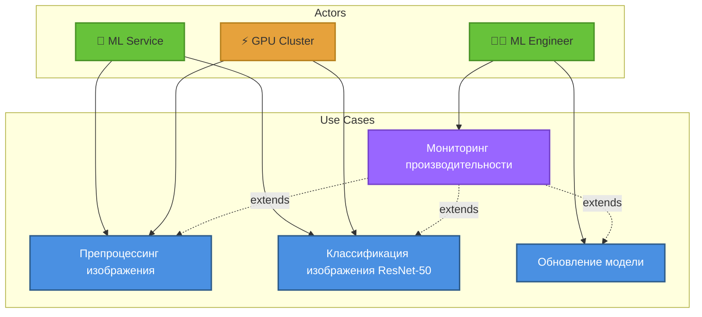
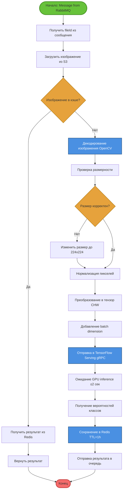
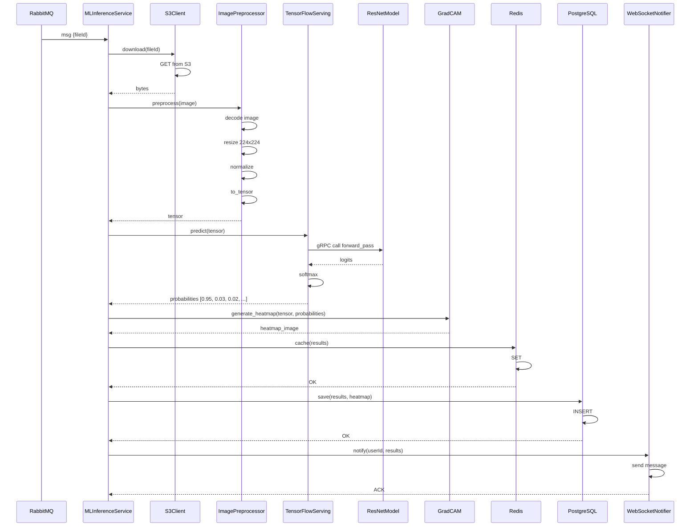
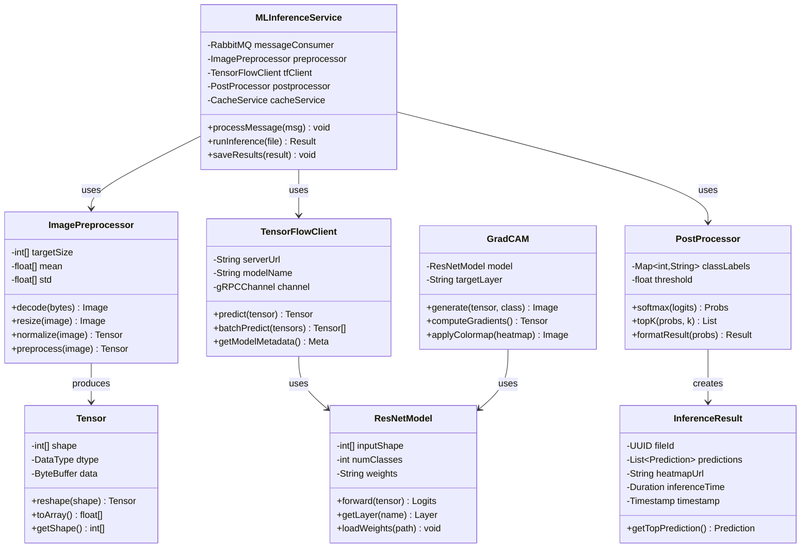

# UML Диаграммы: Обработка изображений

## Функция 3: Обработка медицинских изображений (ResNet-50)

### 1. Use Case Diagram (Диаграмма вариантов использования)



**Актёры:**
- **ML Service** (система)
- **ML Engineer** (инженер машинного обучения)
- **GPU Cluster** (инфраструктура)

**Варианты использования:**
1. **Препроцессинг изображения**
   - Первичный актёр: ML Service
   - Предусловия: Изображение загружено в S3
   - Постусловия: Тензор готов для inference
   
2. **Классификация изображения (ResNet-50)**
   - Первичный актёр: ML Service
   - Предусловия: Тензор подготовлен
   - Постусловия: Результаты классификации получены
   
3. **Обновление модели**
   - Первичный актёр: ML Engineer
   - Предусловия: Новая версия модели обучена
   - Постусловия: Модель развёрнута в TensorFlow Serving

4. **Мониторинг производительности**
   - Первичный актёр: ML Engineer
   - Связь: `<<extend>>` для всех сценариев

**Связи:**
- `<<include>>`: Классификация включает препроцессинг
- `<<extend>>`: Кэширование расширяет классификацию

---

### 2. Activity Diagram (Диаграмма активностей)


```

**Особенности:**
- Параллельное сохранение для оптимизации
- Кэширование для повторных запросов

---

### 3. Sequence Diagram (Диаграмма последовательности)

**Участники:**
- RabbitMQ
- MLInferenceService
- S3Client
- ImagePreprocessor
- TensorFlowServing
- ResNetModel
- GradCAM
- Redis
- PostgreSQL
- WebSocketNotifier


   |          |         |           |            |         |  Grad-CAM     |        |          |
   |          |<--heatmap_image-----|            |         |<-------|       |        |          |
   |          |         |           |            |         |        |       |        |          |
   |          |         |           |   [Parallel save]    |        |       |        |          |
   |          |         |           |            |         |        |       |        |          |
   |          |--cache(results)------------------------------->|    |       |        |          |
   |          |         |           |            |         | SET    |       |        |          |
   |          |         |           |            |         |<-------|       |        |          |
   |          |         |           |            |         |        |       |        |          |
   |          |--save(results, heatmap)------------------------------->|    |        |          |
   |          |         |           |            |         |        | INSERT|        |          |
   |          |         |           |            |         |        |<------|        |          |
   |          |         |           |            |         |        |       |        |          |
   |          |--notify(userId, results)---------------------------------------->|   |          |
   |          |         |           |            |         |        |       |        |--------->|
   |          |         |           |            |         |        |       |        |  send    |
   |          |         |           |            |         |        |       |        |  message |
   |          |         |           |            |         |        |       |        |          |
   |<--ACK----|         |           |            |         |        |       |        |          |
```

**Ключевые моменты:**
- gRPC для высокопроизводительного inference
- Grad-CAM для визуализации решений модели
- Параллельное сохранение в Redis и PostgreSQL

---

### 4. Class Diagram (Диаграмма классов)


│ + toJSON(): String              │
└─────────────────────────────────┘

┌─────────────────────────────────┐
│      Prediction                 │
├─────────────────────────────────┤
│ - className: String             │
│ - probability: float            │
│ - confidence: float             │
├─────────────────────────────────┤
│ + isHighConfidence(): boolean   │
│ + toString(): String            │
└─────────────────────────────────┘

┌─────────────────────────────────┐
│    CacheService                 │
├─────────────────────────────────┤
│ - redisTemplate: RedisTemplate  │
│ - ttl: Duration                 │
├─────────────────────────────────┤
│ + get(key): Optional<Result>    │
│ + set(key, value, ttl): void    │
│ + invalidate(key): void         │
└─────────────────────────────────┘
```

**Паттерны:**
- **Strategy:** ImagePreprocessor (разные стратегии препроцессинга)
- **Factory:** TensorFlowClient (создание gRPC каналов)
- **Repository:** CacheService (абстракция над Redis)

---

### 5. State Diagram (Диаграмма состояний)

**Объект:** Image Inference Task

```mermaid
stateDiagram-v2
    direction LR
    
    [*] --> Queued : Message received
    
    Queued --> Downloading : consumer picks up
    Downloading --> Preprocessing : file downloaded
    Preprocessing --> Inferencing : preprocessing done
    Inferencing --> Postprocessing : inference complete
    Postprocessing --> Caching : results ready
    Caching --> Completed : saved to cache
    Completed --> [*] : task finished
    
    Queued --> Failed : download error
    Downloading --> Failed : S3 error
    Preprocessing --> Failed : format error
    Inferencing --> Failed : model error
    Postprocessing --> Failed : processing error
    Caching --> Failed : cache error
    
    Failed --> Queued : retry
    Failed --> [*] : max retries exceeded
    
    state Queued {
        [*] --> Waiting : In queue
        Waiting --> Processing : Consumer available
    }
    
    state Downloading {
        [*] --> S3Request : Request file
        S3Request --> Downloading : Downloading bytes
        Downloading --> [*] : Complete
    }
    
    state Preprocessing {
        [*] --> Decode : Decode image
        Decode --> Resize : Image decoded
        Resize --> Normalize : Resized
        Normalize --> [*] : Normalized
    }
    
    state Inferencing {
        [*] --> TensorFlow : Send to TF
        TensorFlow --> GPU : GPU processing
        GPU --> [*] : Logits ready
    }
    
    state Postprocessing {
        [*] --> Softmax : Apply softmax
        Softmax --> GradCAM : Generate heatmap
        GradCAM --> [*] : Results ready
    }
    
    state Caching {
        [*] --> Redis : Save to Redis
        Redis --> Database : Save to DB
        Database --> [*] : Persisted
    }
```
            ┌────┼────┐
            │    │    │
    error   │    │    │ success
        ┌───┘    │    └───┐
        │        │        │
        ↓        ↓        ↓
   ┌────────┐ ┌──────────────┐
   │ Failed │ │Preprocessing │
   │(Ошибка)│ │(Обработка)   │
   └────────┘ └──────────────┘
        │           │
        │           │ tensor ready
        │           ↓
        │     ┌──────────────┐
        │     │  Inferencing │
        │     │(GPU обработка)│
        │     └──────────────┘
        │           │
        │      ┌────┼────┐
        │      │    │    │
        │ GPU  │    │    │ success
        │ error│    │    │
        │   ┌──┘    │    └──┐
        │   │       │       │
        └───►       ↓       ↓
           ┌──────────────┐ ┌──────────────┐
           │PostProcessing│ │  Generating  │
           │(Пост-обработка)│  Heatmap     │
           └──────────────┘ │(Создание карты)│
                 │          └──────────────┘
                 │                │
                 │                │
                 ↓                ↓
           ┌──────────────┐ ┌──────────────┐
           │   Caching    │ │   Saving     │
           │(Кэширование) │ │ (Сохранение) │
           └──────────────┘ └──────────────┘
                 │                │
                 └────────┬───────┘
                          ↓
                    ┌──────────┐
                    │Completed │
                    │(Готово)  │
                    └──────────┘
                          │
                          ↓
                          ●
```

**Состояния:**
1. **Queued:** Задача в RabbitMQ
2. **Downloading:** Загрузка изображения из S3
3. **Preprocessing:** Подготовка тензора
4. **Inferencing:** GPU inference (ResNet-50)
5. **PostProcessing:** Обработка результатов
6. **Generating Heatmap:** Grad-CAM визуализация
7. **Caching:** Сохранение в Redis
8. **Saving:** Сохранение в PostgreSQL
9. **Completed:** Задача завершена
10. **Failed:** Ошибка на любом этапе

**Переходы с таймаутами:**
- Downloading → Failed (если S3 недоступен > 30 сек)
- Inferencing → Failed (если GPU timeout > 5 сек)

---

### 6. Component Diagram (Диаграмма компонентов)

```mermaid
graph TB
    subgraph "ML Inference Service"
        MC[MessageConsumer<br/>RabbitMQ]
        IO[InferenceOrchestrator<br/>Pipeline Controller]
        PC[Pipeline Components]
        
        subgraph "Pipeline Components"
            IP[ImagePreprocessor<br/>OpenCV]
            TC[TensorFlowClient<br/>gRPC Client]
            PP[PostProcessor<br/>Results Handler]
            GC[GradCAMGenerator<br/>Visualization]
        end
    end
    
    subgraph "External Services"
        TFS[TensorFlow Serving<br/>gRPC Server<br/>ResNet-50 Model]
        OCV[OpenCV Library<br/>C++ Backend]
        S3[AWS S3<br/>Image Storage]
        REDIS[Redis<br/>Cache Layer]
        PG[PostgreSQL<br/>Metadata DB]
    end
    
    subgraph "Infrastructure"
        GPU[GPU Cluster<br/>NVIDIA Tesla V100]
        K8S[Kubernetes<br/>Container Orchestration]
    end
    
    MC --> IO : triggers
    IO --> PC : orchestrates
    PC --> IP
    PC --> TC
    PC --> PP
    PC --> GC
    
    IP --> OCV : uses
    TC --> TFS : gRPC calls
    TFS --> GPU : runs on
    GPU --> K8S : managed by
    
    IP --> S3 : downloads from
    PP --> REDIS : caches to
    PP --> PG : saves to
    
    style MC fill:#4a90e2,stroke:#2e5c8a,stroke-width:2px,color:#fff
    style IO fill:#4a90e2,stroke:#2e5c8a,stroke-width:2px,color:#fff
    style TFS fill:#ff6f00,stroke:#c43e00,stroke-width:2px,color:#fff
    style GPU fill:#9c27b0,stroke:#6a1b9a,stroke-width:2px,color:#fff
    style S3 fill:#ff9900,stroke:#cc7700,stroke-width:2px
    style REDIS fill:#dc382d,stroke:#a02822,stroke-width:2px,color:#fff
    style PG fill:#336791,stroke:#1a3a5c,stroke-width:2px,color:#fff
```
                    ↓
          ┌──────────────────┐
          │   GPU Cluster    │
          │  (NVIDIA T4/A100)│
          │                  │
          │  - CUDA 11.x     │
          │  - cuDNN 8.x     │
          └──────────────────┘

┌─────────────────────────────────────────────────────────────┐
│              Storage Components                             │
│                                                             │
│  ┌──────────────────┐           ┌──────────────────┐       │
│  │                  │           │                  │       │
│  │  CacheService    │           │ ResultRepository │       │
│  │   (Redis)        │           │  (PostgreSQL)    │       │
│  └──────────────────┘           └──────────────────┘       │
│         │                               │                   │
│         │ stores                        │ persists          │
│         ↓                               ↓                   │
│  ┌──────────────────┐           ┌──────────────────┐       │
│  │  Redis Cluster   │           │  PostgreSQL DB   │       │
│  │  (In-memory)     │           │  (results table) │       │
│  └──────────────────┘           └──────────────────┘       │
└─────────────────────────────────────────────────────────────┘

┌─────────────────────────────────────────────────────────────┐
│           Monitoring Components                             │
│                                                             │
│  ┌──────────────────────┐       ┌──────────────────┐       │
│  │                      │       │                  │       │
│  │  MetricsCollector    │──────>│  Prometheus      │       │
│  │                      │exports│  (TSDB)          │       │
│  └──────────────────────┘       └──────────────────┘       │
│           │                                                 │
│           │ tracks                                          │
│           │                                                 │
│           │  - Inference time                               │
│           │  - GPU utilization                              │
│           │  - Throughput                                   │
│           │  - Error rate                                   │
└─────────────────────────────────────────────────────────────┘
```

**Интерфейсы:**
- `gRPC`: TensorFlow Serving API
- `AMQP`: RabbitMQ message protocol
- `Redis Protocol`: Cache communication
- `JDBC`: PostgreSQL connection

---

## Источники

- «Deep Learning» Ian Goodfellow
- [ResNet Paper](https://arxiv.org/abs/1512.03385)
- [Grad-CAM](https://arxiv.org/abs/1610.02391)
- [TensorFlow Serving Guide](https://www.tensorflow.org/tfx/guide/serving)

