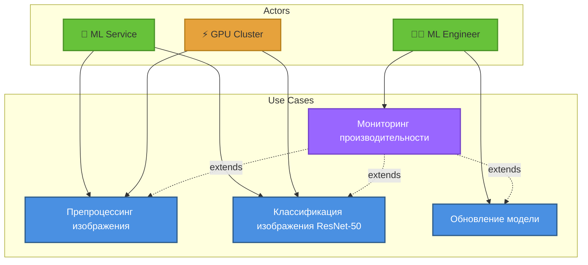

# UML Диаграммы: Обработка изображений

## Функция 3: Обработка медицинских изображений (ResNet-50)

### 1. Use Case Diagram (Диаграмма вариантов использования)



**Актёры:**
- **ML Service** (система)
- **ML Engineer** (инженер машинного обучения)
- **GPU Cluster** (инфраструктура)

**Варианты использования:**
1. **Препроцессинг изображения**
   - Первичный актёр: ML Service
   - Предусловия: Изображение загружено в S3
   - Постусловия: Тензор готов для inference
   
2. **Классификация изображения (ResNet-50)**
   - Первичный актёр: ML Service
   - Предусловия: Тензор подготовлен
   - Постусловия: Результаты классификации получены
   
3. **Обновление модели**
   - Первичный актёр: ML Engineer
   - Предусловия: Новая версия модели обучена
   - Постусловия: Модель развёрнута в TensorFlow Serving

4. **Мониторинг производительности**
   - Первичный актёр: ML Engineer
   - Связь: `<<extend>>` для всех сценариев

**Связи:**
- `<<include>>`: Классификация включает препроцессинг
- `<<extend>>`: Кэширование расширяет классификацию

---

### 2. Activity Diagram (Диаграмма активностей)

```
[Начало: Message from RabbitMQ]
    ↓
[Получить fileId из сообщения]
    ↓
[Загрузить изображение из S3]
    ↓
<Изображение в кэше?> ◇
    ├─ Да → [Получить результат из Redis] → [Вернуть результат] → [Конец]
    └─ Нет ↓
[Декодирование изображения (OpenCV)]
    ↓
[Проверка размерности]
    ↓
<Размер корректен?> ◇
    ├─ Нет → [Изменить размер до 224x224]
    └─ Да ↓
[Нормализация пикселей (mean=[0.485, 0.456, 0.406])]
    ↓
[Преобразование в тензор (CHW format)]
    ↓
[Добавление batch dimension]
    ↓
[Отправка в TensorFlow Serving (gRPC)]
    ↓
[Ожидание GPU inference (≤2 сек)]
    ↓
[Получение вероятностей (softmax)]
    ↓
[Постпроцессинг: выбор топ-3 класса]
    ↓
[Генерация heatmap (Grad-CAM)]
    ↓
════════════════════════════════════════
    ║ Параллельное сохранение ║
════════════════════════════════════════
    ║                          ║
    ║ [Сохранение в Redis]     ║ [Сохранение в PostgreSQL]
    ║  TTL = 1 час             ║  + heatmap URL
    ║                          ║
════════════════════════════════════════
    ↓
[Отправка уведомления в WebSocket]
    ↓
[Конец]
```

**Особенности:**
- Параллельное сохранение для оптимизации
- Кэширование для повторных запросов

---

### 3. Sequence Diagram (Диаграмма последовательности)

**Участники:**
- RabbitMQ
- MLInferenceService
- S3Client
- ImagePreprocessor
- TensorFlowServing
- ResNetModel
- GradCAM
- Redis
- PostgreSQL
- WebSocketNotifier

```
RabbitMQ  MLService  S3Client  Preprocessor  TFServing  ResNet  GradCAM  Redis  PostgreSQL  WebSocket
   |          |         |           |            |         |        |       |        |          |
   |--msg---->|         |           |            |         |        |       |        |          |
   |{fileId}  |         |           |            |         |        |       |        |          |
   |          |         |           |            |         |        |       |        |          |
   |          |--download(fileId)-->|            |         |        |       |        |          |
   |          |         |--GET----->|            |         |        |       |        |          |
   |          |         |<--bytes---|            |         |        |       |        |          |
   |          |<--image-|           |            |         |        |       |        |          |
   |          |         |           |            |         |        |       |        |          |
   |          |--preprocess(image)-------------->|         |        |       |        |          |
   |          |         |           |            |         |        |       |        |          |
   |          |         |     [decode image]     |         |        |       |        |          |
   |          |         |     [resize 224x224]   |         |        |       |        |          |
   |          |         |     [normalize]        |         |        |       |        |          |
   |          |         |     [to_tensor]        |         |        |       |        |          |
   |          |         |           |            |         |        |       |        |          |
   |          |<--tensor-----------|            |         |        |       |        |          |
   |          |         |           |            |         |        |       |        |          |
   |          |--predict(tensor)--------------->|         |        |       |        |          |
   |          |         |           |            |         |        |       |        |          |
   |          |         |           |      [gRPC call]     |        |       |        |          |
   |          |         |           |            |-------->|        |       |        |          |
   |          |         |           |            |  forward_pass   |       |        |          |
   |          |         |           |            |<--------|        |       |        |          |
   |          |         |           |            |  logits |        |       |        |          |
   |          |         |           |            |         |        |       |        |          |
   |          |         |           |      [softmax]       |        |       |        |          |
   |          |         |           |            |         |        |       |        |          |
   |          |<--probabilities-----|            |         |        |       |        |          |
   |          |  [0.95, 0.03, 0.02, ...]         |         |        |       |        |          |
   |          |         |           |            |         |        |       |        |          |
   |          |--generate_heatmap(tensor, probabilities)----------->|       |        |          |
   |          |         |           |            |         |  Grad-CAM     |        |          |
   |          |<--heatmap_image-----|            |         |<-------|       |        |          |
   |          |         |           |            |         |        |       |        |          |
   |          |         |           |   [Parallel save]    |        |       |        |          |
   |          |         |           |            |         |        |       |        |          |
   |          |--cache(results)------------------------------->|    |       |        |          |
   |          |         |           |            |         | SET    |       |        |          |
   |          |         |           |            |         |<-------|       |        |          |
   |          |         |           |            |         |        |       |        |          |
   |          |--save(results, heatmap)------------------------------->|    |        |          |
   |          |         |           |            |         |        | INSERT|        |          |
   |          |         |           |            |         |        |<------|        |          |
   |          |         |           |            |         |        |       |        |          |
   |          |--notify(userId, results)---------------------------------------->|   |          |
   |          |         |           |            |         |        |       |        |--------->|
   |          |         |           |            |         |        |       |        |  send    |
   |          |         |           |            |         |        |       |        |  message |
   |          |         |           |            |         |        |       |        |          |
   |<--ACK----|         |           |            |         |        |       |        |          |
```

**Ключевые моменты:**
- gRPC для высокопроизводительного inference
- Grad-CAM для визуализации решений модели
- Параллельное сохранение в Redis и PostgreSQL

---

### 4. Class Diagram (Диаграмма классов)

```
┌─────────────────────────────────┐
│   MLInferenceService            │
├─────────────────────────────────┤
│ - messageConsumer: RabbitMQ     │
│ - preprocessor: ImagePreprocessor│
│ - tfClient: TensorFlowClient    │
│ - postprocessor: PostProcessor  │
│ - cacheService: CacheService    │
├─────────────────────────────────┤
│ + processMessage(msg): void     │
│ + runInference(file): Result    │
│ + saveResults(result): void     │
└─────────────────────────────────┘
           │ uses
           ↓
┌─────────────────────────────────┐         ┌─────────────────────────────┐
│   ImagePreprocessor             │         │   TensorFlowClient          │
├─────────────────────────────────┤         ├─────────────────────────────┤
│ - targetSize: (int, int)        │         │ - serverUrl: String         │
│ - mean: float[]                 │         │ - modelName: String         │
│ - std: float[]                  │         │ - channel: gRPCChannel      │
├─────────────────────────────────┤         ├─────────────────────────────┤
│ + decode(bytes): Image          │         │ + predict(tensor): Tensor   │
│ + resize(image): Image          │         │ + batchPredict(tensors): []  │
│ + normalize(image): Tensor      │         │ + getModelMetadata(): Meta  │
│ + preprocess(image): Tensor     │         └─────────────────────────────┘
└─────────────────────────────────┘
           │                                            │
           │ produces                                   │ uses
           ↓                                            ↓
┌─────────────────────────────────┐         ┌─────────────────────────────┐
│       Tensor                    │         │   ResNetModel               │
├─────────────────────────────────┤         ├─────────────────────────────┤
│ - shape: int[]                  │         │ - inputShape: [1,224,224,3] │
│ - dtype: DataType               │         │ - numClasses: int           │
│ - data: ByteBuffer              │         │ - weights: String (path)    │
├─────────────────────────────────┤         ├─────────────────────────────┤
│ + reshape(shape): Tensor        │         │ + forward(tensor): Logits   │
│ + toArray(): float[]            │         │ + getLayer(name): Layer     │
│ + getShape(): int[]             │         │ + loadWeights(path): void   │
└─────────────────────────────────┘         └─────────────────────────────┘

┌─────────────────────────────────┐         ┌─────────────────────────────┐
│    PostProcessor                │         │      GradCAM                │
├─────────────────────────────────┤         ├─────────────────────────────┤
│ - classLabels: Map<int, String> │         │ - model: ResNetModel        │
│ - threshold: float              │         │ - targetLayer: String       │
├─────────────────────────────────┤         ├─────────────────────────────┤
│ + softmax(logits): Probs        │         │ + generate(tensor, class): Image│
│ + topK(probs, k): List          │         │ + computeGradients(): Tensor│
│ + formatResult(probs): Result   │         │ + applyColormap(heatmap): Image│
└─────────────────────────────────┘         └─────────────────────────────┘

┌─────────────────────────────────┐
│   InferenceResult               │
├─────────────────────────────────┤
│ - fileId: UUID                  │
│ - predictions: List<Prediction> │
│ - heatmapUrl: String            │
│ - inferenceTime: Duration       │
│ - timestamp: Timestamp          │
├─────────────────────────────────┤
│ + getTopPrediction(): Prediction│
│ + toJSON(): String              │
└─────────────────────────────────┘

┌─────────────────────────────────┐
│      Prediction                 │
├─────────────────────────────────┤
│ - className: String             │
│ - probability: float            │
│ - confidence: float             │
├─────────────────────────────────┤
│ + isHighConfidence(): boolean   │
│ + toString(): String            │
└─────────────────────────────────┘

┌─────────────────────────────────┐
│    CacheService                 │
├─────────────────────────────────┤
│ - redisTemplate: RedisTemplate  │
│ - ttl: Duration                 │
├─────────────────────────────────┤
│ + get(key): Optional<Result>    │
│ + set(key, value, ttl): void    │
│ + invalidate(key): void         │
└─────────────────────────────────┘
```

**Паттерны:**
- **Strategy:** ImagePreprocessor (разные стратегии препроцессинга)
- **Factory:** TensorFlowClient (создание gRPC каналов)
- **Repository:** CacheService (абстракция над Redis)

---

### 5. State Diagram (Диаграмма состояний)

**Объект:** Image Inference Task

```
          [Message received]
                 ↓
           ┌──────────┐
      ●───>│  Queued  │
           │(В очереди)│
           └──────────┘
                 │ consumer picks up
                 ↓
           ┌──────────────┐
           │ Downloading  │
           │(Загрузка из S3)│
           └──────────────┘
                 │
            ┌────┼────┐
            │    │    │
    error   │    │    │ success
        ┌───┘    │    └───┐
        │        │        │
        ↓        ↓        ↓
   ┌────────┐ ┌──────────────┐
   │ Failed │ │Preprocessing │
   │(Ошибка)│ │(Обработка)   │
   └────────┘ └──────────────┘
        │           │
        │           │ tensor ready
        │           ↓
        │     ┌──────────────┐
        │     │  Inferencing │
        │     │(GPU обработка)│
        │     └──────────────┘
        │           │
        │      ┌────┼────┐
        │      │    │    │
        │ GPU  │    │    │ success
        │ error│    │    │
        │   ┌──┘    │    └──┐
        │   │       │       │
        └───►       ↓       ↓
           ┌──────────────┐ ┌──────────────┐
           │PostProcessing│ │  Generating  │
           │(Пост-обработка)│  Heatmap     │
           └──────────────┘ │(Создание карты)│
                 │          └──────────────┘
                 │                │
                 │                │
                 ↓                ↓
           ┌──────────────┐ ┌──────────────┐
           │   Caching    │ │   Saving     │
           │(Кэширование) │ │ (Сохранение) │
           └──────────────┘ └──────────────┘
                 │                │
                 └────────┬───────┘
                          ↓
                    ┌──────────┐
                    │Completed │
                    │(Готово)  │
                    └──────────┘
                          │
                          ↓
                          ●
```

**Состояния:**
1. **Queued:** Задача в RabbitMQ
2. **Downloading:** Загрузка изображения из S3
3. **Preprocessing:** Подготовка тензора
4. **Inferencing:** GPU inference (ResNet-50)
5. **PostProcessing:** Обработка результатов
6. **Generating Heatmap:** Grad-CAM визуализация
7. **Caching:** Сохранение в Redis
8. **Saving:** Сохранение в PostgreSQL
9. **Completed:** Задача завершена
10. **Failed:** Ошибка на любом этапе

**Переходы с таймаутами:**
- Downloading → Failed (если S3 недоступен > 30 сек)
- Inferencing → Failed (если GPU timeout > 5 сек)

---

### 6. Component Diagram (Диаграмма компонентов)

```
┌─────────────────────────────────────────────────────────────┐
│           ML Inference Service                              │
│                                                             │
│  ┌──────────────────────┐       ┌──────────────────┐       │
│  │                      │       │                  │       │
│  │  MessageConsumer     │──────>│ InferenceOrchestrator   │
│  │   (RabbitMQ)         │triggers                  │       │
│  └──────────────────────┘       └──────────────────┘       │
│                                           │                 │
│                                           │ orchestrates    │
│                                           ↓                 │
│                         ┌──────────────────────────────┐    │
│                         │  Pipeline Components        │    │
│                         │                              │    │
│                         │  - ImagePreprocessor         │    │
│                         │  - TensorFlowClient          │    │
│                         │  - PostProcessor             │    │
│                         │  - GradCAMGenerator          │    │
│                         └──────────────────────────────┘    │
└─────────────────────────────────────────────────────────────┘
                    │                        │
                    │ uses                   │ uses
                    ↓                        ↓
     ┌────────────────────────┐   ┌─────────────────────┐
     │                        │   │                     │
     │  TensorFlow Serving    │   │   OpenCV Library    │
     │    (gRPC Server)       │   │   (C++ Backend)     │
     │                        │   │                     │
     │  - ResNet-50 Model     │   └─────────────────────┘
     │  - Model Signature     │
     │  - GPU Support         │
     └────────────────────────┘
                    │
                    │ runs on
                    ↓
          ┌──────────────────┐
          │   GPU Cluster    │
          │  (NVIDIA T4/A100)│
          │                  │
          │  - CUDA 11.x     │
          │  - cuDNN 8.x     │
          └──────────────────┘

┌─────────────────────────────────────────────────────────────┐
│              Storage Components                             │
│                                                             │
│  ┌──────────────────┐           ┌──────────────────┐       │
│  │                  │           │                  │       │
│  │  CacheService    │           │ ResultRepository │       │
│  │   (Redis)        │           │  (PostgreSQL)    │       │
│  └──────────────────┘           └──────────────────┘       │
│         │                               │                   │
│         │ stores                        │ persists          │
│         ↓                               ↓                   │
│  ┌──────────────────┐           ┌──────────────────┐       │
│  │  Redis Cluster   │           │  PostgreSQL DB   │       │
│  │  (In-memory)     │           │  (results table) │       │
│  └──────────────────┘           └──────────────────┘       │
└─────────────────────────────────────────────────────────────┘

┌─────────────────────────────────────────────────────────────┐
│           Monitoring Components                             │
│                                                             │
│  ┌──────────────────────┐       ┌──────────────────┐       │
│  │                      │       │                  │       │
│  │  MetricsCollector    │──────>│  Prometheus      │       │
│  │                      │exports│  (TSDB)          │       │
│  └──────────────────────┘       └──────────────────┘       │
│           │                                                 │
│           │ tracks                                          │
│           │                                                 │
│           │  - Inference time                               │
│           │  - GPU utilization                              │
│           │  - Throughput                                   │
│           │  - Error rate                                   │
└─────────────────────────────────────────────────────────────┘
```

**Интерфейсы:**
- `gRPC`: TensorFlow Serving API
- `AMQP`: RabbitMQ message protocol
- `Redis Protocol`: Cache communication
- `JDBC`: PostgreSQL connection

---

## Источники

- «Deep Learning» Ian Goodfellow
- [ResNet Paper](https://arxiv.org/abs/1512.03385)
- [Grad-CAM](https://arxiv.org/abs/1610.02391)
- [TensorFlow Serving Guide](https://www.tensorflow.org/tfx/guide/serving)

