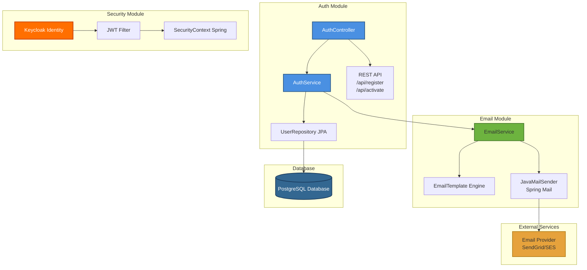

# UML Диаграммы: Регистрация пользователя

## Функция 1: Регистрация пользователя

### 1. Use Case Diagram (Диаграмма вариантов использования)

**Актёры:**
- **Пациент** (Patient)
- **Администратор** (Administrator)
- **Email Service** (система)

**Варианты использования:**
1. **Регистрация в системе**
   - Первичный актёр: Пациент
   - Предусловия: Нет
   - Постусловия: Пациент зарегистрирован, письмо отправлено
   
2. **Подтверждение email**
   - Первичный актёр: Пациент
   - Предусловия: Регистрация завершена
   - Постусловия: Аккаунт активирован
   
3. **Управление ролями**
   - Первичный актёр: Администратор
   - Предусловия: Администратор аутентифицирован
   - Постусловия: Роли пользователя обновлены

**Связи:**
- `<<include>>`: Регистрация включает валидацию данных
- `<<extend>>`: Подтверждение email расширяет регистрацию

---

### 2. Activity Diagram (Диаграмма активностей)

**Элементы:**
- **Начальная точка:** Круг с заливкой
- **Активности:** Прямоугольники со скруглёнными углами
- **Условия:** Ромб (decision node)
- **Конечная точка:** Круг с кругом внутри

---

### 3. Sequence Diagram (Диаграмма последовательности)

**Ключевые сообщения:**
- Синхронные вызовы: сплошная линия со стрелкой
- Возвраты: пунктирная линия
- Активация: вертикальный прямоугольник на lifeline

---

### 4. Class Diagram (Диаграмма классов)

**Связи:**
- **Ассоциация:** `AuthController` использует `AuthService`
- **Зависимость:** `AuthService` зависит от `UserRepository`
- **Реализация:** `UserRepositoryImpl` реализует `UserRepository`
- **Наследование:** `User` наследуется от `BaseEntity`

---

### 5. State Diagram (Диаграмма состояний)

**Состояния:**
1. **New:** Пользователь создан, письмо не отправлено
2. **Pending:** Письмо отправлено, ожидание активации
3. **Activated:** Аккаунт активирован, может использовать систему
4. **Dormant:** Неактивен более 30 дней
5. **Blocked:** Заблокирован администратором

**Переходы:**
- `sendActivationEmail()`: New → Pending
- `activate(token)`: Pending → Activated
- `after 30 days no login`: Activated → Dormant
- `admin blocks`: * → Blocked

---

### 6. Component Diagram (Диаграмма компонентов)

**Компоненты:**
- **Auth Module:** Управление пользователями
- **Email Module:** Отправка писем
- **Security Module:** Аутентификация и авторизация

**Интерфейсы:**
- REST API: `/api/register`, `/api/activate`
- SMTP: Протокол отправки email
- JDBC: Подключение к PostgreSQL

---

## Источники

- «UML Distilled» Martin Fowler
- [Spring Security Documentation](https://spring.io/projects/spring-security)
- «Design Patterns» Gang of Four

