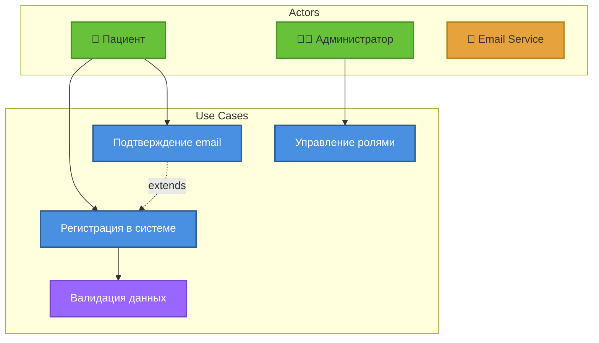
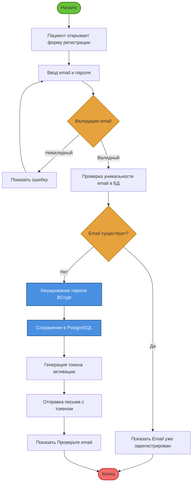
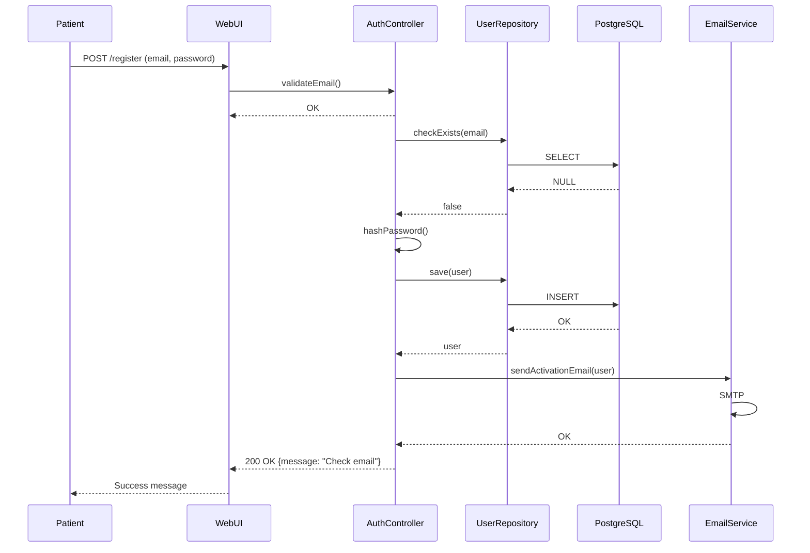
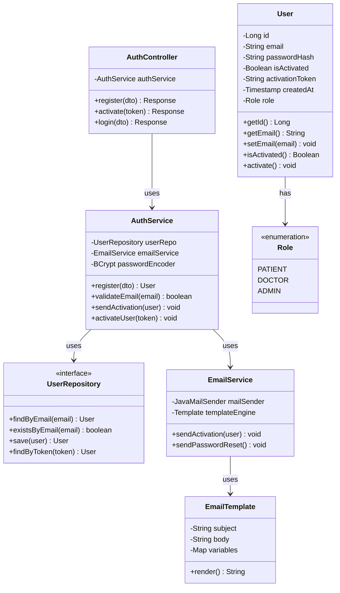
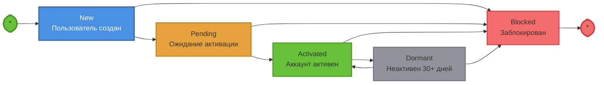
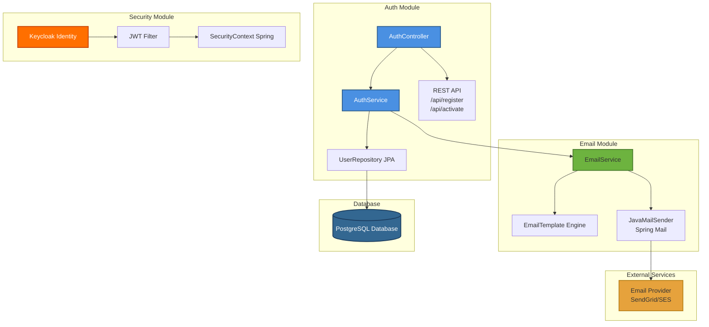

# UML Диаграммы: Регистрация пользователя

## Функция 1: Регистрация пользователя

### 1. Use Case Diagram (Диаграмма вариантов использования)

```mermaid
graph TB
    subgraph "Actors"
        Patient[👤 Пациент]
        Admin[👨‍💼 Администратор]
        EmailService[📧 Email Service]
    end
    
    subgraph "Use Cases"
        Register[Регистрация в системе]
        ConfirmEmail[Подтверждение email]
        ManageRoles[Управление ролями]
        ValidateData[Валидация данных]
    end
    
    Patient --> Register
    Patient --> ConfirmEmail
    Admin --> ManageRoles
    Register --> ValidateData
    ConfirmEmail -.->|extends| Register
    
    style Patient fill:#67c23a,stroke:#4a9428,stroke-width:2px
    style Admin fill:#67c23a,stroke:#4a9428,stroke-width:2px
    style EmailService fill:#e6a23c,stroke:#b8821e,stroke-width:2px
    style Register fill:#4a90e2,stroke:#2e5c8a,stroke-width:2px,color:#fff
    style ConfirmEmail fill:#4a90e2,stroke:#2e5c8a,stroke-width:2px,color:#fff
    style ManageRoles fill:#4a90e2,stroke:#2e5c8a,stroke-width:2px,color:#fff
    style ValidateData fill:#9966ff,stroke:#7744cc,stroke-width:2px,color:#fff
```

**Актёры:**
- **Пациент** (Patient)
- **Администратор** (Administrator)
- **Email Service** (система)

**Варианты использования:**
1. **Регистрация в системе**
   - Первичный актёр: Пациент
   - Предусловия: Нет
   - Постусловия: Пациент зарегистрирован, письмо отправлено
   
2. **Подтверждение email**
   - Первичный актёр: Пациент
   - Предусловия: Регистрация завершена
   - Постусловия: Аккаунт активирован
   
3. **Управление ролями**
   - Первичный актёр: Администратор
   - Предусловия: Администратор аутентифицирован
   - Постусловия: Роли пользователя обновлены

**Связи:**
- `<<include>>`: Регистрация включает валидацию данных
- `<<extend>>`: Подтверждение email расширяет регистрацию

---

### 2. Activity Diagram (Диаграмма активностей)

```mermaid
flowchart TD
    Start([Начало])
    
    A[Пациент открывает форму регистрации]
    B[Ввод email и пароля]
    C{Валидация email}
    D[Показать ошибку]
    E[Проверка уникальности email в БД]
    F{Email существует?}
    G[Показать Email уже зарегистрирован]
    H[Хеширование пароля BCrypt]
    I[Сохранение в PostgreSQL]
    J[Генерация токена активации]
    K[Отправка письма с токеном]
    L[Показать Проверьте email]
    End([Конец])
    
    Start --> A
    A --> B
    B --> C
    C -->|Невалидный| D
    D --> B
    C -->|Валидный| E
    E --> F
    F -->|Да| G
    G --> End
    F -->|Нет| H
    H --> I
    I --> J
    J --> K
    K --> L
    L --> End
    
    style Start fill:#67c23a,stroke:#4a9428,stroke-width:3px
    style End fill:#f56c6c,stroke:#c94545,stroke-width:3px
    style C fill:#e6a23c,stroke:#b8821e,stroke-width:2px
    style F fill:#e6a23c,stroke:#b8821e,stroke-width:2px
    style H fill:#4a90e2,stroke:#2e5c8a,stroke-width:2px,color:#fff
    style I fill:#4a90e2,stroke:#2e5c8a,stroke-width:2px,color:#fff
```

**Элементы:**
- **Начальная точка:** Круг с заливкой
- **Активности:** Прямоугольники со скруглёнными углами
- **Условия:** Ромб (decision node)
- **Конечная точка:** Круг с кругом внутри

---

### 3. Sequence Diagram (Диаграмма последовательности)

```mermaid
sequenceDiagram
    participant P as Patient
    participant W as WebUI
    participant A as AuthController
    participant R as UserRepository
    participant DB as PostgreSQL
    participant E as EmailService
    
    P->>W: POST /register (email, password)
    W->>A: validateEmail()
    A-->>W: OK
    A->>R: checkExists(email)
    R->>DB: SELECT
    DB-->>R: NULL
    R-->>A: false
    A->>A: hashPassword()
    A->>R: save(user)
    R->>DB: INSERT
    DB-->>R: OK
    R-->>A: user
    A->>E: sendActivationEmail(user)
    E->>E: SMTP
    E-->>A: OK
    A-->>W: 200 OK {message: "Check email"}
    W-->>P: Success message
```

**Ключевые сообщения:**
- Синхронные вызовы: сплошная линия со стрелкой
- Возвраты: пунктирная линия
- Активация: вертикальный прямоугольник на lifeline

---

### 4. Class Diagram (Диаграмма классов)

```mermaid
classDiagram
    class User {
        -Long id
        -String email
        -String passwordHash
        -Boolean isActivated
        -String activationToken
        -Timestamp createdAt
        -Role role
        +getId() Long
        +getEmail() String
        +setEmail(email) void
        +isActivated() Boolean
        +activate() void
    }
    
    class AuthController {
        -AuthService authService
        +register(dto) Response
        +activate(token) Response
        +login(dto) Response
    }
    
    class AuthService {
        -UserRepository userRepo
        -EmailService emailService
        -BCrypt passwordEncoder
        +register(dto) User
        +validateEmail(email) boolean
        +sendActivation(user) void
        +activateUser(token) void
    }
    
    class UserRepository {
        <<interface>>
        +findByEmail(email) User
        +existsByEmail(email) boolean
        +save(user) User
        +findByToken(token) User
    }
    
    class EmailService {
        -JavaMailSender mailSender
        -Template templateEngine
        +sendActivation(user) void
        +sendPasswordReset() void
    }
    
    class EmailTemplate {
        -String subject
        -String body
        -Map variables
        +render() String
    }
    
    class Role {
        <<enumeration>>
        PATIENT
        DOCTOR
        ADMIN
    }
    
    AuthController --> AuthService : uses
    AuthService --> UserRepository : uses
    AuthService --> EmailService : uses
    EmailService --> EmailTemplate : uses
    User --> Role : has
```

**Связи:**
- **Ассоциация:** `AuthController` использует `AuthService`
- **Зависимость:** `AuthService` зависит от `UserRepository`
- **Реализация:** `UserRepositoryImpl` реализует `UserRepository`
- **Наследование:** `User` наследуется от `BaseEntity`

---

### 5. State Diagram (Диаграмма состояний)

```mermaid
flowchart LR
    Start([*]) --> New[New<br/>Пользователь создан]
    
    New --> Pending[Pending<br/>Ожидание активации]
    Pending --> Activated[Activated<br/>Аккаунт активен]
    Activated --> Dormant[Dormant<br/>Неактивен 30+ дней]
    Dormant --> Activated
    
    New --> Blocked[Blocked<br/>Заблокирован]
    Pending --> Blocked
    Activated --> Blocked
    Dormant --> Blocked
    
    Blocked --> End([*])
    
    style Start fill:#67c23a,stroke:#4a9428,stroke-width:3px
    style End fill:#f56c6c,stroke:#c94545,stroke-width:3px
    style New fill:#4a90e2,stroke:#2e5c8a,stroke-width:2px,color:#fff
    style Pending fill:#e6a23c,stroke:#b8821e,stroke-width:2px
    style Activated fill:#67c23a,stroke:#4a9428,stroke-width:2px
    style Dormant fill:#909399,stroke:#6c6e72,stroke-width:2px
    style Blocked fill:#f56c6c,stroke:#c94545,stroke-width:2px
```

**Состояния:**
1. **New:** Пользователь создан, письмо не отправлено
2. **Pending:** Письмо отправлено, ожидание активации
3. **Activated:** Аккаунт активирован, может использовать систему
4. **Dormant:** Неактивен более 30 дней
5. **Blocked:** Заблокирован администратором

**Переходы:**
- `sendActivationEmail()`: New → Pending
- `activate(token)`: Pending → Activated
- `after 30 days no login`: Activated → Dormant
- `admin blocks`: * → Blocked

---

### 6. Component Diagram (Диаграмма компонентов)

```mermaid
graph TB
    subgraph "Auth Module"
        AuthController[AuthController]
        AuthService[AuthService]
        UserRepository[UserRepository JPA]
        RESTAPI[REST API<br/>/api/register<br/>/api/activate]
    end
    
    subgraph "Email Module"
        EmailService[EmailService]
        EmailTemplate[EmailTemplate Engine]
        JavaMailSender[JavaMailSender<br/>Spring Mail]
    end
    
    subgraph "Security Module"
        Keycloak[Keycloak Identity]
        JWTFilter[JWT Filter]
        SecurityContext[SecurityContext Spring]
    end
    
    subgraph "Database"
        PostgreSQL[(PostgreSQL Database)]
    end
    
    subgraph "External Services"
        EmailProvider[Email Provider<br/>SendGrid/SES]
    end
    
    AuthController --> AuthService
    AuthController --> RESTAPI
    AuthService --> UserRepository
    AuthService --> EmailService
    UserRepository --> PostgreSQL
    
    EmailService --> EmailTemplate
    EmailService --> JavaMailSender
    JavaMailSender --> EmailProvider
    
    Keycloak --> JWTFilter
    JWTFilter --> SecurityContext
    
    style AuthController fill:#4a90e2,stroke:#2e5c8a,stroke-width:2px,color:#fff
    style AuthService fill:#4a90e2,stroke:#2e5c8a,stroke-width:2px,color:#fff
    style EmailService fill:#6db33f,stroke:#4a7c2f,stroke-width:2px
    style Keycloak fill:#ff6f00,stroke:#c43e00,stroke-width:2px,color:#fff
    style PostgreSQL fill:#336791,stroke:#1a3a5c,stroke-width:2px,color:#fff
    style EmailProvider fill:#e6a23c,stroke:#b8821e,stroke-width:2px
```

**Компоненты:**
- **Auth Module:** Управление пользователями
- **Email Module:** Отправка писем
- **Security Module:** Аутентификация и авторизация

**Интерфейсы:**
- REST API: `/api/register`, `/api/activate`
- SMTP: Протокол отправки email
- JDBC: Подключение к PostgreSQL

---

## Источники

- «UML Distilled» Martin Fowler
- [Spring Security Documentation](https://spring.io/projects/spring-security)
- «Design Patterns» Gang of Four

