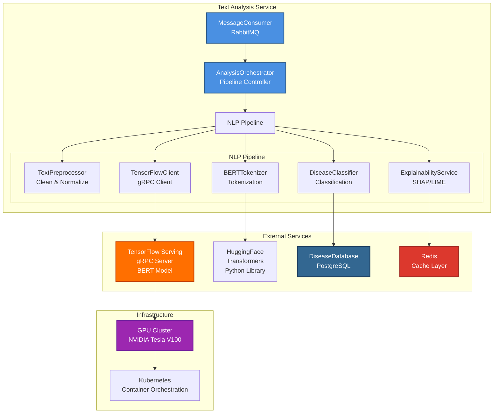

# UML Диаграммы: Анализ текста

## Функция 4: Анализ текстовых симптомов (BERT)

### 1. Use Case Diagram (Диаграмма вариантов использования)

**Актёры:**
- **ML Service** (система)
- **Врач** (Doctor)
- **ML Engineer** (инженер машинного обучения)

**Варианты использования:**
1. **Токенизация симптомов**
   - Первичный актёр: ML Service
   - Предусловия: Текст симптомов получен
   - Постусловия: Токены готовы для BERT
   
2. **BERT-анализ симптомов**
   - Первичный актёр: ML Service
   - Предусловия: Токены подготовлены
   - Постусловия: Вероятности заболеваний получены
   
3. **Валидация медицинской терминологии**
   - Первичный актёр: Врач
   - Связь: `<<extend>>` для анализа
   
4. **Fine-tuning BERT модели**
   - Первичный актёр: ML Engineer
   - Предусловия: Новые медицинские данные
   - Постусловия: Модель дообучена

**Связи:**
- `<<include>>`: Анализ включает токенизацию
- `<<extend>>`: Spell-check расширяет токенизацию

---

### 2. Activity Diagram (Диаграмма активностей)

**Особенности:**
- Параллельная обработка BERT и NER
- Генерация объяснений для интерпретируемости

---

### 3. Sequence Diagram (Диаграмма последовательности)

**Участники:**
- RabbitMQ
- TextAnalysisService
- TextPreprocessor
- BERTTokenizer
- TensorFlowServing
- BERTModel
- ClassificationHead
- DiseaseDatabase
- ExplainabilityService
- Redis
- PostgreSQL

**Ключевые особенности:**
- Использование pre-trained BERT с fine-tuned classification head
- SHAP для объяснения предсказаний
- Параллельное сохранение результатов

---

### 4. Class Diagram (Диаграмма классов)

**Паттерны:**
- **Pipeline:** TextPreprocessor → Tokenizer → BERT → Classifier
- **Strategy:** Разные стратегии объяснений (SHAP/LIME)
- **Repository:** DiseaseDatabase абстракция

---

### 5. State Diagram (Диаграмма состояний)

**Объект:** Text Analysis Task

**Состояния:**
1. **Queued:** Задача в RabbitMQ
2. **Preprocessing:** Очистка и нормализация текста
3. **Tokenizing:** Токенизация через BERT Tokenizer
4. **Encoding:** Получение embeddings от BERT
5. **Classifying:** Классификация заболеваний
6. **Explaining:** Генерация объяснений (SHAP)
7. **Caching:** Сохранение в Redis
8. **Saving:** Сохранение в PostgreSQL
9. **Completed:** Задача завершена
10. **Invalid/Timeout:** Ошибки

**Переходы:**
- `invalid text` → Invalid
- `BERT timeout` → Timeout (retry with exponential backoff)
- `low confidence` → Request human review

---

### 6. Component Diagram (Диаграмма компонентов)

**Интерфейсы:**
- `gRPC`: BERT model API
- `REST API`: Disease database queries
- `AMQP`: RabbitMQ messaging
- `Python API`: HuggingFace transformers

**Внешние библиотеки:**
- HuggingFace Transformers (BERT)
- SHAP (explainability)
- LIME (local explanations)
- SpaCy (NER для медицинских терминов)

---

## Источники

- [BERT Paper](https://arxiv.org/abs/1810.04805)
- [BioBERT для медицины](https://arxiv.org/abs/1901.08746)
- [SHAP Documentation](https://shap.readthedocs.io/)
- [HuggingFace Transformers](https://huggingface.co/docs/transformers/)
- «Natural Language Processing with Transformers» Lewis Tunstall

