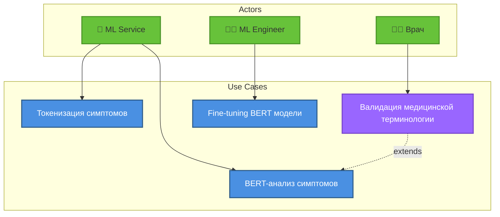
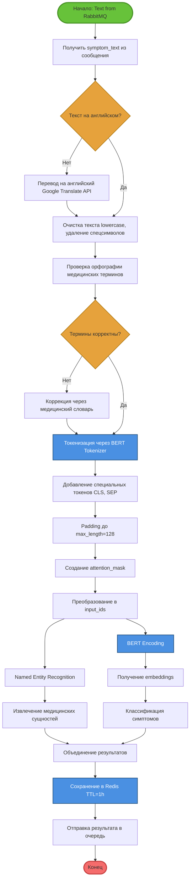

# UML Диаграммы: Анализ текста

## Функция 4: Анализ текстовых симптомов (BERT)

### 1. Use Case Diagram (Диаграмма вариантов использования)



**Актёры:**
- **ML Service** (система)
- **Врач** (Doctor)
- **ML Engineer** (инженер машинного обучения)

**Варианты использования:**
1. **Токенизация симптомов**
   - Первичный актёр: ML Service
   - Предусловия: Текст симптомов получен
   - Постусловия: Токены готовы для BERT
   
2. **BERT-анализ симптомов**
   - Первичный актёр: ML Service
   - Предусловия: Токены подготовлены
   - Постусловия: Вероятности заболеваний получены
   
3. **Валидация медицинской терминологии**
   - Первичный актёр: Врач
   - Связь: `<<extend>>` для анализа
   
4. **Fine-tuning BERT модели**
   - Первичный актёр: ML Engineer
   - Предусловия: Новые медицинские данные
   - Постусловия: Модель дообучена

**Связи:**
- `<<include>>`: Анализ включает токенизацию
- `<<extend>>`: Spell-check расширяет токенизацию

---

### 2. Activity Diagram (Диаграмма активностей)


    ║  TensorFlow Serving      ║  SpaCy Medical NER
    ║         ↓                ║          ↓
    ║ [Получение embeddings]   ║ [Извлечение симптомов]
    ║                          ║
════════════════════════════════════════
    ↓ Синхронизация
[Классификация через Dense Layer]
    ↓
[Softmax activation (вероятности)]
    ↓
[Сопоставление с базой заболеваний]
    ↓
[Ранжирование топ-5 диагнозов]
    ↓
[Генерация объяснений (LIME/SHAP)]
    ↓
════════════════════════════════════════
    ║ Параллельное сохранение ║
════════════════════════════════════════
    ║                          ║
    ║ [Сохранение в Redis]     ║ [Сохранение в PostgreSQL]
    ║  TTL = 1 час             ║  + объяснения
    ║                          ║
════════════════════════════════════════
    ↓
[Отправка уведомления врачу]
    ↓
[Конец]
```

**Особенности:**
- Параллельная обработка BERT и NER
- Генерация объяснений для интерпретируемости

---

### 3. Sequence Diagram (Диаграмма последовательности)

**Участники:**
- RabbitMQ
- TextAnalysisService
- TextPreprocessor
- BERTTokenizer
- TensorFlowServing
- BERTModel
- ClassificationHead
- DiseaseDatabase
- ExplainabilityService
- Redis
- PostgreSQL

```
RabbitMQ  TextService  Preprocessor  Tokenizer  TFServing  BERT  ClassHead  DiseaseDB  Explainer  Redis  PostgreSQL
   |          |            |            |          |         |       |         |          |        |        |
   |--msg---->|            |            |          |         |       |         |          |        |        |
   |{text}    |            |            |          |         |       |         |          |        |        |
   |          |            |            |          |         |       |         |          |        |        |
   |          |--clean(text)---------->|          |         |       |         |          |        |        |
   |          |            |            |          |         |       |         |          |        |        |
   |          |      [lowercase, remove special chars]       |       |         |          |        |        |
   |          |      [spell check]     |          |         |       |         |          |        |        |
   |          |            |            |          |         |       |         |          |        |        |
   |          |<--cleaned_text---------|          |         |       |         |          |        |        |
   |          |            |            |          |         |       |         |          |        |        |
   |          |--tokenize(cleaned_text)----------->|         |       |         |          |        |        |
   |          |            |            |          |         |       |         |          |        |        |
   |          |            |     [convert to tokens]         |       |         |          |        |        |
   |          |            |     [add [CLS], [SEP]]          |       |         |          |        |        |
   |          |            |     [padding to 128]            |       |         |          |        |        |
   |          |            |     [create attention_mask]     |       |         |          |        |        |
   |          |            |            |          |         |       |         |          |        |        |
   |          |<--tokens-----------------|         |         |       |         |          |        |        |
   |          |  {input_ids, attention_mask}       |         |       |         |          |        |        |
   |          |            |            |          |         |       |         |          |        |        |
   |          |--encode(tokens)-------------------->|        |       |         |          |        |        |
   |          |            |            |          |         |       |         |          |        |        |
   |          |            |            |     [gRPC call]    |       |         |          |        |        |
   |          |            |            |          |-------->|       |         |          |        |        |
   |          |            |            |          | forward_pass   |         |          |        |        |
   |          |            |            |          |<--------|       |         |          |        |        |
   |          |            |            |      [768-dim embeddings] |         |          |        |        |
   |          |            |            |          |         |       |         |          |        |        |
   |          |<--embeddings------------|          |         |       |         |          |        |        |
   |          |            |            |          |         |       |         |          |        |        |
   |          |--classify(embeddings)-------------------------->|    |         |          |        |        |
   |          |            |            |          |         |       |         |          |        |        |
   |          |            |            |          |    [Dense(768 → 256)]    |          |        |        |
   |          |            |            |          |    [ReLU]                |          |        |        |
   |          |            |            |          |    [Dropout(0.3)]        |          |        |        |
   |          |            |            |          |    [Dense(256 → num_classes)]     |        |        |
   |          |            |            |          |    [Softmax]             |          |        |        |
   |          |            |            |          |         |       |         |          |        |        |
   |          |<--probabilities---------|          |         |<------|         |          |        |        |
   |          |  [0.45, 0.32, 0.15, ...]           |         |       |         |          |        |        |
   |          |            |            |          |         |       |         |          |        |        |
   |          |--lookup_diseases(top_k=5)--------------------|------>|         |          |        |        |
   |          |            |            |          |         |       |  SELECT |          |        |        |
   |          |<--disease_names---------|          |         |       |<--------|          |        |        |
   |          |            |            |          |         |       |         |          |        |        |
   |          |--generate_explanation(text, probs)----------|-------|---------|--------->|        |        |
   |          |            |            |          |         |       |         |  SHAP   |        |        |
   |          |<--explanation_json------|          |         |       |         |<---------|        |        |
   |          |  {key_symptoms: [...], impact: [...]}        |       |         |          |        |        |
   |          |            |            |          |         |       |         |          |        |        |
   |          |            |   [Parallel save]     |         |       |         |          |        |        |
   |          |            |            |          |         |       |         |          |        |        |
   |          |--cache(results)------------------------------------------->|    |          |        |        |
   |          |            |            |          |         |       | SET     |          |        |        |
   |          |            |            |          |         |       |<--------|          |        |        |
   |          |            |            |          |         |       |         |          |        |        |
   |          |--save(results, explanation)------------------------------>|    |          |------->|        |
   |          |            |            |          |         |       |         |   INSERT |        |        |
   |          |            |            |          |         |       |         |          |<-------|        |
   |          |            |            |          |         |       |         |          |        |        |
   |<--ACK----|            |            |          |         |       |         |          |        |        |
```

**Ключевые особенности:**
- Использование pre-trained BERT с fine-tuned classification head
- SHAP для объяснения предсказаний
- Параллельное сохранение результатов

---

### 4. Class Diagram (Диаграмма классов)

```
┌─────────────────────────────────┐
│   TextAnalysisService           │
├─────────────────────────────────┤
│ - preprocessor: TextPreprocessor│
│ - tokenizer: BERTTokenizer      │
│ - bertClient: TensorFlowClient  │
│ - classifier: Classifier        │
│ - explainer: Explainability     │
├─────────────────────────────────┤
│ + analyzeSymptoms(text): Result │
│ + processMessage(msg): void     │
└─────────────────────────────────┘
           │ uses
           ↓
┌─────────────────────────────────┐         ┌─────────────────────────────┐
│   TextPreprocessor              │         │   BERTTokenizer             │
├─────────────────────────────────┤         ├─────────────────────────────┤
│ - medicalDict: Dictionary       │         │ - vocab: Vocabulary         │
│ - translator: Translator        │         │ - maxLength: int = 128      │
│ - spellChecker: SpellChecker    │         │ - padToken: String = "[PAD]"│
├─────────────────────────────────┤         ├─────────────────────────────┤
│ + clean(text): String           │         │ + tokenize(text): Tokens    │
│ + normalize(text): String       │         │ + encode(tokens): InputIds  │
│ + spellCheck(text): String      │         │ + decode(ids): String       │
│ + translate(text, lang): String │         │ + createAttentionMask(): [] │
└─────────────────────────────────┘         └─────────────────────────────┘

┌─────────────────────────────────┐
│        Tokens                   │
├─────────────────────────────────┤
│ - inputIds: int[]               │
│ - attentionMask: int[]          │
│ - tokenTypeIds: int[]           │
├─────────────────────────────────┤
│ + getInputIds(): int[]          │
│ + getPaddingLength(): int       │
│ + toBatch(): BatchTokens        │
└─────────────────────────────────┘

┌─────────────────────────────────┐         ┌─────────────────────────────┐
│   TensorFlowClient              │────────>│     BERTModel               │
├─────────────────────────────────┤         ├─────────────────────────────┤
│ - serverUrl: String             │         │ - hiddenSize: int = 768     │
│ - modelName: String = "bert"    │         │ - numLayers: int = 12       │
│ - timeout: Duration             │         │ - numAttentionHeads: int=12 │
├─────────────────────────────────┤         ├─────────────────────────────┤
│ + encode(tokens): Embeddings    │         │ + forward(ids, mask): Emb   │
│ + getEmbeddings(text): Vector   │         │ + getPooledOutput(): Tensor │
└─────────────────────────────────┘         │ + getSequenceOutput(): Tensor│
                                            └─────────────────────────────┘

┌─────────────────────────────────┐
│   ClassificationHead            │
├─────────────────────────────────┤
│ - dense1: Dense(768 → 256)      │
│ - dropout: Dropout(0.3)         │
│ - dense2: Dense(256 → classes)  │
│ - activation: Softmax           │
├─────────────────────────────────┤
│ + classify(embeddings): Probs   │
│ + train(X, y): void             │
│ + predict(embeddings): Probs    │
└─────────────────────────────────┘

┌─────────────────────────────────┐         ┌─────────────────────────────┐
│   DiseaseClassifier             │────────>│   DiseaseDatabase           │
├─────────────────────────────────┤         ├─────────────────────────────┤
│ - classificationHead: Head      │         │ - connection: PostgreSQL    │
│ - diseaseDB: DiseaseDatabase    │         ├─────────────────────────────┤
│ - threshold: float = 0.1        │         │ + getDiseaseByClass(id): Disease│
├─────────────────────────────────┤         │ + searchBySymptoms(symp): []│
│ + classify(embeddings): Results │         │ + getAllDiseases(): List    │
│ + topK(probs, k): List          │         └─────────────────────────────┘
└─────────────────────────────────┘

┌─────────────────────────────────┐
│   ExplainabilityService         │
├─────────────────────────────────┤
│ - shapExplainer: SHAPExplainer  │
│ - limeExplainer: LIMEExplainer  │
├─────────────────────────────────┤
│ + explain(text, pred): Explanation│
│ + getFeatureImportance(): Map   │
│ + visualize(): Image            │
└─────────────────────────────────┘

┌─────────────────────────────────┐
│    AnalysisResult               │
├─────────────────────────────────┤
│ - id: UUID                      │
│ - predictions: List<Disease>    │
│ - confidenceScores: float[]     │
│ - explanation: Explanation      │
│ - processedText: String         │
│ - timestamp: Timestamp          │
├─────────────────────────────────┤
│ + getTopPrediction(): Disease   │
│ + toJSON(): String              │
│ + isHighConfidence(): boolean   │
└─────────────────────────────────┘

┌─────────────────────────────────┐
│        Disease                  │
├─────────────────────────────────┤
│ - id: int                       │
│ - name: String                  │
│ - icd10Code: String             │
│ - description: String           │
│ - symptoms: List<String>        │
│ - probability: float            │
├─────────────────────────────────┤
│ + toString(): String            │
│ + matchesSymptoms(symp): bool   │
└─────────────────────────────────┘
```

**Паттерны:**
- **Pipeline:** TextPreprocessor → Tokenizer → BERT → Classifier
- **Strategy:** Разные стратегии объяснений (SHAP/LIME)
- **Repository:** DiseaseDatabase абстракция

---

### 5. State Diagram (Диаграмма состояний)

**Объект:** Text Analysis Task

```
          [Text received]
                 ↓
           ┌──────────┐
      ●───>│  Queued  │
           │(В очереди)│
           └──────────┘
                 │ consumer picks up
                 ↓
           ┌──────────────┐
           │Preprocessing │
           │(Очистка)     │
           └──────────────┘
                 │
            ┌────┼────┐
            │    │    │
    invalid │    │    │ valid
        ┌───┘    │    └───┐
        │        │        │
        ↓        ↓        ↓
   ┌────────┐ ┌──────────────┐
   │Invalid │ │ Tokenizing   │
   │(Ошибка)│ │(Токенизация) │
   └────────┘ └──────────────┘
                     │
                     │ tokens ready
                     ↓
               ┌──────────────┐
               │   Encoding   │
               │(BERT кодирование)│
               └──────────────┘
                     │
                ┌────┼────┐
                │    │    │
       timeout  │    │    │ success
            ┌───┘    │    └───┐
            │        │        │
            ↓        ↓        ↓
       ┌────────┐ ┌──────────────┐
       │Timeout │ │Classifying   │
       │(Таймаут)│ │(Классификация)│
       └────────┘ └──────────────┘
                       │
                       │ classified
                       ↓
                 ┌──────────────┐
                 │  Explaining  │
                 │(Генерация объяснений)│
                 └──────────────┘
                       │
                  ┌────┼────┐
                  │    │    │
                  │    │    │
                  ↓    ↓    ↓
            ┌──────────────┐ ┌──────────────┐
            │   Caching    │ │   Saving     │
            │(Кэширование) │ │ (Сохранение) │
            └──────────────┘ └──────────────┘
                  │                │
                  └────────┬───────┘
                           ↓
                     ┌──────────┐
                     │Completed │
                     │(Готово)  │
                     └──────────┘
                           │
                           ↓
                           ●
```

**Состояния:**
1. **Queued:** Задача в RabbitMQ
2. **Preprocessing:** Очистка и нормализация текста
3. **Tokenizing:** Токенизация через BERT Tokenizer
4. **Encoding:** Получение embeddings от BERT
5. **Classifying:** Классификация заболеваний
6. **Explaining:** Генерация объяснений (SHAP)
7. **Caching:** Сохранение в Redis
8. **Saving:** Сохранение в PostgreSQL
9. **Completed:** Задача завершена
10. **Invalid/Timeout:** Ошибки

**Переходы:**
- `invalid text` → Invalid
- `BERT timeout` → Timeout (retry with exponential backoff)
- `low confidence` → Request human review

---

### 6. Component Diagram (Диаграмма компонентов)

```
┌─────────────────────────────────────────────────────────────┐
│           Text Analysis Service                             │
│                                                             │
│  ┌──────────────────────┐       ┌──────────────────┐       │
│  │                      │       │                  │       │
│  │  MessageConsumer     │──────>│AnalysisOrchestrator     │
│  │   (RabbitMQ)         │triggers                  │       │
│  └──────────────────────┘       └──────────────────┘       │
│                                           │                 │
│                                           │ orchestrates    │
│                                           ↓                 │
│                         ┌──────────────────────────────┐    │
│                         │  NLP Pipeline               │    │
│                         │                              │    │
│                         │  - TextPreprocessor          │    │
│                         │  - BERTTokenizer             │    │
│                         │  - TensorFlowClient          │    │
│                         │  - DiseaseClassifier         │    │
│                         │  - ExplainabilityService     │    │
│                         └──────────────────────────────┘    │
└─────────────────────────────────────────────────────────────┘
                    │                        │
                    │ uses                   │ uses
                    ↓                        ↓
     ┌────────────────────────┐   ┌─────────────────────┐
     │                        │   │                     │
     │  TensorFlow Serving    │   │   HuggingFace       │
     │    (gRPC Server)       │   │   Transformers      │
     │                        │   │   (Python Library)  │
     │  - BERT Model          │   │                     │
     │  - bert-base-uncased   │   │  - Tokenizers       │
     │  + Classification Head │   │  - Model loading    │
     └────────────────────────┘   └─────────────────────┘

┌─────────────────────────────────────────────────────────────┐
│         Medical Knowledge Components                        │
│                                                             │
│  ┌──────────────────────┐       ┌──────────────────┐       │
│  │                      │       │                  │       │
│  │ DiseaseDatabase      │       │ MedicalDictionary│       │
│  │ (PostgreSQL)         │       │ (JSON/Redis)     │       │
│  └──────────────────────┘       └──────────────────┘       │
│           │                               │                 │
│           │ queries                       │ validates       │
│           ↓                               ↓                 │
│  ┌──────────────────────────────────────────────────┐       │
│  │         Disease Ontology                         │       │
│  │                                                  │       │
│  │  - ICD-10 codes                                  │       │
│  │  - Symptom mappings                              │       │
│  │  - Disease relationships                         │       │
│  └──────────────────────────────────────────────────┘       │
└─────────────────────────────────────────────────────────────┘

┌─────────────────────────────────────────────────────────────┐
│           Explainability Components                         │
│                                                             │
│  ┌──────────────────────┐       ┌──────────────────┐       │
│  │                      │       │                  │       │
│  │  SHAPExplainer       │       │  LIMEExplainer   │       │
│  │  (Python Library)    │       │  (Python Library)│       │
│  └──────────────────────┘       └──────────────────┘       │
│           │                               │                 │
│           │ generates                     │ generates       │
│           ↓                               ↓                 │
│  ┌──────────────────────────────────────────────────┐       │
│  │         Explanation Visualizer                   │       │
│  │                                                  │       │
│  │  - Feature importance plots                      │       │
│  │  - Token highlighting                            │       │
│  │  - Confidence intervals                          │       │
│  └──────────────────────────────────────────────────┘       │
└─────────────────────────────────────────────────────────────┘

┌─────────────────────────────────────────────────────────────┐
│              Storage & Cache                                │
│                                                             │
│  ┌──────────────────┐           ┌──────────────────┐       │
│  │                  │           │                  │       │
│  │  CacheService    │           │ ResultRepository │       │
│  │   (Redis)        │           │  (PostgreSQL)    │       │
│  └──────────────────┘           └──────────────────┘       │
└─────────────────────────────────────────────────────────────┘
```

**Интерфейсы:**
- `gRPC`: BERT model API
- `REST API`: Disease database queries
- `AMQP`: RabbitMQ messaging
- `Python API`: HuggingFace transformers

**Внешние библиотеки:**
- HuggingFace Transformers (BERT)
- SHAP (explainability)
- LIME (local explanations)
- SpaCy (NER для медицинских терминов)

---

## Источники

- [BERT Paper](https://arxiv.org/abs/1810.04805)
- [BioBERT для медицины](https://arxiv.org/abs/1901.08746)
- [SHAP Documentation](https://shap.readthedocs.io/)
- [HuggingFace Transformers](https://huggingface.co/docs/transformers/)
- «Natural Language Processing with Transformers» Lewis Tunstall

