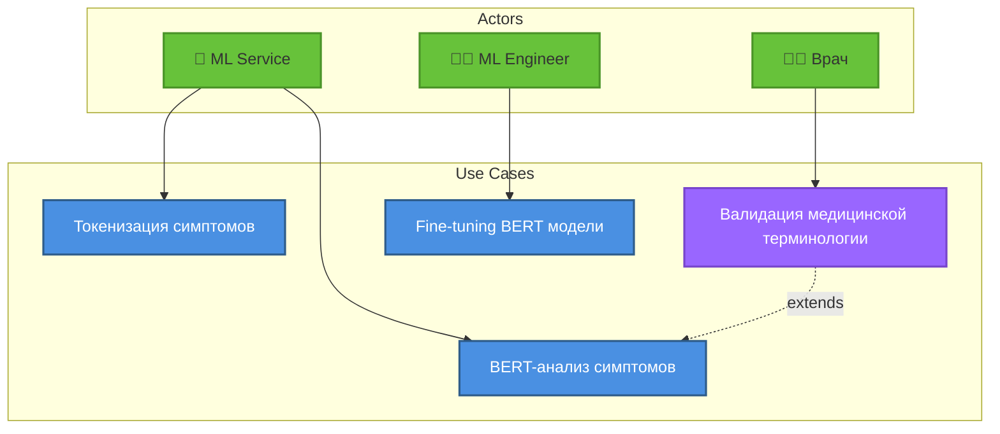
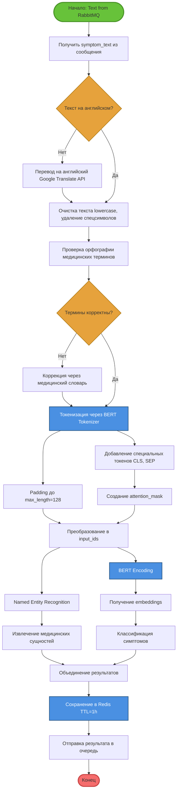
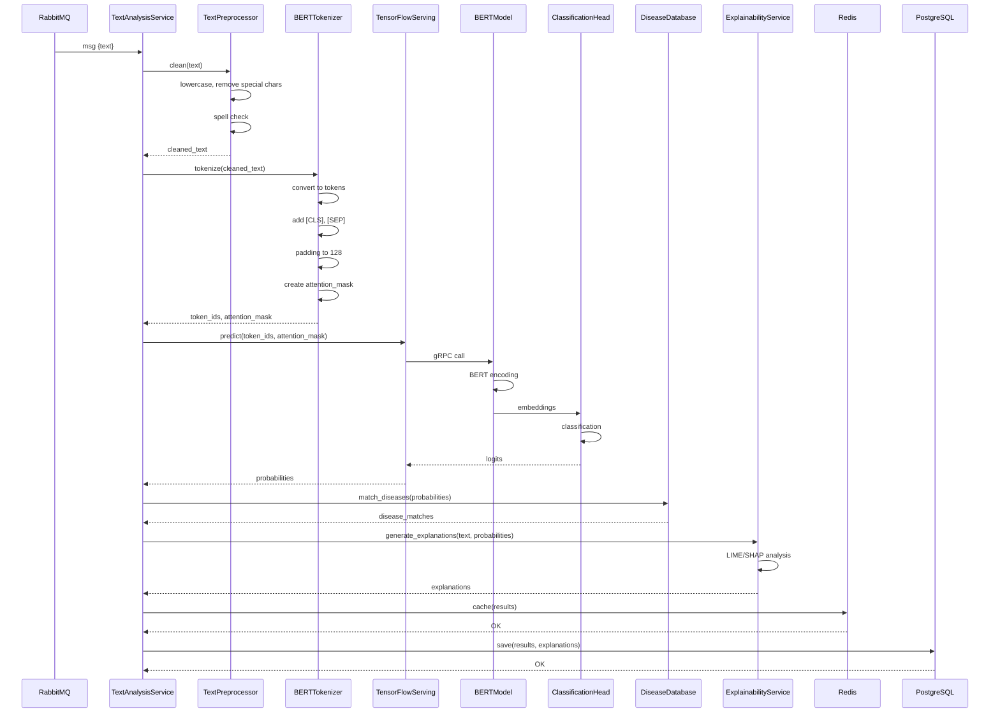
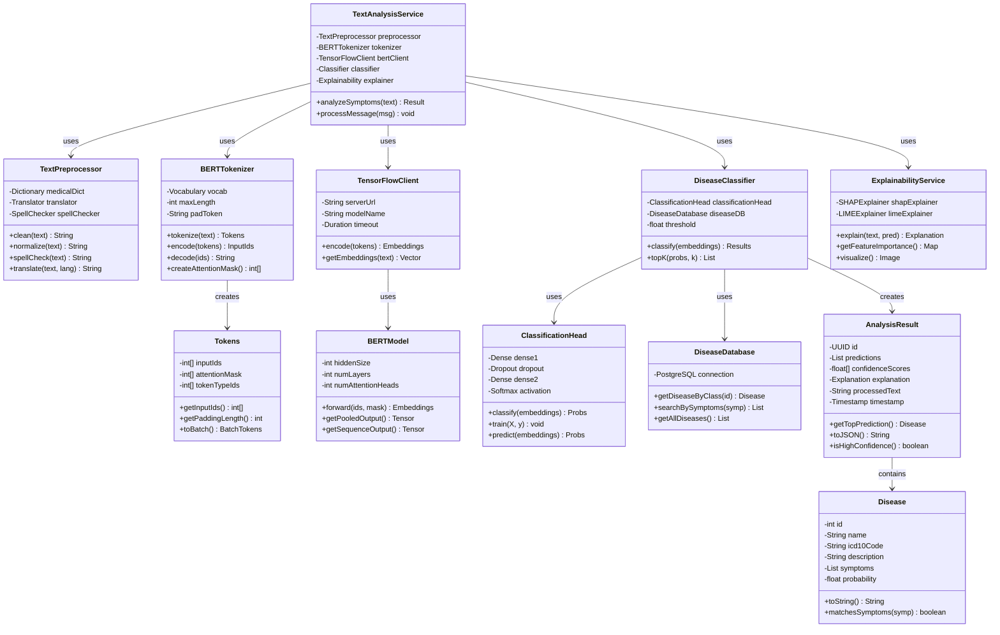
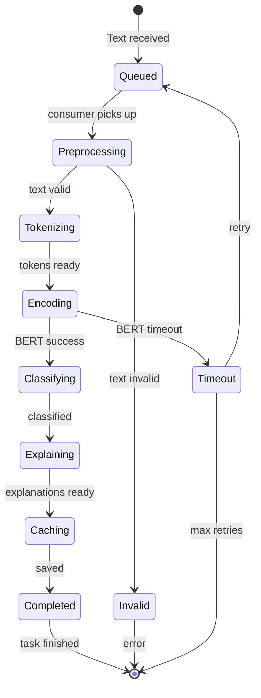
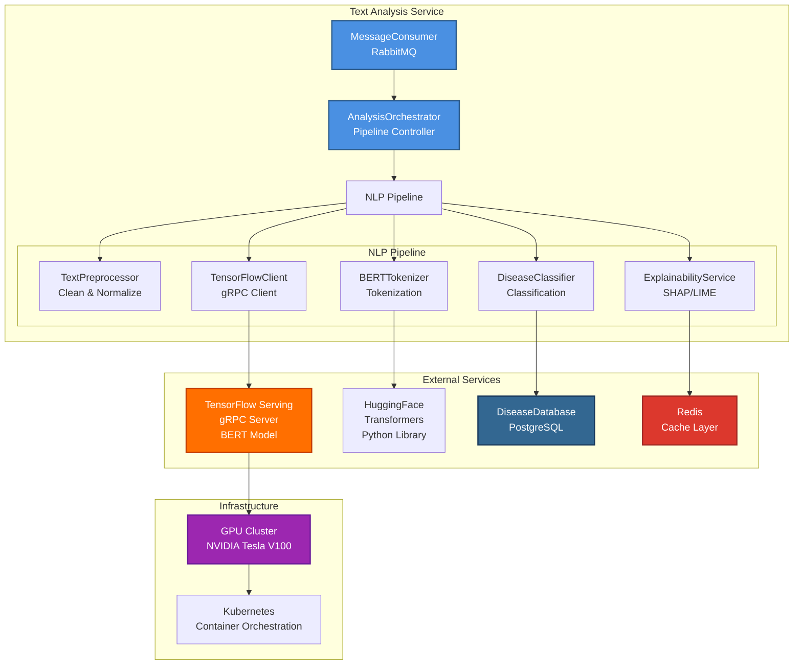

# UML Диаграммы: Анализ текста

## Функция 4: Анализ текстовых симптомов (BERT)

### 1. Use Case Diagram (Диаграмма вариантов использования)

```mermaid
graph TB
    subgraph "Actors"
        MLService[🤖 ML Service]
        Doctor[👨‍⚕️ Врач]
        MLEngineer[👨‍💻 ML Engineer]
    end
    
    subgraph "Use Cases"
        Tokenize[Токенизация симптомов]
        BERTAnalysis[BERT-анализ симптомов]
        Validate[Валидация медицинской терминологии]
        FineTune[Fine-tuning BERT модели]
    end
    
    MLService --> Tokenize
    MLService --> BERTAnalysis
    Doctor --> Validate
    MLEngineer --> FineTune
    Validate -.->|extends| BERTAnalysis
    
    style MLService fill:#67c23a,stroke:#4a9428,stroke-width:2px
    style Doctor fill:#67c23a,stroke:#4a9428,stroke-width:2px
    style MLEngineer fill:#67c23a,stroke:#4a9428,stroke-width:2px
    style Tokenize fill:#4a90e2,stroke:#2e5c8a,stroke-width:2px,color:#fff
    style BERTAnalysis fill:#4a90e2,stroke:#2e5c8a,stroke-width:2px,color:#fff
    style Validate fill:#9966ff,stroke:#7744cc,stroke-width:2px,color:#fff
    style FineTune fill:#4a90e2,stroke:#2e5c8a,stroke-width:2px,color:#fff
```

**Актёры:**
- **ML Service** (система)
- **Врач** (Doctor)
- **ML Engineer** (инженер машинного обучения)

**Варианты использования:**
1. **Токенизация симптомов**
   - Первичный актёр: ML Service
   - Предусловия: Текст симптомов получен
   - Постусловия: Токены готовы для BERT
   
2. **BERT-анализ симптомов**
   - Первичный актёр: ML Service
   - Предусловия: Токены подготовлены
   - Постусловия: Вероятности заболеваний получены
   
3. **Валидация медицинской терминологии**
   - Первичный актёр: Врач
   - Связь: `<<extend>>` для анализа
   
4. **Fine-tuning BERT модели**
   - Первичный актёр: ML Engineer
   - Предусловия: Новые медицинские данные
   - Постусловия: Модель дообучена

**Связи:**
- `<<include>>`: Анализ включает токенизацию
- `<<extend>>`: Spell-check расширяет токенизацию

---

### 2. Activity Diagram (Диаграмма активностей)

```mermaid
flowchart TD
    Start([Начало: Text from RabbitMQ])
    
    A[Получить symptom_text из сообщения]
    B{Текст на английском?}
    C[Перевод на английский Google Translate API]
    D[Очистка текста lowercase, удаление спецсимволов]
    E[Проверка орфографии медицинских терминов]
    F{Термины корректны?}
    G[Коррекция через медицинский словарь]
    
    H[Токенизация через BERT Tokenizer]
    I[Добавление специальных токенов CLS, SEP]
    J[Padding до max_length=128]
    K[Создание attention_mask]
    L[Преобразование в input_ids]
    
    M[BERT Encoding]
    N[Named Entity Recognition]
    O[Получение embeddings]
    P[Классификация симптомов]
    Q[Извлечение медицинских сущностей]
    R[Объединение результатов]
    S[Сохранение в Redis TTL=1h]
    T[Отправка результата в очередь]
    End([Конец])
    
    Start --> A
    A --> B
    B -->|Нет| C
    C --> D
    B -->|Да| D
    D --> E
    E --> F
    F -->|Нет| G
    G --> H
    F -->|Да| H
    
    H --> I
    H --> J
    I --> K
    J --> L
    K --> L
    
    L --> M
    L --> N
    M --> O
    N --> Q
    O --> P
    Q --> R
    P --> R
    R --> S
    S --> T
    T --> End
    
    style Start fill:#67c23a,stroke:#4a9428,stroke-width:3px
    style End fill:#f56c6c,stroke:#c94545,stroke-width:3px
    style B fill:#e6a23c,stroke:#b8821e,stroke-width:2px
    style F fill:#e6a23c,stroke:#b8821e,stroke-width:2px
    style H fill:#4a90e2,stroke:#2e5c8a,stroke-width:2px,color:#fff
    style M fill:#4a90e2,stroke:#2e5c8a,stroke-width:2px,color:#fff
    style S fill:#4a90e2,stroke:#2e5c8a,stroke-width:2px,color:#fff
```

**Особенности:**
- Параллельная обработка BERT и NER
- Генерация объяснений для интерпретируемости

---

### 3. Sequence Diagram (Диаграмма последовательности)

**Участники:**
- RabbitMQ
- TextAnalysisService
- TextPreprocessor
- BERTTokenizer
- TensorFlowServing
- BERTModel
- ClassificationHead
- DiseaseDatabase
- ExplainabilityService
- Redis
- PostgreSQL

```mermaid
sequenceDiagram
    participant R as RabbitMQ
    participant T as TextAnalysisService
    participant P as TextPreprocessor
    participant TK as BERTTokenizer
    participant TF as TensorFlowServing
    participant B as BERTModel
    participant C as ClassificationHead
    participant D as DiseaseDatabase
    participant E as ExplainabilityService
    participant REDIS as Redis
    participant PG as PostgreSQL
    
    R->>T: msg {text}
    T->>P: clean(text)
    P->>P: lowercase, remove special chars
    P->>P: spell check
    P-->>T: cleaned_text
    T->>TK: tokenize(cleaned_text)
    TK->>TK: convert to tokens
    TK->>TK: add [CLS], [SEP]
    TK->>TK: padding to 128
    TK->>TK: create attention_mask
    TK-->>T: token_ids, attention_mask
    T->>TF: predict(token_ids, attention_mask)
    TF->>B: gRPC call
    B->>B: BERT encoding
    B->>C: embeddings
    C->>C: classification
    C-->>TF: logits
    TF-->>T: probabilities
    T->>D: match_diseases(probabilities)
    D-->>T: disease_matches
    T->>E: generate_explanations(text, probabilities)
    E->>E: LIME/SHAP analysis
    E-->>T: explanations
    T->>REDIS: cache(results)
    REDIS-->>T: OK
    T->>PG: save(results, explanations)
    PG-->>T: OK
```

**Ключевые особенности:**
- Использование pre-trained BERT с fine-tuned classification head
- SHAP для объяснения предсказаний
- Параллельное сохранение результатов

---

### 4. Class Diagram (Диаграмма классов)

```mermaid
classDiagram
    class TextAnalysisService {
        -TextPreprocessor preprocessor
        -BERTTokenizer tokenizer
        -TensorFlowClient bertClient
        -Classifier classifier
        -Explainability explainer
        +analyzeSymptoms(text) Result
        +processMessage(msg) void
    }
    
    class TextPreprocessor {
        -Dictionary medicalDict
        -Translator translator
        -SpellChecker spellChecker
        +clean(text) String
        +normalize(text) String
        +spellCheck(text) String
        +translate(text, lang) String
    }
    
    class BERTTokenizer {
        -Vocabulary vocab
        -int maxLength
        -String padToken
        +tokenize(text) Tokens
        +encode(tokens) InputIds
        +decode(ids) String
        +createAttentionMask() int[]
    }
    
    class Tokens {
        -int[] inputIds
        -int[] attentionMask
        -int[] tokenTypeIds
        +getInputIds() int[]
        +getPaddingLength() int
        +toBatch() BatchTokens
    }
    
    class TensorFlowClient {
        -String serverUrl
        -String modelName
        -Duration timeout
        +encode(tokens) Embeddings
        +getEmbeddings(text) Vector
    }
    
    class BERTModel {
        -int hiddenSize
        -int numLayers
        -int numAttentionHeads
        +forward(ids, mask) Embeddings
        +getPooledOutput() Tensor
        +getSequenceOutput() Tensor
    }
    
    class ClassificationHead {
        -Dense dense1
        -Dropout dropout
        -Dense dense2
        -Softmax activation
        +classify(embeddings) Probs
        +train(X, y) void
        +predict(embeddings) Probs
    }
    
    class DiseaseClassifier {
        -ClassificationHead classificationHead
        -DiseaseDatabase diseaseDB
        -float threshold
        +classify(embeddings) Results
        +topK(probs, k) List
    }
    
    class DiseaseDatabase {
        -PostgreSQL connection
        +getDiseaseByClass(id) Disease
        +searchBySymptoms(symp) List
        +getAllDiseases() List
    }
    
    class ExplainabilityService {
        -SHAPExplainer shapExplainer
        -LIMEExplainer limeExplainer
        +explain(text, pred) Explanation
        +getFeatureImportance() Map
        +visualize() Image
    }
    
    class AnalysisResult {
        -UUID id
        -List predictions
        -float[] confidenceScores
        -Explanation explanation
        -String processedText
        -Timestamp timestamp
        +getTopPrediction() Disease
        +toJSON() String
        +isHighConfidence() boolean
    }
    
    class Disease {
        -int id
        -String name
        -String icd10Code
        -String description
        -List symptoms
        -float probability
        +toString() String
        +matchesSymptoms(symp) boolean
    }
    
    TextAnalysisService --> TextPreprocessor : uses
    TextAnalysisService --> BERTTokenizer : uses
    TextAnalysisService --> TensorFlowClient : uses
    TextAnalysisService --> DiseaseClassifier : uses
    TextAnalysisService --> ExplainabilityService : uses
    
    BERTTokenizer --> Tokens : creates
    TensorFlowClient --> BERTModel : uses
    DiseaseClassifier --> ClassificationHead : uses
    DiseaseClassifier --> DiseaseDatabase : uses
    DiseaseClassifier --> AnalysisResult : creates
    AnalysisResult --> Disease : contains
```

**Паттерны:**
- **Pipeline:** TextPreprocessor → Tokenizer → BERT → Classifier
- **Strategy:** Разные стратегии объяснений (SHAP/LIME)
- **Repository:** DiseaseDatabase абстракция

---

### 5. State Diagram (Диаграмма состояний)

**Объект:** Text Analysis Task

```mermaid
stateDiagram-v2
    direction TB
    
    [*] --> Queued : Text received
    Queued --> Preprocessing : consumer picks up
    Preprocessing --> Tokenizing : text valid
    Preprocessing --> Invalid : text invalid
    Tokenizing --> Encoding : tokens ready
    Encoding --> Classifying : BERT success
    Encoding --> Timeout : BERT timeout
    Classifying --> Explaining : classified
    Explaining --> Caching : explanations ready
    Caching --> Completed : saved
    Completed --> [*] : task finished
    
    Invalid --> [*] : error
    Timeout --> Queued : retry
    Timeout --> [*] : max retries
```

**Состояния:**
1. **Queued:** Задача в RabbitMQ
2. **Preprocessing:** Очистка и нормализация текста
3. **Tokenizing:** Токенизация через BERT Tokenizer
4. **Encoding:** Получение embeddings от BERT
5. **Classifying:** Классификация заболеваний
6. **Explaining:** Генерация объяснений (SHAP)
7. **Caching:** Сохранение в Redis
8. **Saving:** Сохранение в PostgreSQL
9. **Completed:** Задача завершена
10. **Invalid/Timeout:** Ошибки

**Переходы:**
- `invalid text` → Invalid
- `BERT timeout` → Timeout (retry with exponential backoff)
- `low confidence` → Request human review

---

### 6. Component Diagram (Диаграмма компонентов)

```mermaid
graph TB
    subgraph "Text Analysis Service"
        MC[MessageConsumer<br/>RabbitMQ]
        AO[AnalysisOrchestrator<br/>Pipeline Controller]
        NLP[NLP Pipeline]
        
        subgraph "NLP Pipeline"
            TP[TextPreprocessor<br/>Clean & Normalize]
            BT[BERTTokenizer<br/>Tokenization]
            TC[TensorFlowClient<br/>gRPC Client]
            DC[DiseaseClassifier<br/>Classification]
            ES[ExplainabilityService<br/>SHAP/LIME]
        end
    end
    
    subgraph "External Services"
        TFS[TensorFlow Serving<br/>gRPC Server<br/>BERT Model]
        HF[HuggingFace<br/>Transformers<br/>Python Library]
        DD[DiseaseDatabase<br/>PostgreSQL]
        REDIS[Redis<br/>Cache Layer]
    end
    
    subgraph "Infrastructure"
        GPU[GPU Cluster<br/>NVIDIA Tesla V100]
        K8S[Kubernetes<br/>Container Orchestration]
    end
    
    MC --> AO
    AO --> NLP
    NLP --> TP
    NLP --> BT
    NLP --> TC
    NLP --> DC
    NLP --> ES
    
    TC --> TFS
    TFS --> GPU
    GPU --> K8S
    BT --> HF
    
    DC --> DD
    ES --> REDIS
    
    style MC fill:#4a90e2,stroke:#2e5c8a,stroke-width:2px,color:#fff
    style AO fill:#4a90e2,stroke:#2e5c8a,stroke-width:2px,color:#fff
    style TFS fill:#ff6f00,stroke:#c43e00,stroke-width:2px,color:#fff
    style GPU fill:#9c27b0,stroke:#6a1b9a,stroke-width:2px,color:#fff
    style DD fill:#336791,stroke:#1a3a5c,stroke-width:2px,color:#fff
    style REDIS fill:#dc382d,stroke:#a02822,stroke-width:2px,color:#fff
```

**Интерфейсы:**
- `gRPC`: BERT model API
- `REST API`: Disease database queries
- `AMQP`: RabbitMQ messaging
- `Python API`: HuggingFace transformers

**Внешние библиотеки:**
- HuggingFace Transformers (BERT)
- SHAP (explainability)
- LIME (local explanations)
- SpaCy (NER для медицинских терминов)

---

## Источники

- [BERT Paper](https://arxiv.org/abs/1810.04805)
- [BioBERT для медицины](https://arxiv.org/abs/1901.08746)
- [SHAP Documentation](https://shap.readthedocs.io/)
- [HuggingFace Transformers](https://huggingface.co/docs/transformers/)
- «Natural Language Processing with Transformers» Lewis Tunstall

